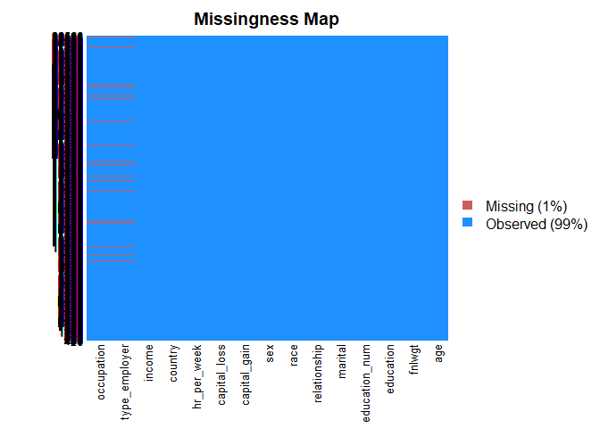

Adult Salary Predictions
================
Akash Lamba

### Content

In this project we will be working with the UCI adult dataset. We will
be attempting to predict if people in the data set belong in a certain
class by salary, either making \<=50k or \>50k per year.

### Loading Packages

``` r
library(ggplot2)
library(caret)
library(caTools)
library(Amelia)
library(dplyr)
```

### Import the Dataset

``` r
adult <- read.csv("adult_sal.csv")
```

### Feature Engineering

  - Featured the **Never-worked** and **Without-pay** Factors into
    **Unemployed column** to reduce the factor levels.
  - Featured **State-gov** and **Local-gov** Factors into a categories
    called **SL-gov** and **Self-emp** Jobs Respectively.
  - Featured **Married** into 3 groups :**Married**,**Not-Married** and
    **Never-Married**.
  - Featured **Country** into **Continents** : **Asia**
    ,**North.America**,**Europe**,**Latin.and.South.America** and
    **Other**.

<!-- end list -->

``` r
#Remove X column
adult <- select(adult,-X)

#Combine the Never-worked and without-pay into Unemployed column to reduce the factor levels by creating a function
table(adult$type_employer)
```

    ## 
    ##                ?      Federal-gov        Local-gov     Never-worked 
    ##             1836              960             2093                7 
    ##          Private     Self-emp-inc Self-emp-not-inc        State-gov 
    ##            22696             1116             2541             1298 
    ##      Without-pay 
    ##               14

``` r
#Combine employer type factors
unemployed <- function(job){
  job<- as.character(job)
  if(job=="Never-worked" | job == "Without-pay"){
    return("Unemployed")
  }else{
      return(job)
    }
}

#Combined the new unemployed column into the type_Employer column using sapply
adult$type_employer <- sapply(adult$type_employer,unemployed)

#Group Self Employed and State and Local
group_emp <- function(job){
  if(job=="State-gov" | job=="Local-gov"){
    return("SL-gov")
  }else if(job=="Self-emp-inc" | job=="Self-emp-not-inc"){
      return("Self-emp")
  }else{
      return(job)
    }
}

#apply function to type employer
adult$type_employer <- sapply(adult$type_employer,group_emp)

#table() to look at the marital column
table(adult$marital)
```

    ## 
    ##              Divorced     Married-AF-spouse    Married-civ-spouse 
    ##                  4443                    23                 14976 
    ## Married-spouse-absent         Never-married             Separated 
    ##                   418                 10683                  1025 
    ##               Widowed 
    ##                   993

``` r
#Combine Martial column factors
group_martial <- function(mar){
  mar <- as.character(mar)
  #not-married
  if(mar=="Divorced" | mar== "Separated" | mar=="Widowed"){
    return("Not-Married")
    
    #Never-married
  }else if(mar=="Never-married"){
    return(mar)
    
    #Married
  }else{
    return("Married")
  }
  
}

#apply the function to martial column
adult$marital<- sapply(adult$marital,group_martial)
table(adult$marital)
```

    ## 
    ##       Married Never-married   Not-Married 
    ##         15417         10683          6461

``` r
#Grouping the countries continent wise
levels(adult$country)
```

    ##  [1] "?"                          "Cambodia"                  
    ##  [3] "Canada"                     "China"                     
    ##  [5] "Columbia"                   "Cuba"                      
    ##  [7] "Dominican-Republic"         "Ecuador"                   
    ##  [9] "El-Salvador"                "England"                   
    ## [11] "France"                     "Germany"                   
    ## [13] "Greece"                     "Guatemala"                 
    ## [15] "Haiti"                      "Holand-Netherlands"        
    ## [17] "Honduras"                   "Hong"                      
    ## [19] "Hungary"                    "India"                     
    ## [21] "Iran"                       "Ireland"                   
    ## [23] "Italy"                      "Jamaica"                   
    ## [25] "Japan"                      "Laos"                      
    ## [27] "Mexico"                     "Nicaragua"                 
    ## [29] "Outlying-US(Guam-USVI-etc)" "Peru"                      
    ## [31] "Philippines"                "Poland"                    
    ## [33] "Portugal"                   "Puerto-Rico"               
    ## [35] "Scotland"                   "South"                     
    ## [37] "Taiwan"                     "Thailand"                  
    ## [39] "Trinadad&Tobago"            "United-States"             
    ## [41] "Vietnam"                    "Yugoslavia"

``` r
#Continent division wise countries
Asia <- c('China','Hong','India','Iran','Cambodia','Japan', 'Laos' ,
          'Philippines' ,'Vietnam' ,'Taiwan', 'Thailand')

North.America <- c('Canada','United-States','Puerto-Rico' )

Europe <- c('England' ,'France', 'Germany' ,'Greece','Holand-Netherlands','Hungary',
            'Ireland','Italy','Poland','Portugal','Scotland','Yugoslavia')

Latin.and.South.America <- c('Columbia','Cuba','Dominican-Republic','Ecuador',
                             'El-Salvador','Guatemala','Haiti','Honduras',
                             'Mexico','Nicaragua','Outlying-US(Guam-USVI-etc)','Peru',
                             'Jamaica','Trinadad&Tobago')
Other <- c('South')

#function Group_Country
group_country <- function(ctry){
  if (ctry %in% Asia){
    return('Asia')
  }else if (ctry %in% North.America){
    return('North.America')
  }else if (ctry %in% Europe){
    return('Europe')
  }else if (ctry %in% Latin.and.South.America){
    return('Latin.and.South.America')
  }else{
    return('Other')      
  }
}

#Sapply group_country on the Country Column 
adult$country <- sapply(adult$country,group_country)
table(adult$country)
```

    ## 
    ##                    Asia                  Europe Latin.and.South.America 
    ##                     671                     521                    1301 
    ##           North.America                   Other 
    ##                   29405                     663

### Factor Conversion

``` r
#Convert the character columns to factors 
adult$type_employer <- sapply(adult$type_employer,factor)
adult$country <- sapply(adult$country,factor)
adult$marital <- sapply(adult$marital,factor)
```

### Data Cleaning

  - Removed **“X”** Column from the dataset since it doesn’t give any
    inference about the Population.
  - Using the Amelia Package’s function **Missmap()** to find the
    Missing values.
  - Removing the NA’s using the **na.omit()** on the Adult dataframe.

<!-- end list -->

``` r
#Convert the character "?" to NA values
adult[adult=="?"]<- NA

#mismap function from amelia package
missmap(adult)
```

<!-- -->

``` r
missmap(adult,y.at=c(1),y.labels = c(''),col=c('yellow','black'))
```

<!-- -->

``` r
#DROP THE MISSING DATA
adult <- na.omit(adult)

#checking again using missmap() function
missmap(adult,y.at=c(1),y.labels = c(''),col=c('yellow','black'))
```

<!-- -->

### Exploratory Data Analysis

  - Histogram of **age**, colored by **income**.
  - Histogram of **hours worked per week**.
  - Renamed the **country** column to **region** column to better
    reflect the factor levels.
  - Barplot of **region** colored by **income** class.

#### 1\. Age VS Income

``` r
#Histogram ages coloured by income 
ggplot(adult,aes(age)) + geom_histogram(aes(fill=income),color="black",binwidth = 1) + theme_bw()
```

<!-- -->

  - Most of the Young people below age 25 years have income below 50k
    and People between 25 years and 50 years have income above
    50k.

#### 2\. Hours\_Per\_Week

``` r
ggplot(adult,aes(hr_per_week)) + geom_histogram() + theme_bw()
```

    ## `stat_bin()` using `bins = 30`. Pick better value with `binwidth`.

<!-- -->

  - Most of the people work between 25 hours per week to 50 hours per
    week.

### 3\. Region Vs Income

``` r
#Rename country to region
adult <- rename(adult,region = country)
pl <- ggplot(adult,aes(region))+ geom_bar(aes(fill=income),color="black")+theme_bw()
pl
```

<!-- -->

  - Most of the people in North America have a income above 50k. Whereas
    Europe with small population has income below 50k.

### Data Splitting

``` r
set.seed(101)
split <- sample.split(adult$income,SplitRatio = 0.7)

train <- subset(adult,split == TRUE)
test <- subset(adult,split == FALSE)
```

### Building Model

#### 1\. Train Data

``` r
#Model on train data
model <- glm(income~.,family = binomial,data = train)

#Summary
summary(model)
```

    ## 
    ## Call:
    ## glm(formula = income ~ ., family = binomial, data = train)
    ## 
    ## Deviance Residuals: 
    ##     Min       1Q   Median       3Q      Max  
    ## -5.1163  -0.5172  -0.1965   0.0000   3.6235  
    ## 
    ## Coefficients: (1 not defined because of singularities)
    ##                                 Estimate Std. Error z value Pr(>|z|)    
    ## (Intercept)                   -7.364e+00  4.245e-01 -17.346  < 2e-16 ***
    ## age                            2.534e-02  2.007e-03  12.627  < 2e-16 ***
    ## type_employerSelf-emp          7.501e-03  8.999e-02   0.083 0.933571    
    ## type_employerPrivate           2.371e-01  7.321e-02   3.239 0.001198 ** 
    ## type_employerFederal-gov       6.835e-01  1.266e-01   5.399 6.71e-08 ***
    ## type_employerUnemployed       -1.346e+01  3.688e+02  -0.036 0.970888    
    ## fnlwgt                         5.424e-07  2.085e-07   2.601 0.009291 ** 
    ## education11th                  2.094e-01  2.570e-01   0.814 0.415384    
    ## education12th                  3.925e-01  3.410e-01   1.151 0.249612    
    ## education1st-4th              -4.590e-01  6.067e-01  -0.757 0.449323    
    ## education5th-6th              -8.009e-02  3.980e-01  -0.201 0.840503    
    ## education7th-8th              -4.991e-01  2.880e-01  -1.733 0.083096 .  
    ## education9th                  -1.229e-02  3.191e-01  -0.038 0.969292    
    ## educationAssoc-acdm            1.250e+00  2.165e-01   5.775 7.70e-09 ***
    ## educationAssoc-voc             1.452e+00  2.084e-01   6.970 3.17e-12 ***
    ## educationBachelors             2.003e+00  1.938e-01  10.337  < 2e-16 ***
    ## educationDoctorate             2.874e+00  2.636e-01  10.902  < 2e-16 ***
    ## educationHS-grad               8.359e-01  1.888e-01   4.426 9.58e-06 ***
    ## educationMasters               2.347e+00  2.063e-01  11.374  < 2e-16 ***
    ## educationPreschool            -1.879e+01  1.645e+02  -0.114 0.909053    
    ## educationProf-school           2.797e+00  2.468e-01  11.337  < 2e-16 ***
    ## educationSome-college          1.203e+00  1.915e-01   6.283 3.33e-10 ***
    ## education_num                         NA         NA      NA       NA    
    ## maritalMarried                 1.280e+00  1.943e-01   6.588 4.45e-11 ***
    ## maritalNot-Married             5.435e-01  9.953e-02   5.460 4.75e-08 ***
    ## occupationArmed-Forces        -6.252e-01  1.844e+00  -0.339 0.734504    
    ## occupationCraft-repair         4.151e-02  9.483e-02   0.438 0.661616    
    ## occupationExec-managerial      7.689e-01  9.095e-02   8.453  < 2e-16 ***
    ## occupationFarming-fishing     -1.120e+00  1.619e-01  -6.920 4.52e-12 ***
    ## occupationHandlers-cleaners   -7.944e-01  1.726e-01  -4.603 4.17e-06 ***
    ## occupationMachine-op-inspct   -2.194e-01  1.203e-01  -1.824 0.068080 .  
    ## occupationOther-service       -8.248e-01  1.386e-01  -5.952 2.65e-09 ***
    ## occupationPriv-house-serv     -3.600e+00  1.938e+00  -1.858 0.063179 .  
    ## occupationProf-specialty       4.957e-01  9.626e-02   5.149 2.62e-07 ***
    ## occupationProtective-serv      6.029e-01  1.491e-01   4.044 5.24e-05 ***
    ## occupationSales                2.896e-01  9.749e-02   2.971 0.002972 ** 
    ## occupationTech-support         6.829e-01  1.325e-01   5.153 2.56e-07 ***
    ## occupationTransport-moving    -1.114e-01  1.189e-01  -0.937 0.348928    
    ## relationshipNot-in-family     -8.661e-01  1.907e-01  -4.541 5.60e-06 ***
    ## relationshipOther-relative    -1.086e+00  2.546e-01  -4.268 1.97e-05 ***
    ## relationshipOwn-child         -1.797e+00  2.357e-01  -7.625 2.45e-14 ***
    ## relationshipUnmarried         -1.031e+00  2.154e-01  -4.784 1.72e-06 ***
    ## relationshipWife               1.476e+00  1.235e-01  11.949  < 2e-16 ***
    ## raceAsian-Pac-Islander         6.073e-01  3.206e-01   1.894 0.058243 .  
    ## raceBlack                      4.528e-01  2.847e-01   1.590 0.111800    
    ## raceOther                      4.135e-02  4.217e-01   0.098 0.921902    
    ## raceWhite                      6.595e-01  2.711e-01   2.432 0.014997 *  
    ## sexMale                        8.855e-01  9.378e-02   9.442  < 2e-16 ***
    ## capital_gain                   3.192e-04  1.273e-05  25.076  < 2e-16 ***
    ## capital_loss                   6.549e-04  4.561e-05  14.358  < 2e-16 ***
    ## hr_per_week                    2.906e-02  1.987e-03  14.623  < 2e-16 ***
    ## regionLatin.and.South.America -5.925e-01  1.595e-01  -3.714 0.000204 ***
    ## regionAsia                    -6.475e-02  2.044e-01  -0.317 0.751446    
    ## regionOther                   -4.300e-01  1.651e-01  -2.604 0.009206 ** 
    ## regionEurope                   4.404e-02  1.552e-01   0.284 0.776660    
    ## ---
    ## Signif. codes:  0 '***' 0.001 '**' 0.01 '*' 0.05 '.' 0.1 ' ' 1
    ## 
    ## (Dispersion parameter for binomial family taken to be 1)
    ## 
    ##     Null deviance: 24138  on 21502  degrees of freedom
    ## Residual deviance: 14004  on 21449  degrees of freedom
    ## AIC: 14112
    ## 
    ## Number of Fisher Scoring iterations: 14

#### 2\. Feature Selection

``` r
new.step.model <- step(model)
```

    ## Start:  AIC=14112.05
    ## income ~ age + type_employer + fnlwgt + education + education_num + 
    ##     marital + occupation + relationship + race + sex + capital_gain + 
    ##     capital_loss + hr_per_week + region
    ## 
    ## 
    ## Step:  AIC=14112.05
    ## income ~ age + type_employer + fnlwgt + education + marital + 
    ##     occupation + relationship + race + sex + capital_gain + capital_loss + 
    ##     hr_per_week + region
    ## 
    ##                 Df Deviance   AIC
    ## <none>                14004 14112
    ## - fnlwgt         1    14011 14117
    ## - race           4    14019 14119
    ## - region         4    14026 14126
    ## - type_employer  4    14050 14150
    ## - marital        2    14060 14164
    ## - sex            1    14097 14203
    ## - age            1    14165 14271
    ## - capital_loss   1    14217 14323
    ## - hr_per_week    1    14222 14328
    ## - relationship   5    14288 14386
    ## - occupation    13    14444 14526
    ## - education     15    14718 14796
    ## - capital_gain   1    15248 15354

``` r
summary(new.step.model)
```

    ## 
    ## Call:
    ## glm(formula = income ~ age + type_employer + fnlwgt + education + 
    ##     marital + occupation + relationship + race + sex + capital_gain + 
    ##     capital_loss + hr_per_week + region, family = binomial, data = train)
    ## 
    ## Deviance Residuals: 
    ##     Min       1Q   Median       3Q      Max  
    ## -5.1163  -0.5172  -0.1965   0.0000   3.6235  
    ## 
    ## Coefficients:
    ##                                 Estimate Std. Error z value Pr(>|z|)    
    ## (Intercept)                   -7.364e+00  4.245e-01 -17.346  < 2e-16 ***
    ## age                            2.534e-02  2.007e-03  12.627  < 2e-16 ***
    ## type_employerSelf-emp          7.501e-03  8.999e-02   0.083 0.933571    
    ## type_employerPrivate           2.371e-01  7.321e-02   3.239 0.001198 ** 
    ## type_employerFederal-gov       6.835e-01  1.266e-01   5.399 6.71e-08 ***
    ## type_employerUnemployed       -1.346e+01  3.688e+02  -0.036 0.970888    
    ## fnlwgt                         5.424e-07  2.085e-07   2.601 0.009291 ** 
    ## education11th                  2.094e-01  2.570e-01   0.814 0.415384    
    ## education12th                  3.925e-01  3.410e-01   1.151 0.249612    
    ## education1st-4th              -4.590e-01  6.067e-01  -0.757 0.449323    
    ## education5th-6th              -8.009e-02  3.980e-01  -0.201 0.840503    
    ## education7th-8th              -4.991e-01  2.880e-01  -1.733 0.083096 .  
    ## education9th                  -1.229e-02  3.191e-01  -0.038 0.969292    
    ## educationAssoc-acdm            1.250e+00  2.165e-01   5.775 7.70e-09 ***
    ## educationAssoc-voc             1.452e+00  2.084e-01   6.970 3.17e-12 ***
    ## educationBachelors             2.003e+00  1.938e-01  10.337  < 2e-16 ***
    ## educationDoctorate             2.874e+00  2.636e-01  10.902  < 2e-16 ***
    ## educationHS-grad               8.359e-01  1.888e-01   4.426 9.58e-06 ***
    ## educationMasters               2.347e+00  2.063e-01  11.374  < 2e-16 ***
    ## educationPreschool            -1.879e+01  1.645e+02  -0.114 0.909053    
    ## educationProf-school           2.797e+00  2.468e-01  11.337  < 2e-16 ***
    ## educationSome-college          1.203e+00  1.915e-01   6.283 3.33e-10 ***
    ## maritalMarried                 1.280e+00  1.943e-01   6.588 4.45e-11 ***
    ## maritalNot-Married             5.435e-01  9.953e-02   5.460 4.75e-08 ***
    ## occupationArmed-Forces        -6.252e-01  1.844e+00  -0.339 0.734504    
    ## occupationCraft-repair         4.151e-02  9.483e-02   0.438 0.661616    
    ## occupationExec-managerial      7.689e-01  9.095e-02   8.453  < 2e-16 ***
    ## occupationFarming-fishing     -1.120e+00  1.619e-01  -6.920 4.52e-12 ***
    ## occupationHandlers-cleaners   -7.944e-01  1.726e-01  -4.603 4.17e-06 ***
    ## occupationMachine-op-inspct   -2.194e-01  1.203e-01  -1.824 0.068080 .  
    ## occupationOther-service       -8.248e-01  1.386e-01  -5.952 2.65e-09 ***
    ## occupationPriv-house-serv     -3.600e+00  1.938e+00  -1.858 0.063179 .  
    ## occupationProf-specialty       4.957e-01  9.626e-02   5.149 2.62e-07 ***
    ## occupationProtective-serv      6.029e-01  1.491e-01   4.044 5.24e-05 ***
    ## occupationSales                2.896e-01  9.749e-02   2.971 0.002972 ** 
    ## occupationTech-support         6.829e-01  1.325e-01   5.153 2.56e-07 ***
    ## occupationTransport-moving    -1.114e-01  1.189e-01  -0.937 0.348928    
    ## relationshipNot-in-family     -8.661e-01  1.907e-01  -4.541 5.60e-06 ***
    ## relationshipOther-relative    -1.086e+00  2.546e-01  -4.268 1.97e-05 ***
    ## relationshipOwn-child         -1.797e+00  2.357e-01  -7.625 2.45e-14 ***
    ## relationshipUnmarried         -1.031e+00  2.154e-01  -4.784 1.72e-06 ***
    ## relationshipWife               1.476e+00  1.235e-01  11.949  < 2e-16 ***
    ## raceAsian-Pac-Islander         6.073e-01  3.206e-01   1.894 0.058243 .  
    ## raceBlack                      4.528e-01  2.847e-01   1.590 0.111800    
    ## raceOther                      4.135e-02  4.217e-01   0.098 0.921902    
    ## raceWhite                      6.595e-01  2.711e-01   2.432 0.014997 *  
    ## sexMale                        8.855e-01  9.378e-02   9.442  < 2e-16 ***
    ## capital_gain                   3.192e-04  1.273e-05  25.076  < 2e-16 ***
    ## capital_loss                   6.549e-04  4.561e-05  14.358  < 2e-16 ***
    ## hr_per_week                    2.906e-02  1.987e-03  14.623  < 2e-16 ***
    ## regionLatin.and.South.America -5.925e-01  1.595e-01  -3.714 0.000204 ***
    ## regionAsia                    -6.475e-02  2.044e-01  -0.317 0.751446    
    ## regionOther                   -4.300e-01  1.651e-01  -2.604 0.009206 ** 
    ## regionEurope                   4.404e-02  1.552e-01   0.284 0.776660    
    ## ---
    ## Signif. codes:  0 '***' 0.001 '**' 0.01 '*' 0.05 '.' 0.1 ' ' 1
    ## 
    ## (Dispersion parameter for binomial family taken to be 1)
    ## 
    ##     Null deviance: 24138  on 21502  degrees of freedom
    ## Residual deviance: 14004  on 21449  degrees of freedom
    ## AIC: 14112
    ## 
    ## Number of Fisher Scoring iterations: 14

  - The Step Function kept all the Features used previously. While used
    the AIC Criteria to compare the Models.

#### 3\. Test Data

``` r
test$predicted.income <- predict(model,newdata=test,type="response")
```

#### 4\. Performance Metrics

``` r
#Confusion Matrix
table(test$income,test$predicted.income>0.5)
```

    ##        
    ##         FALSE TRUE
    ##   <=50K  6372  548
    ##   >50K    872 1423

``` r
#Accuracy
(6372+1423)/(6372+1423+548+872)
```

    ## [1] 0.8459034

``` r
#recall
6732/(6372+548)
```

    ## [1] 0.9728324

``` r
#precision
6732/(6372+872)
```

    ## [1] 0.9293208

### Conclusion

  - Logistic Regression model showed a model accuracy of 84%.
