Big Mart Sales Prediction
================
Akash Lamba

### Problem Statement

The data scientists at BigMart have collected 2013 sales data for 1559
products across 10 stores in different cities. Also, certain attributes
of each product and store have been defined. The aim is to build a
predictive model and find out the sales of each product at a particular
store.

Using this model, BigMart will try to understand the properties of
products and stores which play a key role in increasing sales.


### Dataset Attributes

  - **Item\_identifier:** Unique Product ID
  - **Item\_Weight:** Weight of the Product
  - **Item\_Fat\_content:** Whether the product is low fat or not
  - **Item\_Visibility:** The % of total display area of all products in
    a store allocated to the particular product
  - **Item\_Type:** The category to which the product belongs
  - **Item\_MRP:** Maximum Retail Price (list price) of the product
    belongs
  - **Outlet\_Identifier:** Unique Store ID
  - **Outlet\_Establishment\_Year:** The year in which store was
    established
  - **Outlet\_Size:** The size of the store in terms of ground area
    covered
  - **Outlet\_Location\_Type:** The type of city in which store is
    located
  - **Outlet\_type:** Whether the outlet is just a grocery store or some
    sort of supermarket
  - **Item\_Outlet\_Sales:** Sales of the product in the particular
    store. This is the outcome variable to be predicted

### Loading Packages

``` r
library(data.table) 
library(dplyr)      
library(ggplot2)    
library(caret)      
library(corrplot)   
library(xgboost)    
library(cowplot)   
library(knitr)
library(dplyr)
```

### Import The Train and Test Dataset

``` r
# Read datasets
train = fread("Train.csv")
test = fread("Test.csv")
submission = fread("SampleSubmission.csv")

#train data column names
names(train)
```

    ##  [1] "Item_Identifier"           "Item_Weight"              
    ##  [3] "Item_Fat_Content"          "Item_Visibility"          
    ##  [5] "Item_Type"                 "Item_MRP"                 
    ##  [7] "Outlet_Identifier"         "Outlet_Establishment_Year"
    ##  [9] "Outlet_Size"               "Outlet_Location_Type"     
    ## [11] "Outlet_Type"               "Item_Outlet_Sales"

``` r
#test data column names
names(test)
```

    ##  [1] "Item_Identifier"           "Item_Weight"              
    ##  [3] "Item_Fat_Content"          "Item_Visibility"          
    ##  [5] "Item_Type"                 "Item_MRP"                 
    ##  [7] "Outlet_Identifier"         "Outlet_Establishment_Year"
    ##  [9] "Outlet_Size"               "Outlet_Location_Type"     
    ## [11] "Outlet_Type"

``` r
#structure of train data
str(train)
```

    ## Classes 'data.table' and 'data.frame':   8523 obs. of  12 variables:
    ##  $ Item_Identifier          : chr  "FDA15" "DRC01" "FDN15" "FDX07" ...
    ##  $ Item_Weight              : num  9.3 5.92 17.5 19.2 8.93 ...
    ##  $ Item_Fat_Content         : chr  "Low Fat" "Regular" "Low Fat" "Regular" ...
    ##  $ Item_Visibility          : num  0.016 0.0193 0.0168 0 0 ...
    ##  $ Item_Type                : chr  "Dairy" "Soft Drinks" "Meat" "Fruits and Vegetables" ...
    ##  $ Item_MRP                 : num  249.8 48.3 141.6 182.1 53.9 ...
    ##  $ Outlet_Identifier        : chr  "OUT049" "OUT018" "OUT049" "OUT010" ...
    ##  $ Outlet_Establishment_Year: int  1999 2009 1999 1998 1987 2009 1987 1985 2002 2007 ...
    ##  $ Outlet_Size              : chr  "Medium" "Medium" "Medium" "" ...
    ##  $ Outlet_Location_Type     : chr  "Tier 1" "Tier 3" "Tier 1" "Tier 3" ...
    ##  $ Outlet_Type              : chr  "Supermarket Type1" "Supermarket Type2" "Supermarket Type1" "Grocery Store" ...
    ##  $ Item_Outlet_Sales        : num  3735 443 2097 732 995 ...
    ##  - attr(*, ".internal.selfref")=<externalptr>

``` r
#structure of test data
str(test)
```

    ## Classes 'data.table' and 'data.frame':   5681 obs. of  11 variables:
    ##  $ Item_Identifier          : chr  "FDW58" "FDW14" "NCN55" "FDQ58" ...
    ##  $ Item_Weight              : num  20.75 8.3 14.6 7.32 NA ...
    ##  $ Item_Fat_Content         : chr  "Low Fat" "reg" "Low Fat" "Low Fat" ...
    ##  $ Item_Visibility          : num  0.00756 0.03843 0.09957 0.01539 0.1186 ...
    ##  $ Item_Type                : chr  "Snack Foods" "Dairy" "Others" "Snack Foods" ...
    ##  $ Item_MRP                 : num  107.9 87.3 241.8 155 234.2 ...
    ##  $ Outlet_Identifier        : chr  "OUT049" "OUT017" "OUT010" "OUT017" ...
    ##  $ Outlet_Establishment_Year: int  1999 2007 1998 2007 1985 1997 2009 1985 2002 2007 ...
    ##  $ Outlet_Size              : chr  "Medium" "" "" "" ...
    ##  $ Outlet_Location_Type     : chr  "Tier 1" "Tier 2" "Tier 3" "Tier 2" ...
    ##  $ Outlet_Type              : chr  "Supermarket Type1" "Supermarket Type1" "Grocery Store" "Supermarket Type1" ...
    ##  - attr(*, ".internal.selfref")=<externalptr>

``` r
#Add Item_Outlet_Sales to test data
test[,Item_Outlet_Sales := NA] 

#Combining train and test datasets
combi = rbind(train, test) 
```

### Exploratory Data Analysis

  - Univariate EDA
  - Bivariate
EDA

### Univariate EDA

#### Item\_Outlet\_Sales - Target Variable

``` r
ggplot(train) + geom_histogram(aes(train$Item_Outlet_Sales), binwidth = 100, fill = "darkgreen") +
  xlab("Item_Outlet_Sales")
```

<!-- -->

*Right skewed variable and would need some data transformation to treat
skewness*

### Independent Variables (Numerical Variables)

#### 1\. Item\_Weight

``` r
p1 = ggplot(combi) + geom_histogram(aes(Item_Weight), binwidth = 0.5, fill = "blue")
```

#### 2\. Item\_Visibility

``` r
p2 = ggplot(combi) + geom_histogram(aes(Item_Visibility), binwidth = 0.005, fill = "blue")
```

#### 3\. Item\_Visibility

``` r
p3 = ggplot(combi) + geom_histogram(aes(Item_MRP), binwidth = 1, fill = "blue")
```

``` r
plot_grid(p1, p2, p3, nrow = 1) 
```

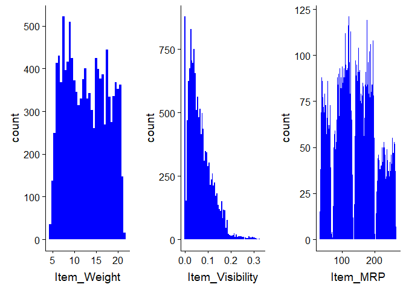<!-- -->

*As you can see,there is no clear pattern in `Item_Weight` and
`Item_MRP`. However,`Item_Visibility` is right.Skewed and should be
transformed to curb its
skewness.*

### Independent Variables (Categorical Variables)

#### 1\. Item Fat Content

``` r
ggplot(combi %>% group_by(Item_Fat_Content) %>% summarise(Count = n())) + 
  geom_bar(aes(Item_Fat_Content, Count), stat = "identity", fill = "coral1")
```

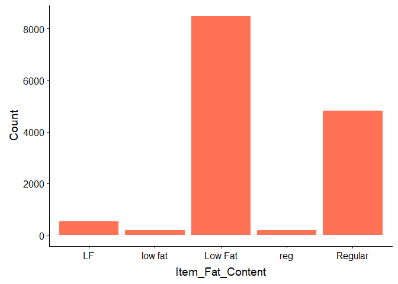<!-- -->

``` r
#"Low Fat,low fat and LF" are same so combine and "Regular and reg" are same so combine. 
combi$Item_Fat_Content[combi$Item_Fat_Content == "LF"] = "Low Fat"
combi$Item_Fat_Content[combi$Item_Fat_Content == "low fat"] = "Low Fat"
combi$Item_Fat_Content[combi$Item_Fat_Content == "reg"] = "Regular"

#"Low Fat and Regular" only
ggplot(combi %>% group_by(Item_Fat_Content) %>% summarise(Count = n())) + 
  geom_bar(aes(Item_Fat_Content, Count), stat = "identity", fill = "coral1")
```

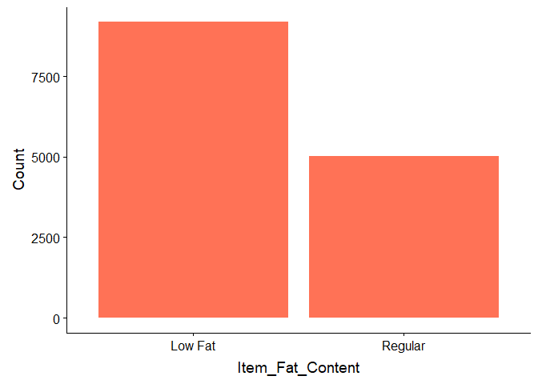<!-- -->

*Most of the `Item_Fat` has low fat only.*

#### 2\. Item\_Type

``` r
p4 = ggplot(combi %>% group_by(Item_Type) %>% summarise(Count = n())) + 
  geom_bar(aes(Item_Type, Count), stat = "identity", fill = "coral1") +
  xlab("") +
  geom_label(aes(Item_Type, Count, label = Count), vjust = 0.5) +
  theme(axis.text.x = element_text(angle = 45, hjust = 1))+
  ggtitle("Item_Type")

p4
```

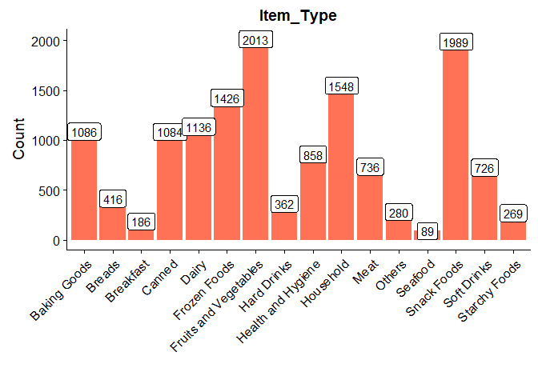<!-- -->

*Fruit & Vegetables and Snack foods are the two predominant products
sold.*

#### 3\. Outlet\_Identifier

``` r
p5 = ggplot(combi %>% group_by(Outlet_Identifier) %>% summarise(Count = n())) + 
  geom_bar(aes(Outlet_Identifier, Count), stat = "identity", fill = "coral1") +
  geom_label(aes(Outlet_Identifier, Count, label = Count), vjust = 0.5) +
  theme(axis.text.x = element_text(angle = 45, hjust = 1))
p5
```

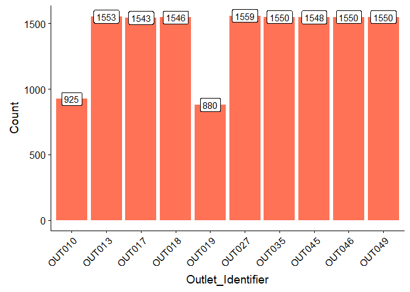<!-- -->

*10 different outlets and most of them are
same.*

#### 4\. Outlet\_Size

``` r
p6 = ggplot(combi %>% group_by(Outlet_Size) %>% summarise(Count = n())) + 
  geom_bar(aes(Outlet_Size, Count), stat = "identity", fill = "coral1") +
  geom_label(aes(Outlet_Size, Count, label = Count), vjust = 0.5) +
  theme(axis.text.x = element_text(angle = 45, hjust = 1))
p6
```

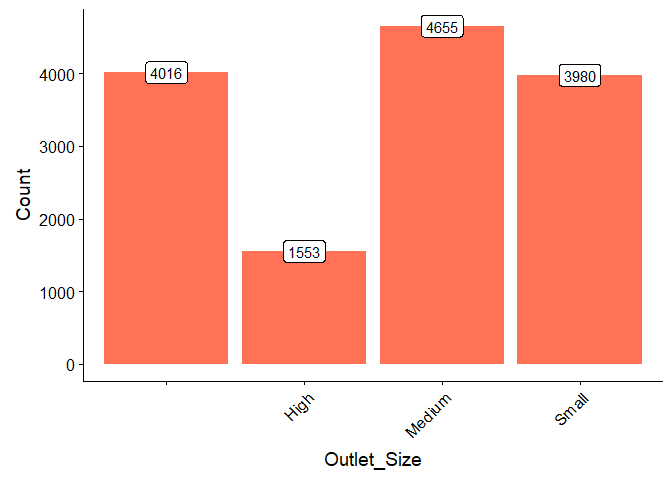<!-- -->

*Medium is high and In `Outlet_size` plot 4016
Observations,`Outlet_Size` is missing or blank.*

``` r
second_row = plot_grid(p5, p6, nrow = 1)
plot_grid(p4, second_row, ncol = 1)
```

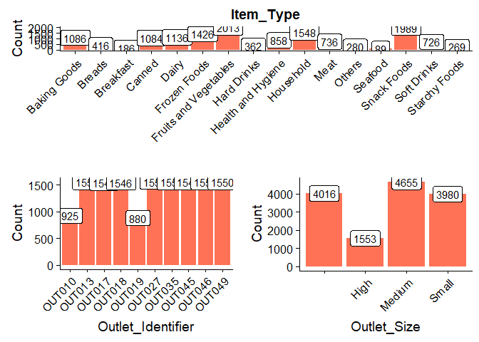<!-- -->

#### 5\. Outlet\_Establishment\_Year

``` r
p7 = ggplot(combi %>% group_by(Outlet_Establishment_Year) %>% summarise(Count = n())) + 
  geom_bar(aes(factor(Outlet_Establishment_Year), Count), stat = "identity", fill = "coral1") +
  geom_label(aes(factor(Outlet_Establishment_Year), Count, label = Count), vjust = 0.5) +
  xlab("Outlet_Establishment_Year") +
  theme(axis.text.x = element_text(size = 8.5))

p7
```

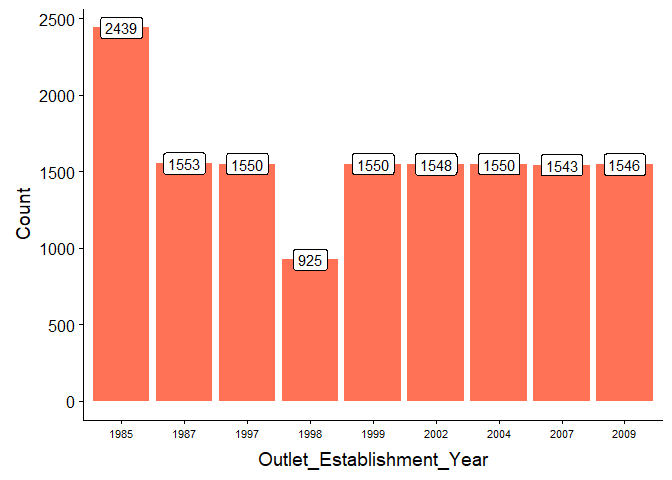<!-- -->

*There are lesser number of observations in the data for the outlets
established in the year 1998 as compared to the other
years.*

#### 6\. Outlet\_Type

``` r
p8 = ggplot(combi %>% group_by(Outlet_Type) %>% summarise(Count = n())) + 
  geom_bar(aes(Outlet_Type, Count), stat = "identity", fill = "coral1") +
  geom_label(aes(factor(Outlet_Type), Count, label = Count), vjust = 0.5) +
  theme(axis.text.x = element_text(size = 8.5))

p8
```

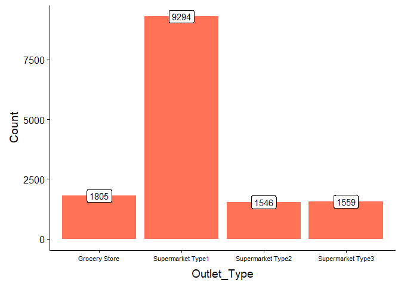<!-- -->

*Supermarket Type1 seems to be the most popular category of
`Outlet_Type`.*

``` r
plot_grid(p7, p8, ncol = 2)
```

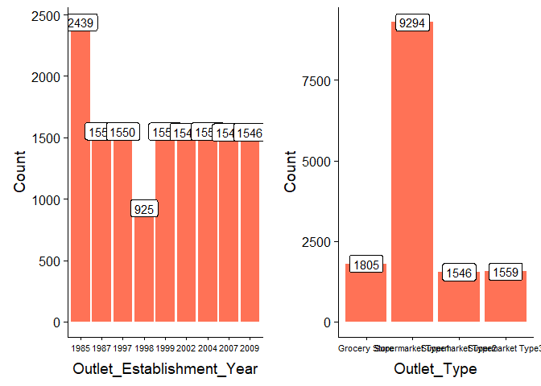<!-- -->

### Bivariate EDA

Since we don’t have target variable in test dataset we will restrict to
training dataset

``` r
train = combi[1:nrow(train)]
```

#### Numerical Variables-Numerical Variable(Target Variable)

#### 1\. Item\_Weight vs Item\_Outlet\_Sales

``` r
train = combi[1:nrow(train)]
p9 = ggplot(train) + geom_point(aes(Item_Weight, Item_Outlet_Sales), colour = "violet", alpha = 0.3) +
     theme(axis.title = element_text(size = 8.5))

p9
```

<!-- -->

*`Item_Outlet_Sales` is spread well across the entire range of the
`Item_Weight` without any obvious
pattern.*

#### 2\. Item\_Visibility vs Item\_Outlet\_Sales

``` r
p10 = ggplot(train) + geom_point(aes(Item_Visibility, Item_Outlet_Sales), colour = "violet", alpha = 0.3) +
      theme(axis.title = element_text(size = 8.5))

p10
```

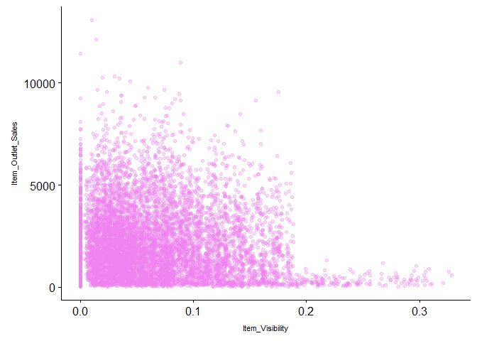<!-- -->

*In the `Item_Visibility` vs `Item_Outlet_Sales`, there is a string of
points at `Item_Visibility` = 0.0 which seems strange as item visibility
cannot be completely
zero.*

#### 3\. Item\_MRP vs Item\_Outlet\_Sales

``` r
p11 = ggplot(train) + geom_point(aes(Item_MRP, Item_Outlet_Sales), colour = "violet", alpha = 0.3) +
      theme(axis.title = element_text(size = 8.5))

p11
```

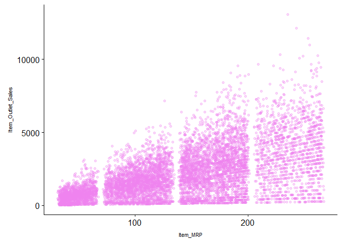<!-- -->

*In `Item_MRP` vs `Item_Outlet_Sales` plot, we can clearly see 4
segments of prices that can be used in feature engineering to create a
new variable.*

``` r
second_row_2 = plot_grid(p10, p11, ncol = 2)
plot_grid(p9, second_row_2, nrow = 2)
```

    ## Warning: Removed 1463 rows containing missing values (geom_point).

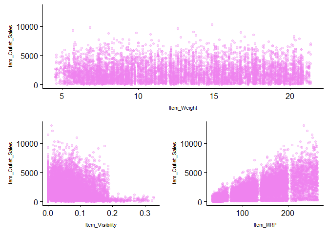<!-- -->

#### Categorical Variables-Numerical Variable(Target Variable)

#### 1\. Item\_Type vs Item\_Outlet\_Sales

``` r
p12 = ggplot(train) + geom_boxplot(aes(Item_Type, Item_Outlet_Sales), fill = "magenta") +
  theme(axis.text.x = element_text(angle = 45, hjust = 1),
        axis.text = element_text(size = 6),
        axis.title = element_text(size = 8.5))
p12
```

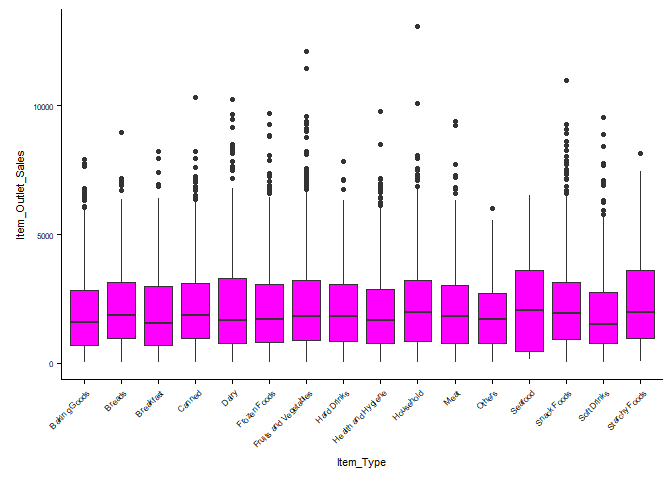<!-- -->

``` r
p12 = ggplot(train) + geom_violin(aes(Item_Type, Item_Outlet_Sales), fill = "magenta") +
  theme(axis.text.x = element_text(angle = 45, hjust = 1),
        axis.text = element_text(size = 6),
        axis.title = element_text(size = 8.5))
p12
```

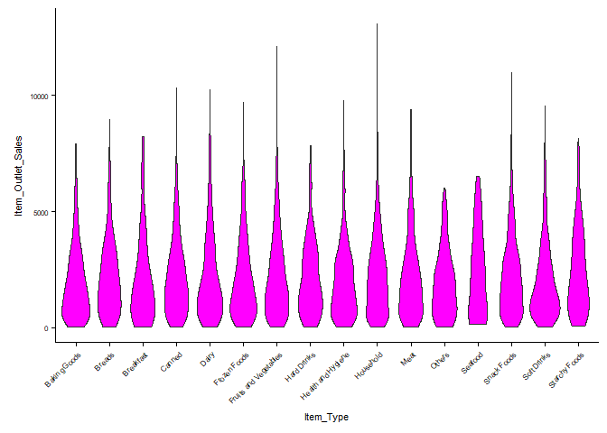<!-- -->

#### 2\. Item\_Fat\_Content vs Item\_Outlet\_Sales

``` r
p13 = ggplot(train) + geom_violin(aes(Item_Fat_Content, Item_Outlet_Sales), fill = "magenta") +
  theme(axis.text.x = element_text(angle = 45, hjust = 1),
        axis.text = element_text(size = 8),
        axis.title = element_text(size = 8.5))
p13
```

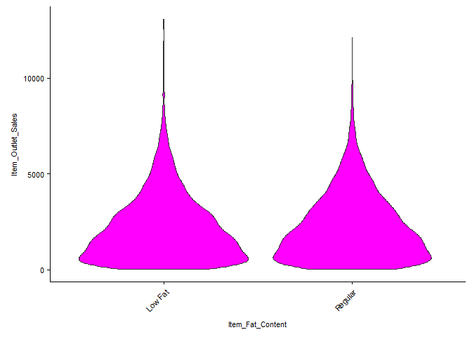<!-- -->

#### 3\. Outlet\_Identifier vs Item\_Outlet\_Sales

``` r
p14 = ggplot(train) + geom_violin(aes(Outlet_Identifier, Item_Outlet_Sales), fill = "magenta") +
  theme(axis.text.x = element_text(angle = 45, hjust = 1),
        axis.text = element_text(size = 8),
        axis.title = element_text(size = 8.5))
p14
```

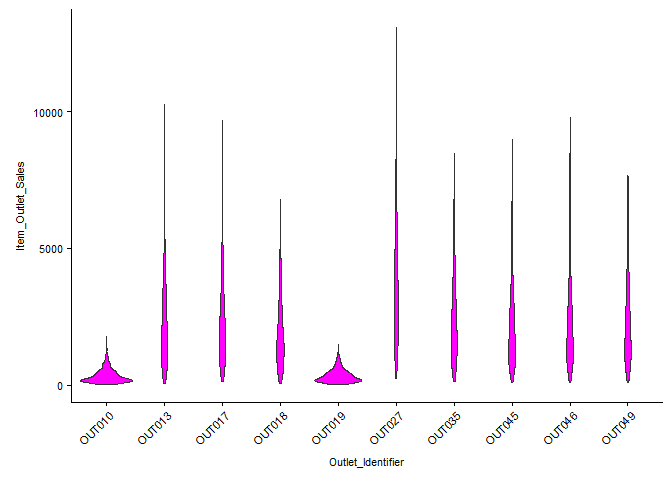<!-- -->

``` r
second_row_3 = plot_grid(p13, p14, ncol = 2)

plot_grid(p12, second_row_3, ncol = 1)
```

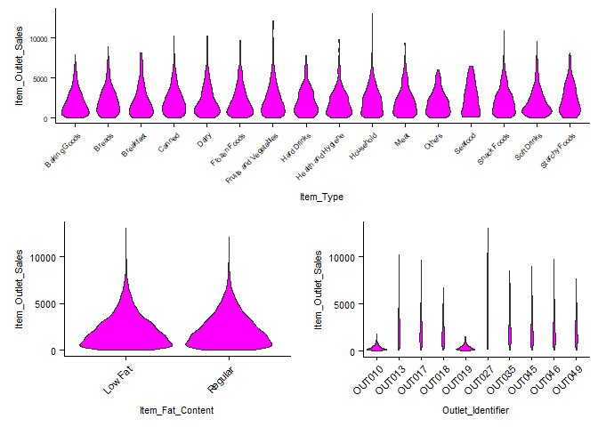<!-- -->

*Distribution of `Item_Outlet_Sales` across the categories of
`Item_Type` is not very distinct and same is the case with
`Item_Fat_Content`.However,the distribution of `Outlet_Identifier` from
the rest of the categories of
`Outlet_Identifier`.*

#### 4\. Outlet\_Size vs Item\_Outlet\_Sales

``` r
ggplot(train) + geom_violin(aes(Outlet_Size, Item_Outlet_Sales), fill = "magenta")
```

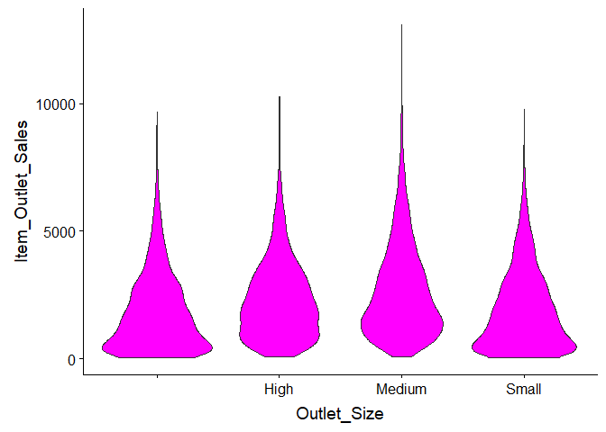<!-- -->

*The distribution of “Small” `Outlet_Size` is almost identical to the
distribution of the blank category(First Violin) of the `Outl_Size`. So,
we can substitute the blanks in `Outlet_Size` with “small”.We will
impute the values with
“Small”.*

#### 5\. Outlet\_Location\_Type vs Item\_Outlet\_Sales

``` r
p15 = ggplot(train) + geom_violin(aes(Outlet_Location_Type, Item_Outlet_Sales), fill = "magenta")
p15
```

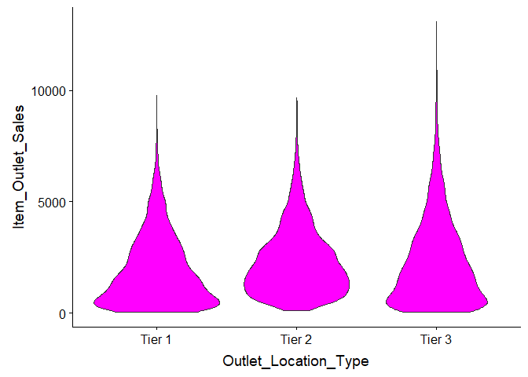<!-- -->

*Tier 1 and Tier 3 locations of `Outlet_Location_Type` look
similar.*

#### 6\. Outlet\_Type vs Item\_Outlet\_Sales

``` r
p16 = ggplot(train) + geom_violin(aes(Outlet_Type, Item_Outlet_Sales), fill = "magenta")
p16
```

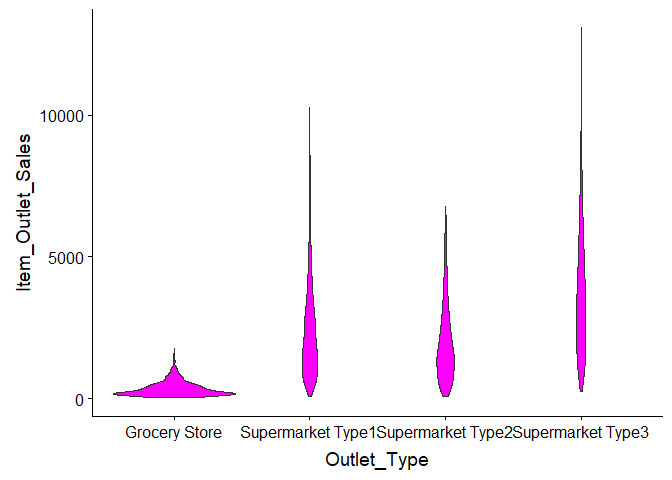<!-- -->

*In `Outlet_Type`, Grocery Store has most of its data points around the
lower sales values as compared to other categories.Grocery will be
keeping very low MRP Items.*

``` r
plot_grid(p15, p16, ncol = 1)
```

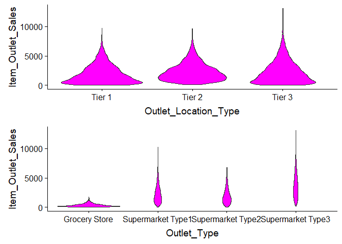<!-- -->

### Missing Value Treatment

``` r
#Checking for missing values in the column of combi
colSums(is.na(combi))
```

    ##           Item_Identifier               Item_Weight 
    ##                         0                      2439 
    ##          Item_Fat_Content           Item_Visibility 
    ##                         0                         0 
    ##                 Item_Type                  Item_MRP 
    ##                         0                         0 
    ##         Outlet_Identifier Outlet_Establishment_Year 
    ##                         0                         0 
    ##               Outlet_Size      Outlet_Location_Type 
    ##                         0                         0 
    ##               Outlet_Type         Item_Outlet_Sales 
    ##                         0                      5681

``` r
#Imputing the missing values in Item_Weight column with mean weight based on the Item_Identifier variable.
missing_index = which(is.na(combi$Item_Weight))
for(i in missing_index){
  
  item = combi$Item_Identifier[i]
  combi$Item_Weight[i] = mean(combi$Item_Weight[combi$Item_Identifier == item], na.rm = T)
  
}

#Replacing 0 in Item_Visibility with the mean
zero_index = which(combi$Item_Visibility == 0)
for(i in zero_index){
  
  item = combi$Item_Identifier[i]
  combi$Item_Visibility[i] = mean(combi$Item_Visibility[combi$Item_Identifier == item], na.rm = T)
  
}
```

1.  As you can see above, We have Missing Values in `Item_Weight` and
    `Item_Outlet_Sales` Columns.
2.  Missing data in `Item_Outlet_Sales` can be ignored since they belong
    to the test dataset.
3.  Also, We Imputed the missing values in `Item_Weight` column with
    mean weight based on the `Item_Identifier` variable.

### Feature Engineering

  - FEATURE 1 - Item Type New
  - FEATURE 2 - Item Type Category
  - FEATURE 3 - Outlet Years
  - FEATURE 4 - Price per unit Weight
  - FEATURE 5 - Item MRP
Clusters

#### FEATURE 1 - Item Type New

``` r
perishable = c("Breads", "Breakfast", "Dairy", "Fruits and Vegetables", "Meat", "Seafood")
non_perishable = c("Baking Goods", "Canned", "Frozen Foods", "Hard Drinks", "Health and Hygiene",
                   "Household", "Soft Drinks")

combi[,Item_Type_new := ifelse(Item_Type %in% perishable, "perishable",
                               ifelse(Item_Type %in% non_perishable, "non_perishable", "not_sure"))]
```

*We can have a look at the `Item_Type` variable and classify the
categories into perishable and non\_perishable as per our understanding
and make it into a new feature.*

#### FEATURE 2 - Item Type Category

``` r
#extracting first 2 characters for the first position
combi[,Item_category := substr(combi$Item_Identifier, 1, 2)]
combi$Item_Fat_Content[combi$Item_category == "NC"] = "Non-Edible"
```

*Compare them `Item_Type` with the first 2 characters of
`Item_Identifier`, ie., ‘DR’,‘FD’, and ‘NC’.These identifiers stands
drinks,food and non-consumable.*

#### FEATURE 3 - Outlet Years

``` r
combi[,Outlet_Years := 2013 - Outlet_Establishment_Year]
combi$Outlet_Establishment_Year = as.factor(combi$Outlet_Establishment_Year)
```

*Converting the `Outlet_Establishement_Year` to `Outlet_Years` by
subtracting from 2013 Year will give the years operations untill 2013
Year.Older the Outlet more Popular it will be.*

#### FEATURE 4 - Price per unit Weight

``` r
combi[,price_per_unit_wt := Item_MRP/Item_Weight]
```

*Soft drinks for a particular 1.5 ltr has some discount nd if you buy in
large quanitity and the sales will increase.So you need to know the
Price per unit Weight for it.*

#### FEATURE 5 - Item MRP Clusters

``` r
#Kmeans for building the clusters
Item_MRP_clusters = kmeans(combi$Item_MRP, centers = 4)
#Display no. of observations in each cluster
table(Item_MRP_clusters$cluster)
```

    ## 
    ##    1    2    3    4 
    ## 4931 2556 4317 2400

``` r
#Converting to Factor
combi$Item_MRP_clusters = as.factor(Item_MRP_clusters$cluster)
```

*Earlier in the `Item_MRP` vs `Item_Outlet_Sales` plot, We saw
`Item_MRP` was spread across in 4 chunks.We can use K means clustering
to create 4 groups using `Item_MRP` variable. We will go ahead with
K=4.*

### Encoding Categorical Variables

  - Label Encoding
  - One Hot Encoding

#### Label Encoding

``` r
combi[,Outlet_Size_num := ifelse(Outlet_Size == "Small", 0,
                                 ifelse(Outlet_Size == "Medium", 1, 2))]

combi[,Outlet_Location_Type_num := ifelse(Outlet_Location_Type == "Tier 3", 0,
                                          ifelse(Outlet_Location_Type == "Tier 2", 1, 2))]

#removing categorical variables after label encoding
combi[, c("Outlet_Size", "Outlet_Location_Type") := NULL]
```

#### One Hot Encoding

``` r
ohe = dummyVars("~.", data = combi[,-c("Item_Identifier", "Outlet_Establishment_Year", "Item_Type")], fullRank = T)
ohe_df = data.table(predict(ohe, combi[,-c("Item_Identifier", "Outlet_Establishment_Year", "Item_Type")]))

combi = cbind(combi[,"Item_Identifier"], ohe_df)
```

### Skewness and Scaling

#### Removing the Skewness

``` r
library(e1071) 
skewness(combi$Item_Visibility) 
```

    ## [1] 1.254046

``` r
skewness(combi$price_per_unit_wt)
```

    ## [1] 1.304551

``` r
combi[,Item_Visibility := log(Item_Visibility + 1)] # log + 1 to avoid division by zero
combi[,price_per_unit_wt := log(price_per_unit_wt + 1)]
```

#### Scaling and Centering the Data

``` r
#Which are the numerical variables - 29 numerical variables since we converted all using Encoding
num_vars = which(sapply(combi, is.numeric)) 
num_vars_names = names(num_vars)

#Remove Item_Outlet_Sales
combi_numeric = combi[,setdiff(num_vars_names, "Item_Outlet_Sales"), with = F]

#Preprocess function used for scaling
prep_num = preProcess(combi_numeric, method=c("center", "scale"))
combi_numeric_norm = predict(prep_num, combi_numeric)

#removing numeric independent variables
combi[,setdiff(num_vars_names, "Item_Outlet_Sales") := NULL] 
combi = cbind(combi, combi_numeric_norm)
```

### Feature Selection

``` r
#splitting data back to train and test
train = combi[1:nrow(train)]
test = combi[(nrow(train) + 1):nrow(combi)]
test[,Item_Outlet_Sales := NULL] # removing Item_Outlet_Sales as it contains only NA for test dataset

#Correlation Plot
cor_train = cor(train[,-c("Item_Identifier")])
corrplot(cor_train, method = "pie", type = "lower", tl.cex = 0.9)
```

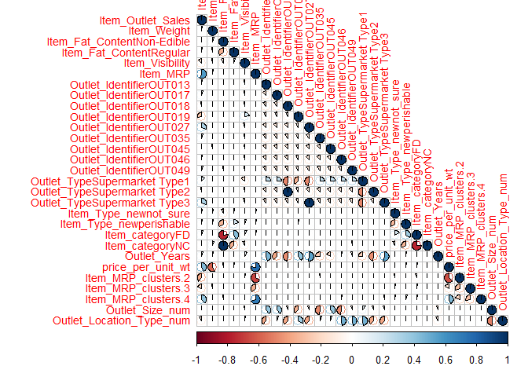<!-- -->

*1. Variables `price_per_unit_wt` and `Item_Weight` are highly
correlated as the former one was created from the latter.*

*2. Similarly `price_per_unit_wt` and `Item_MRP` are highly correlated
for the same reason.*

*3. This attributes are important for predicting `Outlet_Sales`.*

*4.`Item_MRP`,`Item_MRP_Cluster_4`,`price_per_unit_wt` and
`Outlet_IdentifierOUT019` has high correlation to `Item_Outlet_Sales`.*

### Model Building

  - Linear Regression
  - Lasso Regression
  - Ridge Regression
  - RandomForest Model
  - XGBoost Modeling

#### Linear Regression

``` r
#All Independent Variables
linear_reg_mod = lm(Item_Outlet_Sales ~ ., data = train[,-c("Item_Identifier")])
summary(linear_reg_mod)
```

    ## 
    ## Call:
    ## lm(formula = Item_Outlet_Sales ~ ., data = train[, -c("Item_Identifier")])
    ## 
    ## Residuals:
    ##     Min      1Q  Median      3Q     Max 
    ## -4300.5  -677.0   -90.3   574.6  7951.6 
    ## 
    ## Coefficients: (7 not defined because of singularities)
    ##                                Estimate Std. Error t value Pr(>|t|)    
    ## (Intercept)                    2181.373     12.230 178.359   <2e-16 ***
    ## Item_Weight                     -31.115     50.024  -0.622    0.534    
    ## `Item_Fat_ContentNon-Edible`     -2.191     19.408  -0.113    0.910    
    ## Item_Fat_ContentRegular          19.296     13.555   1.424    0.155    
    ## Item_Visibility                 -11.082     12.768  -0.868    0.385    
    ## Item_MRP                        980.808     77.362  12.678   <2e-16 ***
    ## Outlet_IdentifierOUT013         605.954     19.156  31.633   <2e-16 ***
    ## Outlet_IdentifierOUT017         626.850     19.112  32.799   <2e-16 ***
    ## Outlet_IdentifierOUT018         509.270     19.118  26.638   <2e-16 ***
    ## Outlet_IdentifierOUT019           4.340     16.552   0.262    0.793    
    ## Outlet_IdentifierOUT027        1050.647     19.195  54.735   <2e-16 ***
    ## Outlet_IdentifierOUT035         640.847     19.140  33.482   <2e-16 ***
    ## Outlet_IdentifierOUT045         574.242     19.138  30.006   <2e-16 ***
    ## Outlet_IdentifierOUT046         595.913     19.134  31.144   <2e-16 ***
    ## Outlet_IdentifierOUT049         626.191     19.132  32.729   <2e-16 ***
    ## `Outlet_TypeSupermarket Type1`       NA         NA      NA       NA    
    ## `Outlet_TypeSupermarket Type2`       NA         NA      NA       NA    
    ## `Outlet_TypeSupermarket Type3`       NA         NA      NA       NA    
    ## Item_Type_newnot_sure            -1.304     13.748  -0.095    0.924    
    ## Item_Type_newperishable           6.324     14.468   0.437    0.662    
    ## Item_categoryFD                   8.149     20.756   0.393    0.695    
    ## Item_categoryNC                      NA         NA      NA       NA    
    ## Outlet_Years                         NA         NA      NA       NA    
    ## price_per_unit_wt               -50.879     79.827  -0.637    0.524    
    ## Item_MRP_clusters.2             -28.041     39.059  -0.718    0.473    
    ## Item_MRP_clusters.3             -22.178     26.300  -0.843    0.399    
    ## Item_MRP_clusters.4              -3.281     25.394  -0.129    0.897    
    ## Outlet_Size_num                      NA         NA      NA       NA    
    ## Outlet_Location_Type_num             NA         NA      NA       NA    
    ## ---
    ## Signif. codes:  0 '***' 0.001 '**' 0.01 '*' 0.05 '.' 0.1 ' ' 1
    ## 
    ## Residual standard error: 1129 on 8501 degrees of freedom
    ## Multiple R-squared:  0.5636, Adjusted R-squared:  0.5625 
    ## F-statistic: 522.7 on 21 and 8501 DF,  p-value: < 2.2e-16

``` r
linear_reg_mod2 = lm(Item_Outlet_Sales ~ Item_MRP+Outlet_IdentifierOUT013+Outlet_IdentifierOUT017+Outlet_IdentifierOUT018+Outlet_IdentifierOUT027+Outlet_IdentifierOUT035+Outlet_IdentifierOUT045+Outlet_IdentifierOUT046+Outlet_IdentifierOUT049, data = train[,-c("Item_Identifier")])
summary(linear_reg_mod2)
```

    ## 
    ## Call:
    ## lm(formula = Item_Outlet_Sales ~ Item_MRP + Outlet_IdentifierOUT013 + 
    ##     Outlet_IdentifierOUT017 + Outlet_IdentifierOUT018 + Outlet_IdentifierOUT027 + 
    ##     Outlet_IdentifierOUT035 + Outlet_IdentifierOUT045 + Outlet_IdentifierOUT046 + 
    ##     Outlet_IdentifierOUT049, data = train[, -c("Item_Identifier")])
    ## 
    ## Residuals:
    ##     Min      1Q  Median      3Q     Max 
    ## -4298.4  -676.4   -87.5   571.0  7911.6 
    ## 
    ## Coefficients:
    ##                         Estimate Std. Error t value Pr(>|t|)    
    ## (Intercept)              2181.55      12.22  178.48   <2e-16 ***
    ## Item_MRP                  966.13      12.19   79.26   <2e-16 ***
    ## Outlet_IdentifierOUT013   605.90      15.73   38.51   <2e-16 ***
    ## Outlet_IdentifierOUT017   626.87      15.72   39.88   <2e-16 ***
    ## Outlet_IdentifierOUT018   508.96      15.72   32.37   <2e-16 ***
    ## Outlet_IdentifierOUT027  1050.92      15.75   66.74   <2e-16 ***
    ## Outlet_IdentifierOUT035   640.76      15.73   40.73   <2e-16 ***
    ## Outlet_IdentifierOUT045   574.13      15.73   36.51   <2e-16 ***
    ## Outlet_IdentifierOUT046   595.73      15.73   37.87   <2e-16 ***
    ## Outlet_IdentifierOUT049   626.26      15.73   39.81   <2e-16 ***
    ## ---
    ## Signif. codes:  0 '***' 0.001 '**' 0.01 '*' 0.05 '.' 0.1 ' ' 1
    ## 
    ## Residual standard error: 1128 on 8513 degrees of freedom
    ## Multiple R-squared:  0.5632, Adjusted R-squared:  0.5627 
    ## F-statistic:  1220 on 9 and 8513 DF,  p-value: < 2.2e-16

``` r
## predicting on test set and writing a submission file
submission$Item_Outlet_Sales = predict(linear_reg_mod2, test[,-c("Item_Identifier")])
write.csv(submission, "Linear_Reg_submit.csv", row.names = F)
```

#### Lasso Regression

``` r
set.seed(1235)
my_control = trainControl(method="cv", number=5)
Grid = expand.grid(alpha = 1, lambda = seq(0.001,0.1,by = 0.0002))

lasso_linear_reg_mod = train(x = train[, -c("Item_Identifier", "Item_Outlet_Sales")], y = train$Item_Outlet_Sales,
                       method='glmnet', trControl= my_control, tuneGrid = Grid)

# mean validation score
mean(lasso_linear_reg_mod$resample$RMSE)
```

    ## [1] 1129.935

#### Ridge Regression

``` r
set.seed(1236)
my_control = trainControl(method="cv", number=5)
Grid = expand.grid(alpha = 0, lambda = seq(0.001,0.1,by = 0.0002))

ridge_linear_reg_mod = train(x = train[, -c("Item_Identifier", "Item_Outlet_Sales")], y = train$Item_Outlet_Sales,
                       method='glmnet', trControl= my_control, tuneGrid = Grid)

# mean validation score
mean(ridge_linear_reg_mod$resample$RMSE)
```

    ## [1] 1135.562

#### RandomForest Model

``` r
set.seed(1237)
my_control = trainControl(method="cv", number=5)

tgrid = expand.grid(
  .mtry = c(3:10),
  .splitrule = "variance",
  .min.node.size = c(10,15,20)
)

#remove dependent and Item_Identifier
rf_mod = train(x = train[, -c("Item_Identifier", "Item_Outlet_Sales")], 
               y = train$Item_Outlet_Sales,
               method='ranger', 
               trControl= my_control, 
               tuneGrid = tgrid,
               num.trees = 400,
               importance = "permutation")

#mean validation score
mean(rf_mod$resample$RMSE)
```

    ## [1] 1086.682

``` r
#plot displaying RMSE scores for different tuning parameters
plot(rf_mod)
```

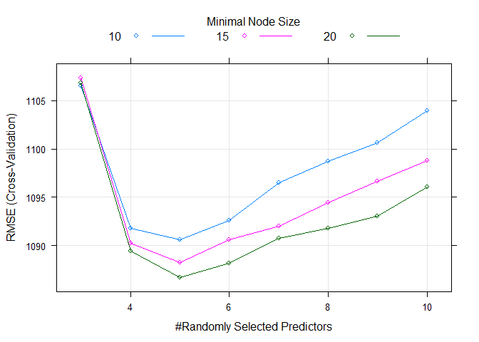<!-- -->

``` r
#plot variable importance
plot(varImp(rf_mod))
```

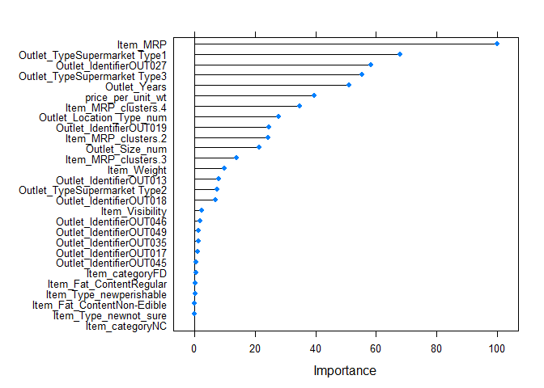<!-- -->

*As expected `Item_MRP` is the most important variable in predicting the
target variable.New features created by us
`price_per_unit_wt`,`Outlet_Years`,`Item_MRP_Clusters`, are also among
the top most important variables.*

#### XGBoost modeling

``` r
## List of parameters for XGBoost modeling
param_list = list(
        
        objective = "reg:linear",
        eta=0.01,
        gamma = 1,
        max_depth=6,
        subsample=0.8,
        colsample_bytree=0.5
        )

## converting train and test into xgb.DMatrix format
dtrain = xgb.DMatrix(data = as.matrix(train[,-c("Item_Identifier", "Item_Outlet_Sales")]), label= train$Item_Outlet_Sales)
dtest = xgb.DMatrix(data = as.matrix(test[,-c("Item_Identifier")]))

## 5-fold cross-validation to find optimal value of nrounds
set.seed(112)
xgbcv = xgb.cv(params = param_list, 
               data = dtrain, 
               nrounds = 1000, 
               nfold = 5, 
               print_every_n = 10, 
               early_stopping_rounds = 30, 
               maximize = F)
```

    ## [1]  train-rmse:2746.276367+7.796122 test-rmse:2746.285889+30.468298 
    ## Multiple eval metrics are present. Will use test_rmse for early stopping.
    ## Will train until test_rmse hasn't improved in 30 rounds.
    ## 
    ## [11] train-rmse:2535.047070+6.995238 test-rmse:2536.429102+29.839241 
    ## [21] train-rmse:2346.301172+4.851986 test-rmse:2349.435205+30.496982 
    ## [31] train-rmse:2177.755078+4.684191 test-rmse:2182.439648+29.677825 
    ## [41] train-rmse:2026.956128+4.743918 test-rmse:2033.433374+28.678839 
    ## [51] train-rmse:1895.825171+4.767625 test-rmse:1904.766968+28.162889 
    ## [61] train-rmse:1778.694629+4.395106 test-rmse:1790.253564+27.855590 
    ## [71] train-rmse:1674.965015+3.043750 test-rmse:1689.331103+27.594949 
    ## [81] train-rmse:1584.170776+2.145427 test-rmse:1601.293017+27.858544 
    ## [91] train-rmse:1505.729858+1.225511 test-rmse:1525.804810+28.282568 
    ## [101]    train-rmse:1436.332300+0.439024 test-rmse:1459.464038+28.210877 
    ## [111]    train-rmse:1375.621997+0.781383 test-rmse:1402.018774+27.639663 
    ## [121]    train-rmse:1323.439746+0.680823 test-rmse:1352.931274+26.824668 
    ## [131]    train-rmse:1278.603833+0.783578 test-rmse:1311.140015+26.187883 
    ## [141]    train-rmse:1239.908154+1.059949 test-rmse:1275.472363+25.332420 
    ## [151]    train-rmse:1206.144580+1.105920 test-rmse:1245.136963+24.815149 
    ## [161]    train-rmse:1177.545386+1.427915 test-rmse:1219.600537+23.876792 
    ## [171]    train-rmse:1152.324072+1.753546 test-rmse:1197.820435+23.089497 
    ## [181]    train-rmse:1131.015552+2.033522 test-rmse:1179.438941+22.719076 
    ## [191]    train-rmse:1112.293286+1.723067 test-rmse:1164.154956+22.283127 
    ## [201]    train-rmse:1095.810010+1.867203 test-rmse:1151.145239+21.795181 
    ## [211]    train-rmse:1081.890479+2.426577 test-rmse:1140.397900+21.237008 
    ## [221]    train-rmse:1069.738941+2.655729 test-rmse:1131.352808+20.743486 
    ## [231]    train-rmse:1058.997290+2.538754 test-rmse:1123.992383+20.406270 
    ## [241]    train-rmse:1049.638403+2.700786 test-rmse:1117.704932+20.291698 
    ## [251]    train-rmse:1041.455249+2.913694 test-rmse:1112.415332+20.025012 
    ## [261]    train-rmse:1034.102783+2.993880 test-rmse:1108.098144+19.571754 
    ## [271]    train-rmse:1027.923828+3.224938 test-rmse:1104.483032+19.310907 
    ## [281]    train-rmse:1022.396643+3.192465 test-rmse:1101.460181+19.073979 
    ## [291]    train-rmse:1017.251575+3.103999 test-rmse:1099.020728+18.889296 
    ## [301]    train-rmse:1012.408862+3.222044 test-rmse:1097.124414+18.706229 
    ## [311]    train-rmse:1008.132813+3.253281 test-rmse:1095.552051+18.463813 
    ## [321]    train-rmse:1003.880945+3.321232 test-rmse:1094.393359+18.325751 
    ## [331]    train-rmse:1000.056189+3.414028 test-rmse:1093.424561+18.163182 
    ## [341]    train-rmse:996.519763+3.498737  test-rmse:1092.670874+18.138258 
    ## [351]    train-rmse:993.122546+3.419885  test-rmse:1091.984814+18.034227 
    ## [361]    train-rmse:989.766833+3.587953  test-rmse:1091.588916+18.054147 
    ## [371]    train-rmse:986.661609+3.532942  test-rmse:1091.165015+18.033108 
    ## [381]    train-rmse:983.873059+3.429625  test-rmse:1090.868482+17.983524 
    ## [391]    train-rmse:980.998621+3.399206  test-rmse:1090.663794+18.067373 
    ## [401]    train-rmse:978.125146+3.493217  test-rmse:1090.532690+18.188006 
    ## [411]    train-rmse:975.490210+3.589566  test-rmse:1090.479004+18.188146 
    ## [421]    train-rmse:972.754883+3.655199  test-rmse:1090.417871+18.169842 
    ## [431]    train-rmse:970.369702+3.807049  test-rmse:1090.489746+18.133451 
    ## [441]    train-rmse:967.675305+3.943630  test-rmse:1090.509204+18.155277 
    ## Stopping. Best iteration:
    ## [414]    train-rmse:974.741711+3.581407  test-rmse:1090.377343+18.217292

``` r
## training XGBoost model at nrounds = 428
xgb_model = xgb.train(data = dtrain, params = param_list, nrounds = 470)

## Variable Importance
var_imp = xgb.importance(feature_names = setdiff(names(train), c("Item_Identifier", "Item_Outlet_Sales")), 
                         model = xgb_model)

xgb.plot.importance(var_imp)
```

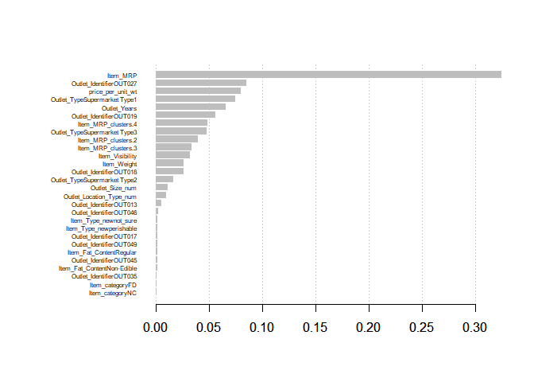<!-- -->

### Model Evaluation

``` r
Model <- c("Linear Regression","Lasso Regression","Ridge Regression","Random Forest","XGBoost")
RMSE_Score <- c(1128,1129,1135,1088,1090)
Model_Evaluation <- data.frame(Model,RMSE_Score)
kable(Model_Evaluation,caption = "A Model Accuracy Evaluation")
```

| Model             | RMSE\_Score |
| :---------------- | ----------: |
| Linear Regression |        1128 |
| Lasso Regression  |        1129 |
| Ridge Regression  |        1135 |
| Random Forest     |        1088 |
| XGBoost           |        1090 |

A Model Accuracy Evaluation

*After trying and testing 5 different algorithms, the best RMSE Score is
achieved by Random Forest Algorithm.*
