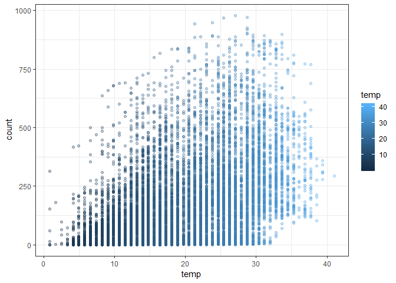
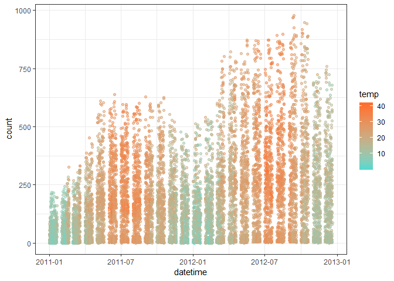
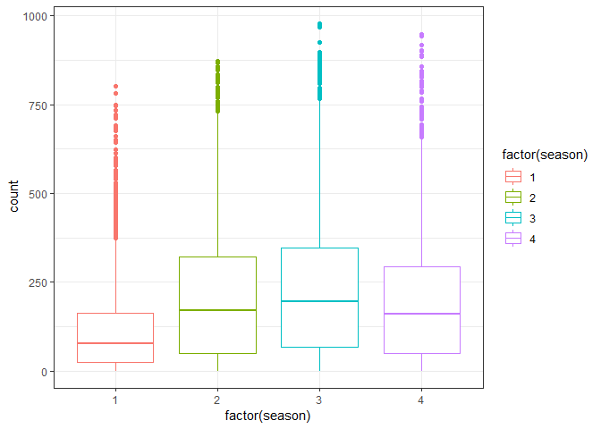
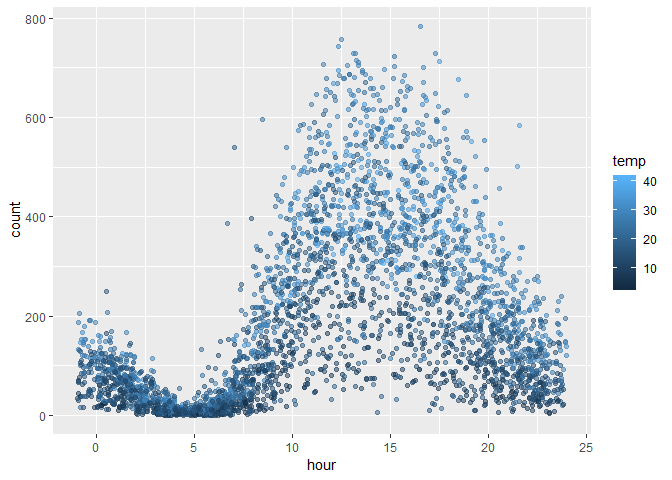
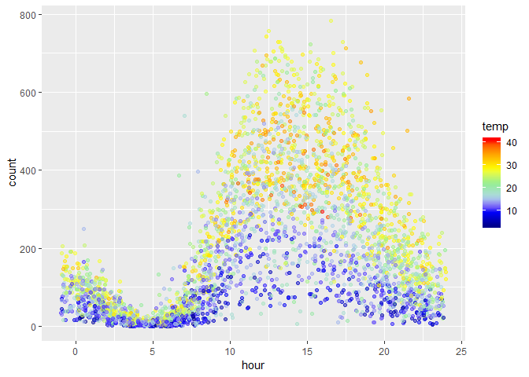
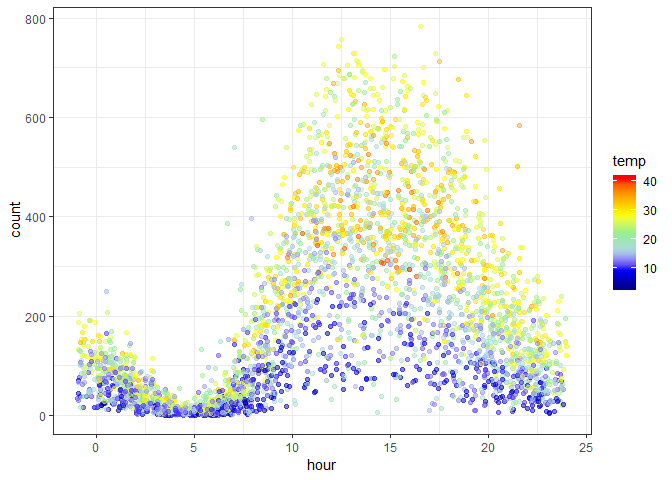

Bike Share Demand Challenge
================
Akash

### IMPORT DATA

``` r
bike <- read.csv("bikeshare.csv")
print(head(bike))
```

    ##              datetime season holiday workingday weather temp  atemp
    ## 1 2011-01-01 00:00:00      1       0          0       1 9.84 14.395
    ## 2 2011-01-01 01:00:00      1       0          0       1 9.02 13.635
    ## 3 2011-01-01 02:00:00      1       0          0       1 9.02 13.635
    ## 4 2011-01-01 03:00:00      1       0          0       1 9.84 14.395
    ## 5 2011-01-01 04:00:00      1       0          0       1 9.84 14.395
    ## 6 2011-01-01 05:00:00      1       0          0       2 9.84 12.880
    ##   humidity windspeed casual registered count
    ## 1       81    0.0000      3         13    16
    ## 2       80    0.0000      8         32    40
    ## 3       80    0.0000      5         27    32
    ## 4       75    0.0000      3         10    13
    ## 5       75    0.0000      0          1     1
    ## 6       75    6.0032      0          1     1

### EXPLORATORY DATA ANALYSIS

#### 1.Count vs temp - Scatterplot

``` r
ggplot(bike,aes(temp,count))+ geom_point(alpha=0.3,aes(color=temp))+theme_bw()
```



#### 2.Count vs Datetime - Scatterplot

``` r
bike$datetime <- as.POSIXct(bike$datetime)
pl <- ggplot(bike,aes(datetime,count))+geom_point(aes(color=temp),alpha=0.5)
```

#### 3.Customize the color using scale\_color\_continous

``` r
pl + scale_color_continuous(low='#55D8CE',high='#FF6E2E')+theme_bw()
```



> 2011 we have less bike rentals and 2012 we have more bike rental trends. Winter bike rental is less and summer bike rentals are more.

### CORRELATIONS

#### Correlation between temp and count

``` r
cor(bike$temp,bike$count)
```

    ## [1] 0.3944536

### BOXPLOT

#### Count vs Season is a factor data

``` r
ggplot(bike,aes(factor(season),count))+geom_boxplot(aes(color=factor(season)))+theme_bw()
```



> More rentals in winter than spring. Highest rentals in summer and fall.

### FEATURE ENGINEERING

#### An "hour" column that takes the hour from the datetime column.

``` r
bike$hour <- sapply(bike$datetime,function(x){format(x,"%H")})
head(bike)
```

    ##              datetime season holiday workingday weather temp  atemp
    ## 1 2011-01-01 00:00:00      1       0          0       1 9.84 14.395
    ## 2 2011-01-01 01:00:00      1       0          0       1 9.02 13.635
    ## 3 2011-01-01 02:00:00      1       0          0       1 9.02 13.635
    ## 4 2011-01-01 03:00:00      1       0          0       1 9.84 14.395
    ## 5 2011-01-01 04:00:00      1       0          0       1 9.84 14.395
    ## 6 2011-01-01 05:00:00      1       0          0       2 9.84 12.880
    ##   humidity windspeed casual registered count hour
    ## 1       81    0.0000      3         13    16   00
    ## 2       80    0.0000      8         32    40   01
    ## 3       80    0.0000      5         27    32   02
    ## 4       75    0.0000      3         10    13   03
    ## 5       75    0.0000      0          1     1   04
    ## 6       75    6.0032      0          1     1   05

#### sapply() and as.numeric to change the hour column to a column of numeric values.

``` r
bike$hour <- sapply(bike$hour,as.numeric)
```

### VISUALIZATIONS

##### 1.Scatterplot - Count vs hour and color scale as temperature

``` r
pl <- ggplot(filter(bike,workingday==0),aes(hour,count))
```

> lowest at in 3 at morning,major bike rental at 6 oclock

#### 2.color scale as temp and jitter with the width at x-axis and we don't add jitter to height

``` r
pl <- pl + geom_point(position=position_jitter(w=1, h=0),aes(color=temp),alpha=0.5)
pl
```



#### extra colorgradients

``` r
pl <- pl + scale_color_gradientn(colours = c('dark blue','blue','light blue','light green','yellow','orange','red'))
pl
```



``` r
pl+theme_bw()
```



### MODEL BUILDING

#### 1.Building Model with Single Feature

``` r
temp.model <- lm(count~temp,bike)
```

#### summary

``` r
summary(temp.model)
```

    ## 
    ## Call:
    ## lm(formula = count ~ temp, data = bike)
    ## 
    ## Residuals:
    ##     Min      1Q  Median      3Q     Max 
    ## -293.32 -112.36  -33.36   78.98  741.44 
    ## 
    ## Coefficients:
    ##             Estimate Std. Error t value Pr(>|t|)    
    ## (Intercept)   6.0462     4.4394   1.362    0.173    
    ## temp          9.1705     0.2048  44.783   <2e-16 ***
    ## ---
    ## Signif. codes:  0 '***' 0.001 '**' 0.01 '*' 0.05 '.' 0.1 ' ' 1
    ## 
    ## Residual standard error: 166.5 on 10884 degrees of freedom
    ## Multiple R-squared:  0.1556, Adjusted R-squared:  0.1555 
    ## F-statistic:  2006 on 1 and 10884 DF,  p-value: < 2.2e-16

> bike rentals if the temperature was 25 degrees Celsius

``` r
temp.test <- data.frame(temp=c(25))
temp.test
```

    ##   temp
    ## 1   25

##### predict

``` r
predict(temp.model,temp.test)
```

    ##        1 
    ## 235.3097

#### 2.Model with all the features

``` r
model <- lm(count~.-casual-registered-datetime-atemp,bike)
```

##### summary

``` r
summary(model)
```

    ## 
    ## Call:
    ## lm(formula = count ~ . - casual - registered - datetime - atemp, 
    ##     data = bike)
    ## 
    ## Residuals:
    ##     Min      1Q  Median      3Q     Max 
    ## -324.61  -96.88  -31.01   55.27  688.83 
    ## 
    ## Coefficients:
    ##              Estimate Std. Error t value Pr(>|t|)    
    ## (Intercept)  46.91369    8.45147   5.551 2.91e-08 ***
    ## season       21.70333    1.35409  16.028  < 2e-16 ***
    ## holiday     -10.29914    8.79069  -1.172    0.241    
    ## workingday   -0.71781    3.14463  -0.228    0.819    
    ## weather      -3.20909    2.49731  -1.285    0.199    
    ## temp          7.01953    0.19135  36.684  < 2e-16 ***
    ## humidity     -2.21174    0.09083 -24.349  < 2e-16 ***
    ## windspeed     0.20271    0.18639   1.088    0.277    
    ## hour          7.61283    0.21688  35.102  < 2e-16 ***
    ## ---
    ## Signif. codes:  0 '***' 0.001 '**' 0.01 '*' 0.05 '.' 0.1 ' ' 1
    ## 
    ## Residual standard error: 147.8 on 10877 degrees of freedom
    ## Multiple R-squared:  0.3344, Adjusted R-squared:  0.3339 
    ## F-statistic:   683 on 8 and 10877 DF,  p-value: < 2.2e-16
