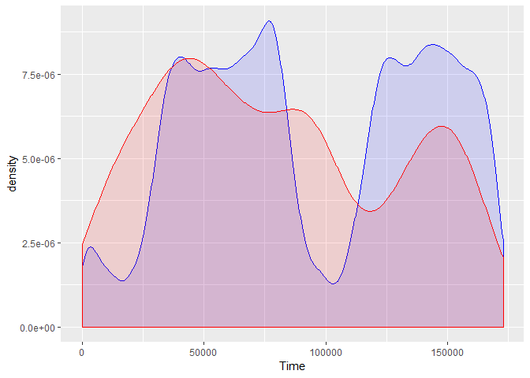
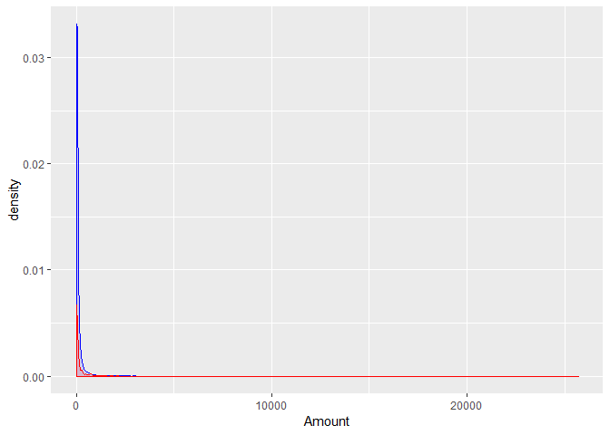

Credit Card Fraud Detection
================
Akash Lamba

### Overview

The datasets contains transactions made by credit cards in September
2013 by european cardholders. This dataset presents transactions that
occurred in two days, where we have 492 frauds out of 284,807
transactions. The dataset is highly unbalanced, the positive class
(frauds) account for 0.172% of all transactions.

It contains only numerical input variables which are the result of a PCA
transformation. Unfortunately, due to confidentiality issues, we cannot
provide the original features and more background information about the
data. Features V1, V2, … V28 are the principal components obtained with
PCA, the only features which have not been transformed with PCA are
‘Time’ and ‘Amount’. Feature ‘Time’ contains the seconds elapsed
between each transaction and the first transaction in the dataset. The
feature ‘Amount’ is the transaction Amount, this feature can be used for
example-dependant cost-senstive learning. Feature ‘Class’ is the
response variable and it takes value 1 in case of fraud and 0 otherwise.

### Loading Packages

``` r
library(pROC)
library(ggplot2)
library(rpart)
library(caret)
library(pROC)
library(MLmetrics)
library(mltools)
library(rpart.plot)
library(randomForest)
library(ROSE)
```

### Import the Dataset

``` r
kccf <- read.csv("creditcard.csv",header=T,sep=",")
str(kccf)
```

    ## 'data.frame':    284807 obs. of  31 variables:
    ##  $ Time  : num  0 0 1 1 2 2 4 7 7 9 ...
    ##  $ V1    : num  -1.36 1.192 -1.358 -0.966 -1.158 ...
    ##  $ V2    : num  -0.0728 0.2662 -1.3402 -0.1852 0.8777 ...
    ##  $ V3    : num  2.536 0.166 1.773 1.793 1.549 ...
    ##  $ V4    : num  1.378 0.448 0.38 -0.863 0.403 ...
    ##  $ V5    : num  -0.3383 0.06 -0.5032 -0.0103 -0.4072 ...
    ##  $ V6    : num  0.4624 -0.0824 1.8005 1.2472 0.0959 ...
    ##  $ V7    : num  0.2396 -0.0788 0.7915 0.2376 0.5929 ...
    ##  $ V8    : num  0.0987 0.0851 0.2477 0.3774 -0.2705 ...
    ##  $ V9    : num  0.364 -0.255 -1.515 -1.387 0.818 ...
    ##  $ V10   : num  0.0908 -0.167 0.2076 -0.055 0.7531 ...
    ##  $ V11   : num  -0.552 1.613 0.625 -0.226 -0.823 ...
    ##  $ V12   : num  -0.6178 1.0652 0.0661 0.1782 0.5382 ...
    ##  $ V13   : num  -0.991 0.489 0.717 0.508 1.346 ...
    ##  $ V14   : num  -0.311 -0.144 -0.166 -0.288 -1.12 ...
    ##  $ V15   : num  1.468 0.636 2.346 -0.631 0.175 ...
    ##  $ V16   : num  -0.47 0.464 -2.89 -1.06 -0.451 ...
    ##  $ V17   : num  0.208 -0.115 1.11 -0.684 -0.237 ...
    ##  $ V18   : num  0.0258 -0.1834 -0.1214 1.9658 -0.0382 ...
    ##  $ V19   : num  0.404 -0.146 -2.262 -1.233 0.803 ...
    ##  $ V20   : num  0.2514 -0.0691 0.525 -0.208 0.4085 ...
    ##  $ V21   : num  -0.01831 -0.22578 0.248 -0.1083 -0.00943 ...
    ##  $ V22   : num  0.27784 -0.63867 0.77168 0.00527 0.79828 ...
    ##  $ V23   : num  -0.11 0.101 0.909 -0.19 -0.137 ...
    ##  $ V24   : num  0.0669 -0.3398 -0.6893 -1.1756 0.1413 ...
    ##  $ V25   : num  0.129 0.167 -0.328 0.647 -0.206 ...
    ##  $ V26   : num  -0.189 0.126 -0.139 -0.222 0.502 ...
    ##  $ V27   : num  0.13356 -0.00898 -0.05535 0.06272 0.21942 ...
    ##  $ V28   : num  -0.0211 0.0147 -0.0598 0.0615 0.2152 ...
    ##  $ Amount: num  149.62 2.69 378.66 123.5 69.99 ...
    ##  $ Class : int  0 0 0 0 0 0 0 0 0 0 ...

### Splitting the Feature Class

``` r
kccf.true <- kccf[kccf$Class==0,] #Fair transaction
kccf.false<- kccf[kccf$Class==1,] #Fraudulent transaction
```

### Exploratory Data Analysis

#### 1.Time Density Plot

``` r
#blue- fair transaction , red - fraud transactions
ggplot()+
  geom_density(data=kccf.true,
               aes(x=Time),color="blue",fill="blue",alpha=0.12)+
  geom_density(data=kccf.false,
               aes(x=Time),color="red",fill="red",alpha=0.12)
```

<!-- -->

*Data was collected for 2 months,In the begining of the first and second
month the real transactions are not so frequent.So there is a fall in
the begining of both the months.Whereas fraudulent transactions go over
almost with equal density throughout the session*

#### 2.Amount density plot

``` r
ggplot()+
  geom_density(data=kccf.true,
               aes(x=Amount),color="blue",fill="blue",alpha=0.12)+
  geom_density(data=kccf.false,
               aes(x=Amount),color="red",fill="red",alpha=0.12)
```

<!-- -->

*Skewed plot right tailed with most of the transactions are of very
small amount whereas the highest transaction goes till almost
$30,000.Most of the transactions happens below 100 dollars that’s why
too skewed.*

``` r
#Taking the log function in use
ggplot()+
  geom_density(data=kccf.true,
               aes(x=log(Amount),color="blue",fill="blue",alpha=0.12))+
  geom_density(data=kccf.false,
               aes(x=log(Amount),color="red",fill="red",alpha=0.12))
```

<!-- -->

*Most of the true transactions are near between 10 scents and 10
dollars. Whereas fraud transactions has highest peak at 10 dollars.*

### Cleaning and Preprocessing

``` r
#Check the missing values in the rows and columns
colnames(kccf)[colSums(is.na(kccf))>0] #null character
```

    ## character(0)

``` r
nrow(kccf[!complete.cases(kccf),])
```

    ## [1] 0

*No Missing Value*

### Conversion to factor

``` r
kccf$Class <- as.factor(kccf$Class)
summary(kccf$Class)
```

    ##      0      1 
    ## 284315    492

### Handling the Imbalance Data

``` r
n_new <- nrow(kccf)
fraction_fraud_new <- 0.5

sampling_result <- ROSE::ovun.sample(Class~., data = kccf, method = "both", N= n_new, p= fraction_fraud_new, seed = 2019)

sampled_credit <- sampling_result$data

table(sampled_credit$Class)
```

    ## 
    ##      0      1 
    ## 142430 142377

## Model Building

  - Decision Tree
  - Random Forest

### Splitting the dataset

``` r
#no. of rows in the data
rows <- nrow(sampled_credit)
#no. of columns in the data
cols <- ncol(sampled_credit)

#Shuffle all the data for unbias 
set.seed(39)
kccf <- sampled_credit[sample(rows),1:cols]

#train-test split
#80% of rows is ntr 
ntr <- as.integer(round(0.8*rows))

#ntr rows to train set
kccf.train <- kccf[1:ntr,1:cols]

#ntr+1 rows to test set and don't include class column
kccf.test <- kccf[(ntr+1):rows,-cols]

#test data with class column
kccf.testc<- kccf[(ntr+1):rows,cols]
kccf.testc <- as.data.frame(kccf.testc)
colnames(kccf.testc)[1]<- c("Class")

#check table
table(kccf.train$Class)
```

    ## 
    ##      0      1 
    ## 113857 113989

### Decision Tree

``` r
#Build model on  train set
kccf.tree <- rpart(Class~.,
                   data=kccf.train,
                   method="class")

#Predictions
kccf.pred <- predict(kccf.tree,kccf.test)

#When 2nd Col probablity greater then 50% declare as fraud
kccf.testc$Pred <- 0L
kccf.testc$Pred[kccf.pred[,2]>0.5]<- 1L
kccf.test$Pred <- factor(kccf.testc$Pred)

#Confustion matrix
library(caret)
confusionMatrix(kccf.test$Pred,kccf.testc$Class,positive = "1")
```

    ## Confusion Matrix and Statistics
    ## 
    ##           Reference
    ## Prediction     0     1
    ##          0 26976  2088
    ##          1  1597 26300
    ##                                           
    ##                Accuracy : 0.9353          
    ##                  95% CI : (0.9333, 0.9373)
    ##     No Information Rate : 0.5016          
    ##     P-Value [Acc > NIR] : < 2.2e-16       
    ##                                           
    ##                   Kappa : 0.8706          
    ##                                           
    ##  Mcnemar's Test P-Value : 6.92e-16        
    ##                                           
    ##             Sensitivity : 0.9264          
    ##             Specificity : 0.9441          
    ##          Pos Pred Value : 0.9428          
    ##          Neg Pred Value : 0.9282          
    ##              Prevalence : 0.4984          
    ##          Detection Rate : 0.4617          
    ##    Detection Prevalence : 0.4898          
    ##       Balanced Accuracy : 0.9353          
    ##                                           
    ##        'Positive' Class : 1               
    ## 

``` r
#Performance Metrics :

#Ordered Factors
kccf.testc$Class <- ordered(kccf.testc$Class,levels=c("0","1"))
kccf.testc$Pred <- ordered(kccf.testc$Pred,levels=c("0","1"))

#AUC=0.8931 Accuracy
auc(kccf.testc$Class,kccf.testc$Pred,positive = "1")
```

    ## Area under the curve: 0.9353

``` r
#Other Metrics (MCC or F-score)
precision(kccf.testc$Class,kccf.testc$Pred,positive="1")
```

    ## [1] 0.9441081

``` r
Recall(kccf.testc$Class,kccf.testc$Pred,positive ="1" )
```

    ## [1] 0.9264478

``` r
F1_Score(kccf.testc$Class,kccf.testc$Pred,positive ="1")
```

    ## [1] 0.9345296

``` r
#Mathews Correlation Coefficient
mcc(kccf.testc$Class,kccf.testc$Pred)
```

    ## [1] 0.870734

``` r
#View Results graphically
library(rpart.plot)
rpart.plot(kccf.tree,cex=0.66,extra=3,
           type=5,box.palette = "BuRd")
```

<!-- -->

### Random Forest

``` r
#ntr=training data (49% of training data)
samp <- as.integer(0.49*ntr)
kccf.rF <- randomForest(Class~.,
                        data=kccf.train,
                        importance=TRUE,
                        ntree=40,
                        samplesize=samp,
                        maxnodes=44)

#Predictions (on test data)
kccf.pred <- predict(kccf.rF,kccf.test)
kccf.testc$Pred <- kccf.pred

#Performance Metrics : (AUC-ROC) & TP/FN...
#Accuracy = 0.8932
confusionMatrix(kccf.testc$Pred,kccf.testc$Class,positive = "1")
```

    ## Confusion Matrix and Statistics
    ## 
    ##           Reference
    ## Prediction     0     1
    ##          0 28503  1390
    ##          1    70 26998
    ##                                          
    ##                Accuracy : 0.9744         
    ##                  95% CI : (0.973, 0.9757)
    ##     No Information Rate : 0.5016         
    ##     P-Value [Acc > NIR] : < 2.2e-16      
    ##                                          
    ##                   Kappa : 0.9487         
    ##                                          
    ##  Mcnemar's Test P-Value : < 2.2e-16      
    ##                                          
    ##             Sensitivity : 0.9510         
    ##             Specificity : 0.9976         
    ##          Pos Pred Value : 0.9974         
    ##          Neg Pred Value : 0.9535         
    ##              Prevalence : 0.4984         
    ##          Detection Rate : 0.4740         
    ##    Detection Prevalence : 0.4752         
    ##       Balanced Accuracy : 0.9743         
    ##                                          
    ##        'Positive' Class : 1              
    ## 

``` r
#Ordered Factors
kccf.testc$Class <- ordered(kccf.testc$Class,levels=c("0","1"))
kccf.testc$Pred <- ordered(kccf.testc$Pred,levels=c("0","1"))

#AUC=0.9029 Accuracy
auc(kccf.testc$Class,kccf.testc$Pred,positive="1")
```

    ## Area under the curve: 0.9743

``` r
#Other Metrics (MCC or F-score)
precision(kccf.testc$Class,kccf.testc$Pred,positive="1")
```

    ## [1] 0.9975501

``` r
Recall(kccf.testc$Class,kccf.testc$Pred,positive ="1" )
```

    ## [1] 0.9510356

``` r
F1_Score(kccf.testc$Class,kccf.testc$Pred,positive ="1")
```

    ## [1] 0.9736728

``` r
#Mathews Correlation Coefficient
mcc(kccf.testc$Class,kccf.testc$Pred)
```

    ## [1] 0.9497495

### Best Model

*Random Forest model has a higher accuracy compared to decision trees
for this model.*
