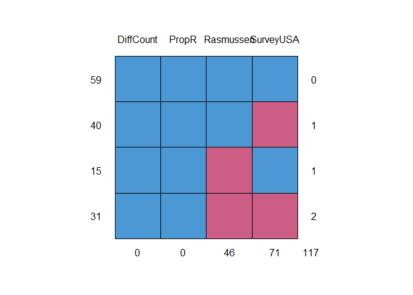

Election Forecasting : Predicting the Winner Before any Votes are Cast
================
Akash Lamba

-   [Overview](#overview)
-   [The Dataset](#the-dataset)
-   [Goal](#goal)
-   [Loading Packages](#loading-packages)
-   [Importing The Dataset](#importing-the-dataset)
-   [Taking a glance at the data](#taking-a-glance-at-the-data)
-   [Head](#head)
-   [Summary](#summary)
-   [Structure](#structure)
-   [Cleaning The Data](#cleaning-the-data)
-   [Data partitioning](#data-partitioning)
-   [Baseline Model](#baseline-model)
-   [Correlation Matrix](#correlation-matrix)
-   [Model Building](#model-building)

### Overview

-   A president is Elected after every four years.
-   Generally, only two competitive candidates :
    -   1.  Republican

    -   1.  Democratic

-   The United States has 50 States.Candidate with the most votes in a state gets all its electoral Votes.
-   Candidate with most electoral votes win the election.


### The Dataset

-   Data is taken from <http://RealClearPolitics.com>.
-   Instances represent a state in a given election:
    -   **State**: Name of state
    -   **Year**: Election Year(2004,2008,2012)
-   **Dependent Variable**
    -   **Republican**: 1 if *Republican* won state,0 if *Democrat* won
-   **Independent Variables**
    -   **Rasmussen**,**SurveyUSA** : Polled R% - Polled D%
    -   **DiffCount**: Polls with R winner - Plls with D winner
    -   **PropR**: Polls with R winner / \#Polls

### Goal

-   We will be using the polling data from the months leading upto a presidential Election to predict that election's winner.
-   We'll build a Logistic Regression Model.
-   We will select the variables to be included in these models and Evaluate the model predictions.

### Loading Packages

``` r
library(caTools)# Splitting
library(caret)# Machine Learning
library(knitr)# Table Building
library(mice)#Imputation Method
library(lattice)#Plotting graphics
library(MASS)#StepAIC
library(car)#VIF
library(psych)#Correlation Matrix
```

### Importing The Dataset

``` r
#Reading the data
polling<-read.csv("PollingData.csv")
```

### Taking a glance at the data

Lets check the first 6 rows as well as the summary statistics of our data to get a feel of how the data looks.

### Head

``` r
head(polling)
```

    ##     State Year Rasmussen SurveyUSA DiffCount PropR Republican
    ## 1 Alabama 2004        11        18         5     1          1
    ## 2 Alabama 2008        21        25         5     1          1
    ## 3  Alaska 2004        NA        NA         1     1          1
    ## 4  Alaska 2008        16        NA         6     1          1
    ## 5 Arizona 2004         5        15         8     1          1
    ## 6 Arizona 2008         5        NA         9     1          1

### Summary

``` r
summary(polling)
```

    ##          State          Year        Rasmussen          SurveyUSA       
    ##  Arizona    :  3   Min.   :2004   Min.   :-41.0000   Min.   :-33.0000  
    ##  Arkansas   :  3   1st Qu.:2004   1st Qu.: -8.0000   1st Qu.:-11.7500  
    ##  California :  3   Median :2008   Median :  1.0000   Median : -2.0000  
    ##  Colorado   :  3   Mean   :2008   Mean   :  0.0404   Mean   : -0.8243  
    ##  Connecticut:  3   3rd Qu.:2012   3rd Qu.:  8.5000   3rd Qu.:  8.0000  
    ##  Florida    :  3   Max.   :2012   Max.   : 39.0000   Max.   : 30.0000  
    ##  (Other)    :127                  NA's   :46         NA's   :71        
    ##    DiffCount           PropR          Republican    
    ##  Min.   :-19.000   Min.   :0.0000   Min.   :0.0000  
    ##  1st Qu.: -6.000   1st Qu.:0.0000   1st Qu.:0.0000  
    ##  Median :  1.000   Median :0.6250   Median :1.0000  
    ##  Mean   : -1.269   Mean   :0.5259   Mean   :0.5103  
    ##  3rd Qu.:  4.000   3rd Qu.:1.0000   3rd Qu.:1.0000  
    ##  Max.   : 11.000   Max.   :1.0000   Max.   :1.0000  
    ## 

### Structure

``` r
str(polling)
```

    ## 'data.frame':    145 obs. of  7 variables:
    ##  $ State     : Factor w/ 50 levels "Alabama","Alaska",..: 1 1 2 2 3 3 3 4 4 4 ...
    ##  $ Year      : int  2004 2008 2004 2008 2004 2008 2012 2004 2008 2012 ...
    ##  $ Rasmussen : int  11 21 NA 16 5 5 8 7 10 NA ...
    ##  $ SurveyUSA : int  18 25 NA NA 15 NA NA 5 NA NA ...
    ##  $ DiffCount : int  5 5 1 6 8 9 4 8 5 2 ...
    ##  $ PropR     : num  1 1 1 1 1 ...
    ##  $ Republican: int  1 1 1 1 1 1 1 1 1 1 ...

### Cleaning The Data

-   We will use Multiple Imputation by Chained Equations (MICE) Package.

-   We're going to create a new data frame called **simple**, which is limited to just the four polling related variables ie. Rasmussen, SurveyUSA, PropR, and DiffCount.

``` r
simple<-polling[c("Rasmussen","SurveyUSA","DiffCount","PropR")]
#summary
summary(simple)
```

    ##    Rasmussen          SurveyUSA          DiffCount           PropR       
    ##  Min.   :-41.0000   Min.   :-33.0000   Min.   :-19.000   Min.   :0.0000  
    ##  1st Qu.: -8.0000   1st Qu.:-11.7500   1st Qu.: -6.000   1st Qu.:0.0000  
    ##  Median :  1.0000   Median : -2.0000   Median :  1.000   Median :0.6250  
    ##  Mean   :  0.0404   Mean   : -0.8243   Mean   : -1.269   Mean   :0.5259  
    ##  3rd Qu.:  8.5000   3rd Qu.:  8.0000   3rd Qu.:  4.000   3rd Qu.:1.0000  
    ##  Max.   : 39.0000   Max.   : 30.0000   Max.   : 11.000   Max.   :1.0000  
    ##  NA's   :46         NA's   :71

#### Imputation

-   A new data frame called **imputed** is created, by using the function **complete** and **mice**.
-   Output will show that five rounds of imputation have been run, and now all of the variables have been filled in.
-   Look at the summary of **Imputed**, **Rasmussen** and **SurveyUSA** both have no more of those NA or missing values.

``` r
#md.pattern()
#blue - no missing values, red - missing values
md.pattern(simple)
```



    ##    DiffCount PropR Rasmussen SurveyUSA    
    ## 59         1     1         1         1   0
    ## 40         1     1         1         0   1
    ## 15         1     1         0         1   1
    ## 31         1     1         0         0   2
    ##            0     0        46        71 117

``` r
#Seed Set
set.seed(144)
#mice()
imputed <- complete(mice(simple))
```

    ## 
    ##  iter imp variable
    ##   1   1  Rasmussen  SurveyUSA
    ##   1   2  Rasmussen  SurveyUSA
    ##   1   3  Rasmussen  SurveyUSA
    ##   1   4  Rasmussen  SurveyUSA
    ##   1   5  Rasmussen  SurveyUSA
    ##   2   1  Rasmussen  SurveyUSA
    ##   2   2  Rasmussen  SurveyUSA
    ##   2   3  Rasmussen  SurveyUSA
    ##   2   4  Rasmussen  SurveyUSA
    ##   2   5  Rasmussen  SurveyUSA
    ##   3   1  Rasmussen  SurveyUSA
    ##   3   2  Rasmussen  SurveyUSA
    ##   3   3  Rasmussen  SurveyUSA
    ##   3   4  Rasmussen  SurveyUSA
    ##   3   5  Rasmussen  SurveyUSA
    ##   4   1  Rasmussen  SurveyUSA
    ##   4   2  Rasmussen  SurveyUSA
    ##   4   3  Rasmussen  SurveyUSA
    ##   4   4  Rasmussen  SurveyUSA
    ##   4   5  Rasmussen  SurveyUSA
    ##   5   1  Rasmussen  SurveyUSA
    ##   5   2  Rasmussen  SurveyUSA
    ##   5   3  Rasmussen  SurveyUSA
    ##   5   4  Rasmussen  SurveyUSA
    ##   5   5  Rasmussen  SurveyUSA

``` r
#summary
summary(imputed)
```

    ##    Rasmussen         SurveyUSA         DiffCount           PropR       
    ##  Min.   :-41.000   Min.   :-33.000   Min.   :-19.000   Min.   :0.0000  
    ##  1st Qu.: -8.000   1st Qu.:-11.000   1st Qu.: -6.000   1st Qu.:0.0000  
    ##  Median :  3.000   Median :  1.000   Median :  1.000   Median :0.6250  
    ##  Mean   :  2.062   Mean   :  1.138   Mean   : -1.269   Mean   :0.5259  
    ##  3rd Qu.: 12.000   3rd Qu.: 16.000   3rd Qu.:  4.000   3rd Qu.:1.0000  
    ##  Max.   : 39.000   Max.   : 30.000   Max.   : 11.000   Max.   :1.0000

-   Copy the **Rasmussen** and **SurveyUSA** variables back into our original **polling** data frame, which has all the variables for the problem.

``` r
#Copy back into polling dataframe
polling$Rasmussen <- imputed$Rasmussen
polling$SurveyUSA <- imputed$SurveyUSA
#summary
summary(polling)
```

    ##          State          Year        Rasmussen         SurveyUSA      
    ##  Arizona    :  3   Min.   :2004   Min.   :-41.000   Min.   :-33.000  
    ##  Arkansas   :  3   1st Qu.:2004   1st Qu.: -8.000   1st Qu.:-11.000  
    ##  California :  3   Median :2008   Median :  3.000   Median :  1.000  
    ##  Colorado   :  3   Mean   :2008   Mean   :  2.062   Mean   :  1.138  
    ##  Connecticut:  3   3rd Qu.:2012   3rd Qu.: 12.000   3rd Qu.: 16.000  
    ##  Florida    :  3   Max.   :2012   Max.   : 39.000   Max.   : 30.000  
    ##  (Other)    :127                                                     
    ##    DiffCount           PropR          Republican    
    ##  Min.   :-19.000   Min.   :0.0000   Min.   :0.0000  
    ##  1st Qu.: -6.000   1st Qu.:0.0000   1st Qu.:0.0000  
    ##  Median :  1.000   Median :0.6250   Median :1.0000  
    ##  Mean   : -1.269   Mean   :0.5259   Mean   :0.5103  
    ##  3rd Qu.:  4.000   3rd Qu.:1.0000   3rd Qu.:1.0000  
    ##  Max.   : 11.000   Max.   :1.0000   Max.   :1.0000  
    ## 

### Data partitioning

``` r
set.seed(123)
#Splitting
training_set = subset(polling,Year== 2004| Year==2008)
test_set = subset(polling,Year == 2012)
```

### Baseline Model

-   We're going to use a function called the **sign** function.
-   If we passed the **Rasmussen** variable into sign, whenever the **Republican** was winning the state, meaning Rasmussen is positive, it's going to return a "1".
-   If the **Democrat** is leading in the **Rasmussen** poll, it'll take on a negative value. So "-1" means this smart baseline is predicting that the Democrat won the state.
-   Finally, if the **Rasmussen** poll had a tie, it would return a "0", saying that the model is inconclusive about who's going to win the state.

``` r
#sign function()
train_class <- sign(training_set$Rasmussen)
#confusion matrix
table(training_set$Republican,train_class)
```

    ##    train_class
    ##     -1  0  1
    ##   0 42  1  4
    ##   1  0  1 52

The smart baseline predicted 56 wins for Republican, 42 for Democrats and 2 inconclusive.

### Correlation Matrix

``` r
cor(training_set[c("Rasmussen","SurveyUSA","DiffCount","PropR","Republican")])
```

    ##            Rasmussen SurveyUSA DiffCount     PropR Republican
    ## Rasmussen  1.0000000 0.8991487 0.5094553 0.8399944  0.7965625
    ## SurveyUSA  0.8991487 1.0000000 0.5619011 0.8793327  0.8199068
    ## DiffCount  0.5094553 0.5619011 1.0000000 0.8273785  0.8092777
    ## PropR      0.8399944 0.8793327 0.8273785 1.0000000  0.9484204
    ## Republican 0.7965625 0.8199068 0.8092777 0.9484204  1.0000000

-   PropR is highly correlated with the Dependent Variable Republican.So,We can use this in our Single variable Model.
-   DiffCount and Ramussen,DiffCount and SurveyUSA are least correlated Independent Variables. So, We can use one of them in our Two Variable Model.

### Model Building

#### One Variable Model

-   We will use the one variable that is most highly correlated with the outcome, Republican.
-   We will call this model mod1.
-   We will make predictions on the training set using the mod1 model.
-   See the outcome measures of the prediction with threshold=0.5

``` r
mod1 <- glm(Republican~PropR,data=training_set,family = "binomial")
summary(mod1)
```

    ## 
    ## Call:
    ## glm(formula = Republican ~ PropR, family = "binomial", data = training_set)
    ## 
    ## Deviance Residuals: 
    ##      Min        1Q    Median        3Q       Max  
    ## -2.22880  -0.06541   0.10260   0.10260   1.37392  
    ## 
    ## Coefficients:
    ##             Estimate Std. Error z value Pr(>|z|)    
    ## (Intercept)   -6.146      1.977  -3.108 0.001882 ** 
    ## PropR         11.390      3.153   3.613 0.000303 ***
    ## ---
    ## Signif. codes:  0 '***' 0.001 '**' 0.01 '*' 0.05 '.' 0.1 ' ' 1
    ## 
    ## (Dispersion parameter for binomial family taken to be 1)
    ## 
    ##     Null deviance: 138.269  on 99  degrees of freedom
    ## Residual deviance:  15.772  on 98  degrees of freedom
    ## AIC: 19.772
    ## 
    ## Number of Fisher Scoring iterations: 8

#### Prediction on Training Set

``` r
#Predicition on training set
pred1 <- predict(mod1,type="response")
#Confustion matrix
table(training_set$Republican,pred1>=0.5)
```

    ##    
    ##     FALSE TRUE
    ##   0    45    2
    ##   1     2   51

Our model has done 4 mistakes and The accuracy of this model is close to that of our smart baseline model. We will improve our model by adding one more variable.

#### Two Variable Model

-   We will Choose 2 variables which have the least multi-collinearity.
-   We'll call it mod2.
-   We will make predictions on the training set using this model.
-   See the outcome measures of the prediction with threshold=0.5

``` r
mod2 <- glm(Republican~DiffCount + SurveyUSA,data=training_set,family = "binomial")
summary(mod2)
```

    ## 
    ## Call:
    ## glm(formula = Republican ~ DiffCount + SurveyUSA, family = "binomial", 
    ##     data = training_set)
    ## 
    ## Deviance Residuals: 
    ##      Min        1Q    Median        3Q       Max  
    ## -2.21833  -0.03179   0.02993   0.10982   1.39666  
    ## 
    ## Coefficients:
    ##             Estimate Std. Error z value Pr(>|z|)  
    ## (Intercept)  -0.5020     0.9029  -0.556   0.5782  
    ## DiffCount     0.6778     0.3502   1.935   0.0529 .
    ## SurveyUSA     0.1897     0.1056   1.796   0.0724 .
    ## ---
    ## Signif. codes:  0 '***' 0.001 '**' 0.01 '*' 0.05 '.' 0.1 ' ' 1
    ## 
    ## (Dispersion parameter for binomial family taken to be 1)
    ## 
    ##     Null deviance: 138.269  on 99  degrees of freedom
    ## Residual deviance:  15.374  on 97  degrees of freedom
    ## AIC: 21.374
    ## 
    ## Number of Fisher Scoring iterations: 8

AIC value of model 2 is much lower than AIC of model 1.

#### Predictions on the Training Set

``` r
#Predictions
pred2<- predict(mod2,type="response")
#Confusion Matrix
table(training_set$Republican,pred2>=0.5)
```

    ##    
    ##     FALSE TRUE
    ##   0    44    3
    ##   1     2   51

We made only 3 mistakes which is better than the previous smart baseline model.

#### Baseline Model for the Test Set

``` r
table(test_set$Republican,sign(test_set$Rasmussen))
```

    ##    
    ##     -1  0  1
    ##   0 18  2  4
    ##   1  0  0 21

The smart baseline predicted 21 wins for Republican, 18 for Democrats and 2 inconclusive.

#### Prediction on the Test Set using the Two Variable Model

-   Now make predictions using mod2 model.
-   We will call it TestPrediction.
-   Calculate the outcome measures for these predictions for t=0.5.
-   There is no sense in using the ROC curve for various thresholds, as there is no priority of one type of error over another.
-   We are only concerned about accuracy.

``` r
# Prediction on the Test Set using the Two Variable Model
TestPrediction <- predict(mod2,newdata = test_set,type="response")
#ConfusionMatrix
table(test_set$Republican,TestPrediction>=0.5)
```

    ##    
    ##     FALSE TRUE
    ##   0    23    1
    ##   1     0   21

We can see that there is only 1 mistake and Overall, the model is outperforming the smart baseline model.
