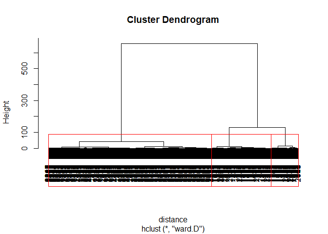
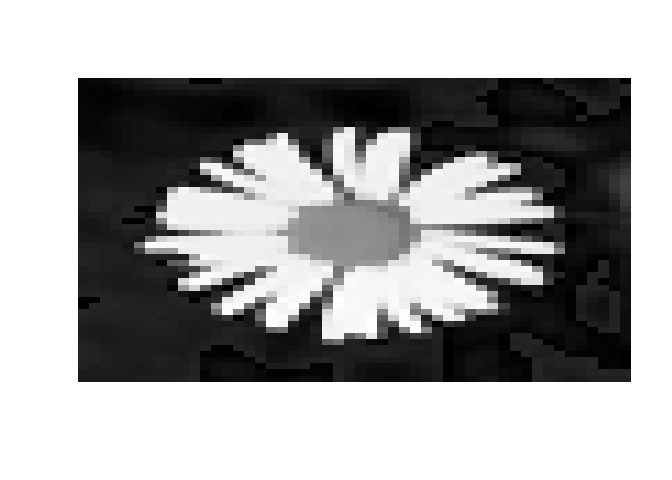

Flower Image Segmentation
================
Akash Lamba

-   [Overview](#overview)
-   [Importing The Data](#importing-the-data)
-   [Structure](#structure)
-   [Hierarchical Clustering](#hierarchical-clustering)
-   [Image Segmentation](#image-segmentation)

### Overview

-   The dataset contains the matrix of pixels intensities of Flower Image.
-   We will use the Clustering technique to Partition the image on the basis of differences in pixel colors,intensity or texture.
-   We will deal with the Gray Scale Images which is represented as matrix of pixel intensity values ranging from 0(Black) to 1(White).
-   The number of rows represent the width of the image and the number columns represents the height of the image.
-   For an instance, if we look below in the gray scale image we have 7x7 pixels :


-   Gray Scale Image Segmentation is done by clustering the pixel values according to their intensity values.So, We can think like our clustering algorithm will cluster the pixels into different intervals as per their intensity values.
-   For an instance, We can see in the below image that the red cluster represents the darkest shades and the green cluster to the lightest.


-   A crucial step is to modify our matrix structure and lump all the intensity values into a single vector. We can easily do this by `as.vector()` function in r.Once we have the vector we can feed it to the clustering algorithm and assign each element to a cluster.

### Importing The Data

``` r
flower <- read.csv("flower.csv",header = FALSE)
```

### Structure

``` r
str(flower)
```

    ## 'data.frame':    50 obs. of  50 variables:
    ##  $ V1 : num  0.0991 0.0991 0.1034 0.1034 0.1034 ...
    ##  $ V2 : num  0.112 0.108 0.112 0.116 0.108 ...
    ##  $ V3 : num  0.134 0.116 0.121 0.116 0.112 ...
    ##  $ V4 : num  0.138 0.138 0.121 0.121 0.112 ...
    ##  $ V5 : num  0.138 0.134 0.125 0.116 0.112 ...
    ##  $ V6 : num  0.138 0.129 0.121 0.108 0.112 ...
    ##  $ V7 : num  0.129 0.116 0.103 0.108 0.112 ...
    ##  $ V8 : num  0.116 0.103 0.103 0.103 0.116 ...
    ##  $ V9 : num  0.1121 0.0991 0.1078 0.1121 0.1164 ...
    ##  $ V10: num  0.121 0.108 0.112 0.116 0.125 ...
    ##  $ V11: num  0.134 0.125 0.129 0.134 0.129 ...
    ##  $ V12: num  0.147 0.134 0.138 0.129 0.138 ...
    ##  $ V13: num  0.000862 0.146552 0.142241 0.142241 0.133621 ...
    ##  $ V14: num  0.000862 0.000862 0.142241 0.133621 0.12931 ...
    ##  $ V15: num  0.142 0.142 0.134 0.121 0.116 ...
    ##  $ V16: num  0.125 0.125 0.116 0.108 0.108 ...
    ##  $ V17: num  0.1121 0.1164 0.1078 0.0991 0.0991 ...
    ##  $ V18: num  0.108 0.112 0.108 0.108 0.108 ...
    ##  $ V19: num  0.121 0.129 0.125 0.116 0.116 ...
    ##  $ V20: num  0.138 0.129 0.125 0.116 0.116 ...
    ##  $ V21: num  0.138 0.134 0.121 0.125 0.125 ...
    ##  $ V22: num  0.134 0.129 0.125 0.121 0.103 ...
    ##  $ V23: num  0.125 0.1207 0.1164 0.1164 0.0819 ...
    ##  $ V24: num  0.1034 0.1034 0.0991 0.0991 0.1034 ...
    ##  $ V25: num  0.0948 0.0905 0.0905 0.1034 0.125 ...
    ##  $ V26: num  0.0862 0.0862 0.0991 0.125 0.1422 ...
    ##  $ V27: num  0.086207 0.086207 0.103448 0.12931 0.000862 ...
    ##  $ V28: num  0.0991 0.1078 0.1164 0.1293 0.1466 ...
    ##  $ V29: num  0.116 0.134 0.134 0.121 0.142 ...
    ##  $ V30: num  0.121 0.138 0.142 0.129 0.138 ...
    ##  $ V31: num  0.121 0.134 0.142 0.134 0.129 ...
    ##  $ V32: num  0.116 0.134 0.129 0.116 0.112 ...
    ##  $ V33: num  0.108 0.112 0.116 0.108 0.108 ...
    ##  $ V34: num  0.1078 0.1078 0.1034 0.0991 0.1034 ...
    ##  $ V35: num  0.1078 0.1034 0.0991 0.0991 0.0991 ...
    ##  $ V36: num  0.1078 0.1034 0.1034 0.0905 0.0862 ...
    ##  $ V37: num  0.1078 0.1078 0.1034 0.0819 0.0733 ...
    ##  $ V38: num  0.0948 0.0991 0.0776 0.069 0.0733 ...
    ##  $ V39: num  0.0733 0.056 0.0474 0.0474 0.056 ...
    ##  $ V40: num  0.0474 0.0388 0.0431 0.0474 0.0603 ...
    ##  $ V41: num  0.0345 0.0345 0.0388 0.0474 0.0647 ...
    ##  $ V42: num  0.0259 0.0259 0.0345 0.0431 0.056 ...
    ##  $ V43: num  0.0259 0.0259 0.0388 0.0517 0.0603 ...
    ##  $ V44: num  0.0302 0.0302 0.0345 0.0517 0.0603 ...
    ##  $ V45: num  0.0259 0.0259 0.0259 0.0388 0.0474 ...
    ##  $ V46: num  0.0259 0.0172 0.0172 0.0259 0.0345 ...
    ##  $ V47: num  0.01724 0.01724 0.00862 0.02155 0.02586 ...
    ##  $ V48: num  0.0216 0.0129 0.0129 0.0172 0.0302 ...
    ##  $ V49: num  0.0216 0.0216 0.0216 0.0345 0.0603 ...
    ##  $ V50: num  0.0302 0.0345 0.0388 0.0603 0.0776 ...

-   We can see that the way the data is stored doesn't reflect the intensity values.So, We need to convert this dataframe into a matrix using `as.matrix()` function.

``` r
flowerMatrix<- as.matrix(flower)
str(flowerMatrix)
```

    ##  num [1:50, 1:50] 0.0991 0.0991 0.1034 0.1034 0.1034 ...
    ##  - attr(*, "dimnames")=List of 2
    ##   ..$ : NULL
    ##   ..$ : chr [1:50] "V1" "V2" "V3" "V4" ...

*We can see that now we have 50 rows and 50 columns in our matrix which represent a resolution 50 pixels in width and 50 pixels in height.*

-   To perform the cluster analysis we will need to convert this matrix of intensity values into vectors of intensity values ranging from 0 to 1.

``` r
flowerVector <- as.vector(flowerMatrix)
str(flowerVector)
```

    ##  num [1:2500] 0.0991 0.0991 0.1034 0.1034 0.1034 ...

*We have 2,500 numerical values, which ranges between 0 and 1.*

### Hierarchical Clustering

#### Distance

-   The distance matrix will compute the pairwise distances between allthe intensity values in our `flowerVector`.

``` r
distance <- dist(flowerVector,method='euclidean')
```

#### Clustering

-   We will cluster all the intesity values using the hierarchical clustering technique.

``` r
clusterIntensity <- hclust(distance,method = 'ward')
```

    ## The "ward" method has been renamed to "ward.D"; note new "ward.D2"

``` r
plot(clusterIntensity)
rect.hclust(clusterIntensity,k=3,border="red")
```



*We can see our 3 clusters in the red rectangle.*

-   Now we will split our data into these 3 clusters using the `cutree()` function.

``` r
flowerCluster <- cutree(clusterIntensity,k=3)
tapply(flowerVector,flowerCluster,mean)
```

    ##          1          2          3 
    ## 0.08574315 0.50826255 0.93147713

*The first cluster shows the mean intensity value of 0.08,which corresponds to the darkest shade in our image and then the third cluster whose mean intensity value is closest to 1, corresponds to the fairest shade.*

### Image Segmentation

-   We can output an image using the `image()` function in R which takes a matrix as an input.
-   So, We need to convert the `floweVector` into a matrix. We can do this by setting the dimension of this variable using the `dimension()` function.

``` r
#Image resolution is 50x50 pixels
dim(flowerCluster) <- c(50,50)
image(flowerCluster,axes=FALSE)
```


*The darkest shade corresponds to the background,which is associated with the first cluster. The one in the middle is the core of the flower which corresponds to the second cluster and then the petals corresponds to the cluster 3 which has the fairest shade in our image.*

-   Now let us compare this segmented image with the original image.

``` r
image(flowerMatrix,axes=FALSE,col=grey(seq(0,1,length=256)))
```


