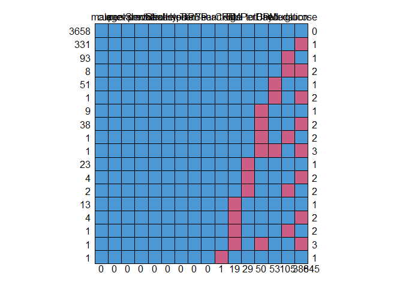
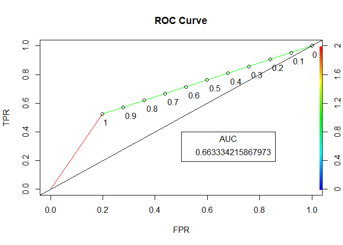

Framingham Heart Study
================
Akash Lamba

-   [Overview](#overview)
-   [Importing The Data](#importing-the-data)
-   [Loading Packages](#loading-packages)
-   [Factor Conversion](#factor-conversion)
-   [Date Cleaning Using MICE Package](#date-cleaning-using-mice-package)
-   [Splitting](#splitting)
-   [Modelling](#modelling)
-   [Logistic Regression](#logistic-regression)

### Overview

We have data for 4,240 patients and 16 variables.The last variable is the outcome or dependent variable, whether or not the patient developed CHD in the next 10 years.

Framingham Heart study dataset includes :

demographic risk factors:

**sex**: male or female
**age**: age of the patient **education**: levels coded 1 for some high school, 2 for a high school diploma or GED, 3 for some college or vocational school, and 4 for a college degree.

The data set also includes behavioral risk factors associated with Smoking:

**currentSmoker**: whether or not the patient is a current smoker
**cigsPerDay**: the number of cigarettes that the person smoked on average in one day.

Medical history risk factors:

**BPMeds**: whether or not the patient was on blood pressure medication
**prevalentStroke**: whether or not the patient had previously had a stroke
**prevalentHyp**: whether or not the patient was hypertensive
**diabetes**: whether or not the patient had diabetes

Risk factors from the first physical examination of the patient:

**totChol**: total cholesterol level
**sysBP**: systolic blood pressure
**diaBP**: diastolic blood pressure
**BMI**: Body Mass Index
**heartRate**: heart rate
**glucose**: glucose level
**TenYearCHD**: 10 year risk of coronary heart disease CHD

### Importing The Data

``` r
framingham <- read.csv("framingham.csv")
```

### Loading Packages

``` r
library(caTools)
library(caret)
library(ROCR)
library(MASS)
library(mice)
```

### Factor Conversion

``` r
#Converting into categorical variables
framingham$male <- factor(framingham$male)
framingham$education <- factor(framingham$education)
framingham$currentSmoker <- factor(framingham$currentSmoker)
framingham$BPMeds <- factor(framingham$BPMeds)
framingham$prevalentHyp <- factor(framingham$prevalentHyp)
framingham$diabetes <- factor(framingham$diabetes)
framingham$prevalentStroke<- factor(framingham$prevalentStroke)
```

### Date Cleaning Using MICE Package

``` r
#md.pattern to check the plot
missing <- md.pattern(framingham)
```



``` r
View(missing)

#Remove missing values using Imputation
imp_mice <- mice(framingham,seed=144,m=5,maxit = 10)
```

    ## 
    ##  iter imp variable
    ##   1   1  education  cigsPerDay  BPMeds  totChol  BMI  heartRate  glucose
    ##   1   2  education  cigsPerDay  BPMeds  totChol  BMI  heartRate  glucose
    ##   1   3  education  cigsPerDay  BPMeds  totChol  BMI  heartRate  glucose
    ##   1   4  education  cigsPerDay  BPMeds  totChol  BMI  heartRate  glucose
    ##   1   5  education  cigsPerDay  BPMeds  totChol  BMI  heartRate  glucose
    ##   2   1  education  cigsPerDay  BPMeds  totChol  BMI  heartRate  glucose
    ##   2   2  education  cigsPerDay  BPMeds  totChol  BMI  heartRate  glucose
    ##   2   3  education  cigsPerDay  BPMeds  totChol  BMI  heartRate  glucose
    ##   2   4  education  cigsPerDay  BPMeds  totChol  BMI  heartRate  glucose
    ##   2   5  education  cigsPerDay  BPMeds  totChol  BMI  heartRate  glucose
    ##   3   1  education  cigsPerDay  BPMeds  totChol  BMI  heartRate  glucose
    ##   3   2  education  cigsPerDay  BPMeds  totChol  BMI  heartRate  glucose
    ##   3   3  education  cigsPerDay  BPMeds  totChol  BMI  heartRate  glucose
    ##   3   4  education  cigsPerDay  BPMeds  totChol  BMI  heartRate  glucose
    ##   3   5  education  cigsPerDay  BPMeds  totChol  BMI  heartRate  glucose
    ##   4   1  education  cigsPerDay  BPMeds  totChol  BMI  heartRate  glucose
    ##   4   2  education  cigsPerDay  BPMeds  totChol  BMI  heartRate  glucose
    ##   4   3  education  cigsPerDay  BPMeds  totChol  BMI  heartRate  glucose
    ##   4   4  education  cigsPerDay  BPMeds  totChol  BMI  heartRate  glucose
    ##   4   5  education  cigsPerDay  BPMeds  totChol  BMI  heartRate  glucose
    ##   5   1  education  cigsPerDay  BPMeds  totChol  BMI  heartRate  glucose
    ##   5   2  education  cigsPerDay  BPMeds  totChol  BMI  heartRate  glucose
    ##   5   3  education  cigsPerDay  BPMeds  totChol  BMI  heartRate  glucose
    ##   5   4  education  cigsPerDay  BPMeds  totChol  BMI  heartRate  glucose
    ##   5   5  education  cigsPerDay  BPMeds  totChol  BMI  heartRate  glucose
    ##   6   1  education  cigsPerDay  BPMeds  totChol  BMI  heartRate  glucose
    ##   6   2  education  cigsPerDay  BPMeds  totChol  BMI  heartRate  glucose
    ##   6   3  education  cigsPerDay  BPMeds  totChol  BMI  heartRate  glucose
    ##   6   4  education  cigsPerDay  BPMeds  totChol  BMI  heartRate  glucose
    ##   6   5  education  cigsPerDay  BPMeds  totChol  BMI  heartRate  glucose
    ##   7   1  education  cigsPerDay  BPMeds  totChol  BMI  heartRate  glucose
    ##   7   2  education  cigsPerDay  BPMeds  totChol  BMI  heartRate  glucose
    ##   7   3  education  cigsPerDay  BPMeds  totChol  BMI  heartRate  glucose
    ##   7   4  education  cigsPerDay  BPMeds  totChol  BMI  heartRate  glucose
    ##   7   5  education  cigsPerDay  BPMeds  totChol  BMI  heartRate  glucose
    ##   8   1  education  cigsPerDay  BPMeds  totChol  BMI  heartRate  glucose
    ##   8   2  education  cigsPerDay  BPMeds  totChol  BMI  heartRate  glucose
    ##   8   3  education  cigsPerDay  BPMeds  totChol  BMI  heartRate  glucose
    ##   8   4  education  cigsPerDay  BPMeds  totChol  BMI  heartRate  glucose
    ##   8   5  education  cigsPerDay  BPMeds  totChol  BMI  heartRate  glucose
    ##   9   1  education  cigsPerDay  BPMeds  totChol  BMI  heartRate  glucose
    ##   9   2  education  cigsPerDay  BPMeds  totChol  BMI  heartRate  glucose
    ##   9   3  education  cigsPerDay  BPMeds  totChol  BMI  heartRate  glucose
    ##   9   4  education  cigsPerDay  BPMeds  totChol  BMI  heartRate  glucose
    ##   9   5  education  cigsPerDay  BPMeds  totChol  BMI  heartRate  glucose
    ##   10   1  education  cigsPerDay  BPMeds  totChol  BMI  heartRate  glucose
    ##   10   2  education  cigsPerDay  BPMeds  totChol  BMI  heartRate  glucose
    ##   10   3  education  cigsPerDay  BPMeds  totChol  BMI  heartRate  glucose
    ##   10   4  education  cigsPerDay  BPMeds  totChol  BMI  heartRate  glucose
    ##   10   5  education  cigsPerDay  BPMeds  totChol  BMI  heartRate  glucose

``` r
#imputed data set
imputed <- complete(imp_mice,1)
```

### Splitting

``` r
set.seed(1000)
split <- sample.split(imputed$TenYearCHD,SplitRatio = 0.65)
train <- subset(imputed,split == "TRUE")
test <- subset(imputed,split == "FALSE")
```

### Modelling

### Logistic Regression

#### 1. Train Data

``` r
#Fit the model to train d
imputedLog = glm(TenYearCHD ~ ., data = train, family=binomial)
summary(imputedLog)
```

    ## 
    ## Call:
    ## glm(formula = TenYearCHD ~ ., family = binomial, data = train)
    ## 
    ## Deviance Residuals: 
    ##     Min       1Q   Median       3Q      Max  
    ## -1.9506  -0.5964  -0.4322  -0.2912   2.8145  
    ## 
    ## Coefficients:
    ##                   Estimate Std. Error z value Pr(>|z|)    
    ## (Intercept)      -7.694471   0.815429  -9.436  < 2e-16 ***
    ## male1             0.476024   0.126607   3.760 0.000170 ***
    ## age               0.058945   0.007842   7.517 5.62e-14 ***
    ## education2       -0.234214   0.141697  -1.653 0.098346 .  
    ## education3       -0.149122   0.170779  -0.873 0.382562    
    ## education4       -0.046619   0.195674  -0.238 0.811689    
    ## currentSmoker1    0.050455   0.178987   0.282 0.778025    
    ## cigsPerDay        0.018150   0.007172   2.530 0.011391 *  
    ## BPMeds1           0.467685   0.269695   1.734 0.082896 .  
    ## prevalentStroke1  1.317130   0.525606   2.506 0.012213 *  
    ## prevalentHyp1     0.303662   0.160054   1.897 0.057795 .  
    ## diabetes1        -0.334004   0.378572  -0.882 0.377629    
    ## totChol           0.002971   0.001281   2.319 0.020422 *  
    ## sysBP             0.011550   0.004269   2.706 0.006814 ** 
    ## diaBP            -0.005257   0.007403  -0.710 0.477676    
    ## BMI               0.007940   0.014826   0.536 0.592252    
    ## heartRate        -0.004799   0.004872  -0.985 0.324582    
    ## glucose           0.009250   0.002705   3.419 0.000628 ***
    ## ---
    ## Signif. codes:  0 '***' 0.001 '**' 0.01 '*' 0.05 '.' 0.1 ' ' 1
    ## 
    ## (Dispersion parameter for binomial family taken to be 1)
    ## 
    ##     Null deviance: 2349.3  on 2755  degrees of freedom
    ## Residual deviance: 2086.4  on 2738  degrees of freedom
    ## AIC: 2122.4
    ## 
    ## Number of Fisher Scoring iterations: 5

#### 2. Dropping The Variables

``` r
stepAIC(imputedLog, direction = 'backward')
```

    ## Start:  AIC=2122.4
    ## TenYearCHD ~ male + age + education + currentSmoker + cigsPerDay + 
    ##     BPMeds + prevalentStroke + prevalentHyp + diabetes + totChol + 
    ##     sysBP + diaBP + BMI + heartRate + glucose
    ## 
    ##                   Df Deviance    AIC
    ## - education        3   2089.4 2119.4
    ## - currentSmoker    1   2086.5 2120.5
    ## - BMI              1   2086.7 2120.7
    ## - diaBP            1   2086.9 2120.9
    ## - diabetes         1   2087.2 2121.2
    ## - heartRate        1   2087.4 2121.4
    ## <none>                 2086.4 2122.4
    ## - BPMeds           1   2089.3 2123.3
    ## - prevalentHyp     1   2090.0 2124.0
    ## - totChol          1   2091.7 2125.7
    ## - prevalentStroke  1   2092.5 2126.5
    ## - cigsPerDay       1   2092.7 2126.7
    ## - sysBP            1   2093.7 2127.7
    ## - glucose          1   2099.0 2133.0
    ## - male             1   2100.5 2134.5
    ## - age              1   2144.6 2178.6
    ## 
    ## Step:  AIC=2119.38
    ## TenYearCHD ~ male + age + currentSmoker + cigsPerDay + BPMeds + 
    ##     prevalentStroke + prevalentHyp + diabetes + totChol + sysBP + 
    ##     diaBP + BMI + heartRate + glucose
    ## 
    ##                   Df Deviance    AIC
    ## - currentSmoker    1   2089.4 2117.4
    ## - BMI              1   2089.9 2117.9
    ## - diaBP            1   2090.0 2118.0
    ## - diabetes         1   2090.2 2118.2
    ## - heartRate        1   2090.3 2118.3
    ## <none>                 2089.4 2119.4
    ## - BPMeds           1   2092.1 2120.1
    ## - prevalentHyp     1   2092.9 2120.9
    ## - totChol          1   2094.4 2122.4
    ## - cigsPerDay       1   2095.7 2123.7
    ## - prevalentStroke  1   2095.8 2123.8
    ## - sysBP            1   2097.0 2125.0
    ## - glucose          1   2101.9 2129.9
    ## - male             1   2105.4 2133.4
    ## - age              1   2155.0 2183.0
    ## 
    ## Step:  AIC=2117.45
    ## TenYearCHD ~ male + age + cigsPerDay + BPMeds + prevalentStroke + 
    ##     prevalentHyp + diabetes + totChol + sysBP + diaBP + BMI + 
    ##     heartRate + glucose
    ## 
    ##                   Df Deviance    AIC
    ## - BMI              1   2089.9 2115.9
    ## - diaBP            1   2090.1 2116.1
    ## - diabetes         1   2090.2 2116.2
    ## - heartRate        1   2090.4 2116.4
    ## <none>                 2089.4 2117.4
    ## - BPMeds           1   2092.1 2118.1
    ## - prevalentHyp     1   2093.0 2119.0
    ## - totChol          1   2094.5 2120.5
    ## - prevalentStroke  1   2095.8 2121.8
    ## - sysBP            1   2097.1 2123.1
    ## - glucose          1   2102.1 2128.1
    ## - cigsPerDay       1   2104.7 2130.7
    ## - male             1   2105.5 2131.5
    ## - age              1   2155.2 2181.2
    ## 
    ## Step:  AIC=2115.94
    ## TenYearCHD ~ male + age + cigsPerDay + BPMeds + prevalentStroke + 
    ##     prevalentHyp + diabetes + totChol + sysBP + diaBP + heartRate + 
    ##     glucose
    ## 
    ##                   Df Deviance    AIC
    ## - diaBP            1   2090.4 2114.4
    ## - diabetes         1   2090.7 2114.7
    ## - heartRate        1   2090.8 2114.8
    ## <none>                 2089.9 2115.9
    ## - BPMeds           1   2092.7 2116.7
    ## - prevalentHyp     1   2093.6 2117.6
    ## - totChol          1   2095.1 2119.1
    ## - prevalentStroke  1   2096.3 2120.3
    ## - sysBP            1   2097.5 2121.5
    ## - glucose          1   2102.6 2126.6
    ## - cigsPerDay       1   2104.8 2128.8
    ## - male             1   2106.3 2130.3
    ## - age              1   2155.7 2179.7
    ## 
    ## Step:  AIC=2114.39
    ## TenYearCHD ~ male + age + cigsPerDay + BPMeds + prevalentStroke + 
    ##     prevalentHyp + diabetes + totChol + sysBP + heartRate + glucose
    ## 
    ##                   Df Deviance    AIC
    ## - diabetes         1   2091.1 2113.1
    ## - heartRate        1   2091.3 2113.3
    ## <none>                 2090.4 2114.4
    ## - BPMeds           1   2093.2 2115.2
    ## - prevalentHyp     1   2093.7 2115.7
    ## - totChol          1   2095.5 2117.5
    ## - prevalentStroke  1   2096.7 2118.7
    ## - sysBP            1   2099.4 2121.4
    ## - glucose          1   2103.2 2125.2
    ## - cigsPerDay       1   2105.5 2127.5
    ## - male             1   2106.4 2128.4
    ## - age              1   2161.5 2183.5
    ## 
    ## Step:  AIC=2113.08
    ## TenYearCHD ~ male + age + cigsPerDay + BPMeds + prevalentStroke + 
    ##     prevalentHyp + totChol + sysBP + heartRate + glucose
    ## 
    ##                   Df Deviance    AIC
    ## - heartRate        1   2092.0 2112.0
    ## <none>                 2091.1 2113.1
    ## - BPMeds           1   2093.7 2113.7
    ## - prevalentHyp     1   2094.4 2114.4
    ## - totChol          1   2096.1 2116.1
    ## - prevalentStroke  1   2097.4 2117.4
    ## - sysBP            1   2100.0 2120.0
    ## - glucose          1   2106.0 2126.0
    ## - cigsPerDay       1   2106.2 2126.2
    ## - male             1   2107.0 2127.0
    ## - age              1   2162.0 2182.0
    ## 
    ## Step:  AIC=2112
    ## TenYearCHD ~ male + age + cigsPerDay + BPMeds + prevalentStroke + 
    ##     prevalentHyp + totChol + sysBP + glucose
    ## 
    ##                   Df Deviance    AIC
    ## <none>                 2092.0 2112.0
    ## - BPMeds           1   2094.8 2112.8
    ## - prevalentHyp     1   2095.2 2113.2
    ## - totChol          1   2096.8 2114.8
    ## - prevalentStroke  1   2098.4 2116.4
    ## - sysBP            1   2100.4 2118.4
    ## - glucose          1   2106.4 2124.4
    ## - cigsPerDay       1   2106.5 2124.5
    ## - male             1   2109.2 2127.2
    ## - age              1   2165.1 2183.1

    ## 
    ## Call:  glm(formula = TenYearCHD ~ male + age + cigsPerDay + BPMeds + 
    ##     prevalentStroke + prevalentHyp + totChol + sysBP + glucose, 
    ##     family = binomial, data = train)
    ## 
    ## Coefficients:
    ##      (Intercept)             male1               age        cigsPerDay  
    ##        -8.145258          0.509528          0.062713          0.018745  
    ##          BPMeds1  prevalentStroke1     prevalentHyp1           totChol  
    ##         0.452278          1.337070          0.279853          0.002817  
    ##            sysBP           glucose  
    ##         0.009509          0.007830  
    ## 
    ## Degrees of Freedom: 2755 Total (i.e. Null);  2746 Residual
    ## Null Deviance:       2349 
    ## Residual Deviance: 2092  AIC: 2112

#### 3. Final Model On Train Data

``` r
final_model <- glm(formula = TenYearCHD ~ male + age + cigsPerDay + BPMeds + 
    prevalentStroke + prevalentHyp + totChol + sysBP + glucose, 
    family = binomial, data = train)
summary(final_model)
```

    ## 
    ## Call:
    ## glm(formula = TenYearCHD ~ male + age + cigsPerDay + BPMeds + 
    ##     prevalentStroke + prevalentHyp + totChol + sysBP + glucose, 
    ##     family = binomial, data = train)
    ## 
    ## Deviance Residuals: 
    ##     Min       1Q   Median       3Q      Max  
    ## -1.9666  -0.5993  -0.4330  -0.2941   2.8052  
    ## 
    ## Coefficients:
    ##                   Estimate Std. Error z value Pr(>|z|)    
    ## (Intercept)      -8.145258   0.590776 -13.787  < 2e-16 ***
    ## male1             0.509528   0.122891   4.146 3.38e-05 ***
    ## age               0.062713   0.007472   8.393  < 2e-16 ***
    ## cigsPerDay        0.018745   0.004865   3.853 0.000117 ***
    ## BPMeds1           0.452278   0.267600   1.690 0.091003 .  
    ## prevalentStroke1  1.337070   0.519270   2.575 0.010027 *  
    ## prevalentHyp1     0.279853   0.156567   1.787 0.073868 .  
    ## totChol           0.002817   0.001270   2.217 0.026592 *  
    ## sysBP             0.009509   0.003277   2.901 0.003714 ** 
    ## glucose           0.007830   0.002104   3.722 0.000197 ***
    ## ---
    ## Signif. codes:  0 '***' 0.001 '**' 0.01 '*' 0.05 '.' 0.1 ' ' 1
    ## 
    ## (Dispersion parameter for binomial family taken to be 1)
    ## 
    ##     Null deviance: 2349.3  on 2755  degrees of freedom
    ## Residual deviance: 2092.0  on 2746  degrees of freedom
    ## AIC: 2112
    ## 
    ## Number of Fisher Scoring iterations: 5

#### 4. Test Data

``` r
#Predictions on test
pred_test <- predict(imputedLog,type="response",newdata = test)
```

#### 5. Performance Metrics

``` r
#probablities to class
#threshold =0.2
pred_test_new <- ifelse(pred_test>0.2,1,0)
confusionMatrix(table(Pred = pred_test_new,acutual = test$TenYearCHD),positive = "1")
```

    ## Confusion Matrix and Statistics
    ## 
    ##     acutual
    ## Pred    0    1
    ##    0 1010  107
    ##    1  249  118
    ##                                           
    ##                Accuracy : 0.7601          
    ##                  95% CI : (0.7375, 0.7816)
    ##     No Information Rate : 0.8484          
    ##     P-Value [Acc > NIR] : 1               
    ##                                           
    ##                   Kappa : 0.2594          
    ##                                           
    ##  Mcnemar's Test P-Value : 7.84e-14        
    ##                                           
    ##             Sensitivity : 0.52444         
    ##             Specificity : 0.80222         
    ##          Pos Pred Value : 0.32153         
    ##          Neg Pred Value : 0.90421         
    ##              Prevalence : 0.15162         
    ##          Detection Rate : 0.07951         
    ##    Detection Prevalence : 0.24730         
    ##       Balanced Accuracy : 0.66333         
    ##                                           
    ##        'Positive' Class : 1               
    ## 

#### 6. ROC Curve

``` r
#Performance and Prediction in ROCR Package
ROCRPred  <- prediction(pred_test_new,test$TenYearCHD)
ROCRPerf  <- performance(ROCRPred,measure = "tpr",x.measure = "fpr")

#plot
plot(ROCRPerf,colorize = TRUE,print.cutoffs.at= seq(0,1,0.1),main="ROC Curve",
     text.adj=c(-0.2,1.7),xlab="FPR",ylab="TPR")
abline(a=0,b=1)

#AUC
auc <- performance(ROCRPred,measure = "auc")
auc <- auc@y.values[[1]]
auc
```

    ## [1] 0.6633342

``` r
legend(.5,.4,auc,title = "AUC",cex=1)
```


