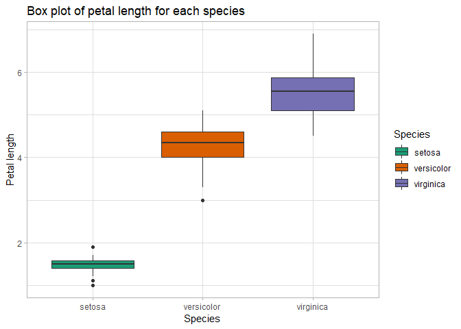

Iris Species
================
Akash Lamba

### Overview

It includes three iris species with 50 samples each as well as some
properties about each flower. One flower species is linearly separable
from the other two, but the other two are not linearly separable from
each other.

The columns in this dataset are:

  - Id
  - SepalLengthCm
  - SepalWidthCm
  - PetalLengthCm
  - PetalWidthCm
  - Species


### Loading Packages

``` r
library(ISLR)# Data Iris is loaded from here
library(caTools)# Splitting
library(e1071)# SVM package download
library(caret)# Machine Learning
library(rpart)# Recursive partitioning of tres
library(rpart.plot)# Plot the trees
library(randomForest)# Machine Learning
library(class)# Knn Algorithm
library(ElemStatLearn)# Plotting
library(knitr)# Table Building
library(psych)# Will be used for correlation visualizations
library(ggplot2)# Data Visualizations
library(plotly)#3d Plots
library(rattle)#Fancy Tree Plots
library(klaR)# Naive Bayes package
```

### Importing The Dataset

``` r
#Load Iris Dataset
data(iris)
```

### Taking a glance at the data

Lets check the first 6 rows as well as the summary statistics of our
data to get a feel of how the data looks.

### Head

``` r
head(iris)
```

    ##   Sepal.Length Sepal.Width Petal.Length Petal.Width Species
    ## 1          5.1         3.5          1.4         0.2  setosa
    ## 2          4.9         3.0          1.4         0.2  setosa
    ## 3          4.7         3.2          1.3         0.2  setosa
    ## 4          4.6         3.1          1.5         0.2  setosa
    ## 5          5.0         3.6          1.4         0.2  setosa
    ## 6          5.4         3.9          1.7         0.4  setosa

### Summary

``` r
summary(iris)
```

    ##   Sepal.Length    Sepal.Width     Petal.Length    Petal.Width   
    ##  Min.   :4.300   Min.   :2.000   Min.   :1.000   Min.   :0.100  
    ##  1st Qu.:5.100   1st Qu.:2.800   1st Qu.:1.600   1st Qu.:0.300  
    ##  Median :5.800   Median :3.000   Median :4.350   Median :1.300  
    ##  Mean   :5.843   Mean   :3.057   Mean   :3.758   Mean   :1.199  
    ##  3rd Qu.:6.400   3rd Qu.:3.300   3rd Qu.:5.100   3rd Qu.:1.800  
    ##  Max.   :7.900   Max.   :4.400   Max.   :6.900   Max.   :2.500  
    ##        Species  
    ##  setosa    :50  
    ##  versicolor:50  
    ##  virginica :50  
    ##                 
    ##                 
    ## 

### Structure

``` r
str(iris)
```

    ## 'data.frame':    150 obs. of  5 variables:
    ##  $ Sepal.Length: num  5.1 4.9 4.7 4.6 5 5.4 4.6 5 4.4 4.9 ...
    ##  $ Sepal.Width : num  3.5 3 3.2 3.1 3.6 3.9 3.4 3.4 2.9 3.1 ...
    ##  $ Petal.Length: num  1.4 1.4 1.3 1.5 1.4 1.7 1.4 1.5 1.4 1.5 ...
    ##  $ Petal.Width : num  0.2 0.2 0.2 0.2 0.2 0.4 0.3 0.2 0.2 0.1 ...
    ##  $ Species     : Factor w/ 3 levels "setosa","versicolor",..: 1 1 1 1 1 1 1 1 1 1 ...

### Data Exploration

### Correlation Matrix

``` r
pairs.panels(
  iris[,1:4], # Our data.
  scale = TRUE, # Changes size of correlation value lables based on strength.
  hist.col = 'grey85', # Histogram color.  
  bg = c("mediumseagreen","orange2","mediumpurple1")[iris$Species], # Colors of the Species levels.
  pch = 21, # The plot characters shape and size.
  main = 'Correlation matrix of Iris data')  # Title. 
```

<!-- -->

The upper part of the correlation matrix tells us the correlation
between the variables and we can see that there is a moderate to strong
correlation between all variables except for between **sepal length**
and **sepal width**. Looking at the bottom half of the matrix gives us
additional insight into not only the scatter plots of these
correlations, but also divides the data points by iris species using
colors. This allows us to see the clusters that are present among the
species.

### Sepal Width

``` r
ggplot(
  # (1) Set data; (2) Specify X and Y variables; (3) 'fill' color separates our Species levels.
  data = iris, mapping = aes(x = Species, y = Sepal.Width, fill = Species)) +
  geom_boxplot() +  # Specifies that we want a box plot. 
  scale_fill_brewer(palette = 'Dark2') +  # Change color of box plots. 
  theme_light() +  # Set light theme. 
  labs(title = 'Box plot of sepal width for each species', 
       x = 'Species', y = 'Sepal width')  # Assign a title, axis names.
```

<!-- -->

From this box plot it can be seen that the setosa species has a higher
sepal width median and interquartile range compared to the other two
species. In contrast, the Versicolor and Virginica show quite a bit of
overlap with each other in term of their interquartile range. This will
make it harder for a machine learning algorithm to distinguish between
the two species levels when predicting using this
variable.

### Sepal Length

``` r
ggplot(data = iris, mapping = aes(x = Species, y = Sepal.Length, fill = Species)) +
  geom_boxplot() + 
  scale_fill_brewer(palette = 'Dark2') + 
  theme_light() +
  labs(title = 'Box plot of sepal length for each species', 
       x = 'Species', y = 'Sepal length')
```

<!-- -->

The ranges of the three species seem to somewhat overlap on the sepal
length variable. However, their medians seem like they
differ.

### Petal Width

``` r
ggplot(data = iris, mapping = aes(x = Species, y = Petal.Width, fill = Species)) + 
  geom_boxplot() + 
  scale_fill_brewer(palette = 'Dark2') + 
  theme_light() +
  labs(title = 'Box plot of petal width for each species', 
       x = 'Species', y = 'Petal width')
```

<!-- -->

This box plot seems to indicate quite a difference in petal width
between the
species.

### Petal Length

``` r
ggplot(data = iris, mapping = aes(x = Species, y = Petal.Length, fill = Species)) +
  geom_boxplot() + 
  scale_fill_brewer(palette = 'Dark2') +
  theme_light() +
  labs(title = 'Box plot of petal length for each species', 
       x = 'Species', y = 'Petal length')
```

<!-- -->

This plot seems to indicate that the three species vary in terms of
interquartile range on petal length. The setosa seems to have a very
narrow interquartile range and have quite a lot shorter petal length
compared to the other two species.

### Data partitioning

``` r
set.seed(123)
split <- sample.split(iris,SplitRatio = 0.7)
train <- subset(iris,split==TRUE)
test <- subset(iris,split==FALSE)
```

### Machine Learning

  - Decision Tree
  - Random Forest
  - Naive Bayes
  - SVM

### 1\. Decision Tree

#### Create Model

``` r
#Model the decision tree model with a 10 fold cross validation.
fitControl <- trainControl(method = "cv", number = 10, savePredictions = TRUE)

#Create Model
dt_model <- train(Species ~ ., # Set Y variable followed by '~'. The period indicates to include all variables for prediction. 
                 data = train, # Data
                 method = 'rpart', # Specify SVM model
                 trControl = fitControl) # Use cross validation
```

#### Confusion Matrix

``` r
confusionMatrix(dt_model)
```

    ## Cross-Validated (10 fold) Confusion Matrix 
    ## 
    ## (entries are percentual average cell counts across resamples)
    ##  
    ##             Reference
    ## Prediction   setosa versicolor virginica
    ##   setosa       33.3        0.0       0.0
    ##   versicolor    0.0       32.2       1.1
    ##   virginica     0.0        1.1      32.2
    ##                             
    ##  Accuracy (average) : 0.9778

The results here tell us that our average accuracy is 96% when testing
our data on resamples of our training data. We can also see what was
predicted correctly/incorrectly.

#### Variable Importance and Tree Plot

``` r
# Create object of importance of our variables 
dt_importance <- varImp(dt_model)

# Create plot of importance of variables
ggplot(data = dt_importance, mapping = aes(x = dt_importance[,1])) + # Data & mapping
  geom_boxplot() + # Create box plot
  labs(title = "Variable importance: Decision tree model") + # Title
  theme_light() # Theme
```

<!-- -->

This table gives us a very informative overview of the importance of
each variable in predicting the species.

``` r
# Plot the tree
fancyRpartPlot(dt_model$finalModel, sub = '')
```

<!-- -->

This decision tree tells us that:

  - If petal length is smaller than 2.5, the prediction is *setosa*
  - If petal length is between 1.7 and 2.5, the prediction is
    *virginica*
  - If petal length is greater than 1.7, the prediction is *versicolor*

As we can see, petal length was the only variable that was needed to
make these predictions.

#### PREDICTION: Decision tree model

``` r
prediction_dt <- predict(dt_model, test)
```

Check the proportion of the predictions which were accurate.

``` r
# table
table(prediction_dt, test$Species) %>% # Create prediction table. 
  prop.table() %>% # Convert table values into proportions instead of counts. 
  round(2) # Round numbers to 2 significant values. 
```

    ##              
    ## prediction_dt setosa versicolor virginica
    ##    setosa       0.33       0.00      0.00
    ##    versicolor   0.00       0.33      0.07
    ##    virginica    0.00       0.00      0.27

``` r
# Confusion Matrix
cm_decisionTree <- confusionMatrix(table(prediction_dt, test$Species))
Accuracy_DecisionTree <- cm_decisionTree$overall[1]
Accuracy_DecisionTree
```

    ##  Accuracy 
    ## 0.9333333

### 2\. Random Forest

#### Create Model

``` r
#Model the random forest tree model with a 10 fold cross validation.
fitControl <- trainControl(method = "cv", number = 10, savePredictions = TRUE)

# Create model
rf_model <- train(
  Species ~ .,  # Set Y variable followed by "~." to include all variables in formula.
  method = 'rf',  # Set method as random forest.
  trControl = fitControl,  # Set cross validation settings
  data = train)  # Set data as train_data. 
```

#### Variable Importance and Tree Plot

``` r
# Create object of importance of our variables 
rf_importance <- varImp(rf_model)

# Create box plot of importance of variables
ggplot(data = rf_importance, mapping = aes(x = rf_importance[,1])) + # Data & mapping
  geom_boxplot() + # Create box plot
  labs(title = "Variable importance: Random forest model") + # Title
  theme_light() # Theme
```

<!-- -->

This plot tells us that petal length and width are the most important
variable for prediction in our model.

#### Confusion Matrix

``` r
confusionMatrix(rf_model)
```

    ## Cross-Validated (10 fold) Confusion Matrix 
    ## 
    ## (entries are percentual average cell counts across resamples)
    ##  
    ##             Reference
    ## Prediction   setosa versicolor virginica
    ##   setosa       33.3        0.0       0.0
    ##   versicolor    0.0       31.1       1.1
    ##   virginica     0.0        2.2      32.2
    ##                             
    ##  Accuracy (average) : 0.9667

#### Prediction: Random forest model

``` r
prediction_rf <- predict(rf_model, test)

#Check the accuracy of our random forest model on our test data.
table(prediction_rf, test$Species) %>% # Create prediction table. 
  prop.table() %>% # Convert table values into proportions instead of counts. 
  round(2) # Round numbers to 2 significant values.
```

    ##              
    ## prediction_rf setosa versicolor virginica
    ##    setosa       0.33       0.00      0.00
    ##    versicolor   0.00       0.33      0.07
    ##    virginica    0.00       0.00      0.27

#### Model Accuracy

``` r
cm_rf <- confusionMatrix(table(prediction_rf, test$Species))
accuracy_RandomForest <- cm_rf$overall[1]
```

### 3\. Naive Bayes

#### Create Model

``` r
#Model the Naive Bayes model with a 10 fold cross validation.
fitControl <- trainControl(method = "cv", number = 10, savePredictions = TRUE)

#Create a predictor model with the `train()` function from the CARET package.  Specify `method = 'nb'` to run a Naive Bayes model. 
# Create model
nb_model <- train(Species ~ ., # Set y variable followed by '~'. The period indicates that we want to use all our variables for prediction.
                  data = train,
                  method = 'nb', # Specify Naive Bayes model
                  trControl = fitControl) # Use cross validation
```

#### Confusion Matrix

``` r
#Check the predicted accuracy of our model by running it on resamples of our *train data*. Later we will test the accuracy of the model by running a prediction on our *test data*.
confusionMatrix(nb_model)
```

    ## Cross-Validated (10 fold) Confusion Matrix 
    ## 
    ## (entries are percentual average cell counts across resamples)
    ##  
    ##             Reference
    ## Prediction   setosa versicolor virginica
    ##   setosa       33.3        0.0       0.0
    ##   versicolor    0.0       31.1       1.1
    ##   virginica     0.0        2.2      32.2
    ##                             
    ##  Accuracy (average) : 0.9667

#### Variable Importance and Tree Plot

``` r
# Create object of importance of our variables 
nb_importance <- varImp(nb_model) 

# Create box plot of importance of variables
ggplot(data = nb_importance, mapping = aes(x = nb_importance[,1])) + # Data & mapping
  geom_boxplot() + # Create box plot
  labs(title = "Variable importance: Naive Bayes model") + # Title
  theme_light() # Theme
```

<!-- -->

This table gives us a very informative overview of the importance of
each variable in predicting each species. We can see that petal width
and length are the two most important variables for predicting each
species.

#### PREDICTION: Naive Bayes Model

``` r
#Use the created `nb_model` to run a prediction on the test data.
prediction_nb <- predict(nb_model, test)

#Check what proportion of the predictions which were accurate.
table(prediction_nb, test$Species) %>% # Create prediction table. 
  prop.table() %>% # Convert table values into proportions instead of counts. 
  round(2) # Round numbers to 2 significant values.
```

    ##              
    ## prediction_nb setosa versicolor virginica
    ##    setosa       0.33       0.00      0.00
    ##    versicolor   0.00       0.33      0.05
    ##    virginica    0.00       0.00      0.28

#### Model Accuracy

``` r
#Accuracy
cm_naivebayes <- confusionMatrix(table(prediction_nb, test$Species))
#test accuracy = 95%
Accuracy_naiveBayes <- cm_naivebayes$overall[1]
```

### 4\. SVM

#### Create Model

``` r
#Model the SVM model with a 10 fold cross validation.
fitControl <- trainControl(method = "cv", number = 10, savePredictions = TRUE)

#Create a predictor model with the `train()` function from the CARET package. Specify `method = 'svmLinear'` to run a SVM model. 
svm_model <- train(Species ~ ., # Set Y variable followed by '~'. The period indicates to include all variables for prediction. 
                   data = train, # Data
                   method = 'svmLinear', # Specify SVM model
                   trControl = fitControl) # Use cross validation
```

#### Confusion Matrix

``` r
#Check the predicted accuracy of our naive Bayes model by running it on resamples of our *train data*. Later we will test the accuracy of the model by running a prediction on our *test data*.
confusionMatrix(svm_model)
```

    ## Cross-Validated (10 fold) Confusion Matrix 
    ## 
    ## (entries are percentual average cell counts across resamples)
    ##  
    ##             Reference
    ## Prediction   setosa versicolor virginica
    ##   setosa       33.3        0.0       0.0
    ##   versicolor    0.0       32.2       0.0
    ##   virginica     0.0        1.1      33.3
    ##                             
    ##  Accuracy (average) : 0.9889

#### Variable Importance and Tree Plot

``` r
# Create object of importance of our variables 
svm_importance <- varImp(svm_model)

# Create box plot
ggplot(data = svm_importance, mapping = aes(x = svm_importance[,1])) + # Data & mapping
  geom_boxplot() + # Create box plot
  labs(title = "Variable importance: Support vector machine model") + # Title
  theme_light() # Theme
```

<!-- -->

This table gives us a very informative overview of the importance of
each variable in predicting each species. We can see that petal length
and petal width are the two most important variables for predicting each
species.

#### PREDICTION: Support Vector Machine

``` r
#Use the created `svm_model` to run a prediction on the test data.
prediction_svm <- predict(svm_model, test)

#Check the proportion of the predictions which were accurate.
table(prediction_svm, test$Species) %>% # Create prediction table. 
  prop.table() %>% # Convert table values into proportions instead of counts. 
  round(2) # Round numbers to 2 significant values. 
```

    ##               
    ## prediction_svm setosa versicolor virginica
    ##     setosa       0.33       0.00      0.00
    ##     versicolor   0.00       0.32      0.02
    ##     virginica    0.00       0.02      0.32

#### Model Accuracy

``` r
cm_SVM <- confusionMatrix(table(prediction_svm, test$Species))
accuracy_SVM <- cm_SVM$overall[1]
```

### Result Comparision

``` r
Model <- c("Decision Trees","Random Forest","Naive Bayes","SVM")
Accuracy <- c(Accuracy_DecisionTree,accuracy_RandomForest,Accuracy_naiveBayes,accuracy_SVM)
Model_Evaluation <- data.frame(Model,Accuracy)
kable(Model_Evaluation,caption = "A Model Accuracy Evaluation")
```

| Model          |  Accuracy |
| :------------- | --------: |
| Decision Trees | 0.9333333 |
| Random Forest  | 0.9333333 |
| Naive Bayes    | 0.9500000 |
| SVM            | 0.9666667 |

A Model Accuracy Evaluation

For our data it looks like the **Naive Bayes** and **support vector
machine** models performed the best.
