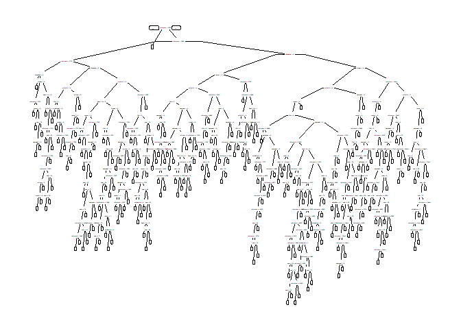

Keeping an Eye on Healthcare Costs: The D2Hawkeye Story
================
Akash Lamba

### Overview

  - D2Hawkeye tries to improve the healthcare case management.
      - Identify High Risk Patients
      - Work with patients to manage treatment and associated cost
      - Arrange specialist care
  - Our goal is to improve the quality of cost predictions.

### D2hawkeye’s Claim Data

  - Available : Claims data for 2.4 million people over a span of 3
    years 

  - Include only people with the data for at least 10 months in both
    periods - 400,000 people.

### Variables

  - Our independent variables are from 2008, and we will be predicting
    cost in 2009.
  - Our independent variables are: + the **patient’s age** in years at
    the end of 2008.
  - Several binary variables indicating whether or not the patient had
    diagnosis codes for a particular disease or related disorder in
    2008: + **alzheimers** + **arthritis** + **cancer** + **chronic
    obstructive pulmonary disease or copd** + **depression** +
    **diabetes** + **heart.failure** + **ischemic heart disease or ihd**
    + **kidney disease** + **osteoporosis**  
    \+ **stroke**
  - **Reimbursement2008** is the total amount of Medicare reimbursements
    for this patient in 2008 and **Reimbursement2009** is the total
    value of all Medicare reimbursements for the patient in 2009.
  - **Bucket2008** is the cost bucket the patient fell into in 2008, and
    **bucket2009** is the cost bucket the patient fell into in 2009.

### Loading Packages

``` r
library(data.table)#XLS file
library(caTools)# Splitting
library(caret)# Machine Learning
library(knitr)# Table Building
library(rpart)#Machine Learning
library(rpart.plot)#Tree Plot
```

### Importing the Dataset

``` r
Claims<-fread(input = "ClaimsData.xls",sep=",",header = T,stringsAsFactors = T)
#Conversion to Dataframe
Claims<-as.data.frame(Claims)
```

### Cost Buckets

  - These cost buckets are defined using the thresholds determine by
    D2Hawkeye: + the first cost bucket contains patients with costs less
    than **$3,000**. + the second cost bucket contains patients with
    costs between **$3,000-$8,000**. + the third cost bucket contains
    patients with costs between **$8000- $19000**. + the Fourth cost
    bucket contains patients with costs between **$19000-$55000**. + The
    Fifth cost bucket contains patients with costs above **$55000**.
  - We can verify that the number of patients in each cost bucket has
    the same structure as what we saw for D2Hawkeye by computing the
    percentage of patients in each cost bucket.
  - So we’ll create a `table` of the variable bucket2009 and divide by
    the number of rows in Claims. This gives the percentage of patients
    in each of the cost buckets.

<!-- end list -->

``` r
table(Claims$bucket2009)/nrow(Claims)*100
```

    ## 
    ##          1          2          3          4          5 
    ## 67.1267781 19.0170413  8.9466272  4.3324855  0.5770679

*The first cost bucket has almost 70% of the patients.The second cost
bucket has about 20% of the patients and The remaining 10% are split
between the final three cost buckets.*

### Medical Interpretation of the Buckets


### Goal

The vast majority of patients in this data set have low cost. Our goal
will be to predict the cost bucket the patient fell into in 2009 using a
CART model.

### Data partitioning

``` r
set.seed(88)
spl = sample.split(Claims$bucket2009, SplitRatio = 0.6)
ClaimsTrain = subset(Claims, spl==TRUE)
ClaimsTest = subset(Claims, spl==FALSE)
```

### Baseline Method

  - Let’s now see how the baseline method used by D2Hawkeye would
    perform on this data set.
  - The baseline method would predict that the cost bucket for a patient
    in 2009 will be the same as it was in 2008.
  - So, let’s create a classification matrix to compute the accuracy for
    the baseline method on the test set.
  - We’ll use the `table` function, where the actual outcomes are
    `ClaimsTest$bucket2009` and our predictions are
    `ClaimsTest$bucket2008`.

<!-- end list -->

``` r
table(ClaimsTest$bucket2009, ClaimsTest$bucket2008)
```

    ##    
    ##          1      2      3      4      5
    ##   1 110138   7787   3427   1452    174
    ##   2  16000  10721   4629   2931    559
    ##   3   7006   4629   2774   1621    360
    ##   4   2688   1943   1415   1539    352
    ##   5    293    191    160    309    104

  - The accuracy is the sum of the diagonal, the observations that were
    classified correctly, divided by the total number of observations in
    our test
set.

<!-- end list -->

``` r
(sum(diag(table(ClaimsTest$bucket2009,ClaimsTest$bucket2008))))/nrow(ClaimsTest)
```

    ## [1] 0.6838135

*The accuracy of the baseline method is `0.68`.*

### Penalty Matrix and Penalty Error

#### Penalty Matrix

  - To compute Penalty Error, we need to first create a Penalty Matrix
    in R. 

  - We’ll call it `PenaltyMatrix`, The numbers that should fill up the
    matrix are : + First row - 0, 1, 2, 3, 4 + Second Row - 2, 0, 1, 2,
    3 + Third row - 4, 2, 0, 1, 2 + Fourth row - 6, 4, 2, 0, 1  
    \+ Fifth row - 8, 6, 4, 2,
0

<!-- end list -->

``` r
PenaltyMatrix = matrix(c(0,1,2,3,4,2,0,1,2,3,4,2,0,1,2,6,4,2,0,1,8,6,4,2,0), byrow=TRUE, nrow=5)
PenaltyMatrix
```

    ##      [,1] [,2] [,3] [,4] [,5]
    ## [1,]    0    1    2    3    4
    ## [2,]    2    0    1    2    3
    ## [3,]    4    2    0    1    2
    ## [4,]    6    4    2    0    1
    ## [5,]    8    6    4    2    0

*The `actual outcomes` are on the `left`, and the `predicted outcomes`
are on the `top`.* *So the worst outcomes are when we predict a low cost
bucket, but the actual outcome is a high cost bucket.We still give
ourselves a penalty when we predict a high cost bucket and it’s actually
a low cost bucket,but it’s not as bad.*

#### Penalty Error

  - We can compute the penalty error of the baseline method, we can
    multiply our classification matrix by the penalty
matrix.

<!-- end list -->

``` r
as.matrix(table(ClaimsTest$bucket2009, ClaimsTest$bucket2008))*PenaltyMatrix
```

    ##    
    ##         1     2     3     4     5
    ##   1     0  7787  6854  4356   696
    ##   2 32000     0  4629  5862  1677
    ##   3 28024  9258     0  1621   720
    ##   4 16128  7772  2830     0   352
    ##   5  2344  1146   640   618     0

  - So now to compute the `penalty error`, we just need to sum it up and
    divid by the number of observations in our test
set.

<!-- end list -->

``` r
PenaltyError<-sum(as.matrix(table(ClaimsTest$bucket2009, ClaimsTest$bucket2008))*PenaltyMatrix)/nrow(ClaimsTest)
PenaltyError
```

    ## [1] 0.7386055

*So the penalty error for the baseline method is `0.74`.*

### Conclusion

Now our goal will be to create a CART model that has an **accuracy**
higher than 68% and a **penalty error** lower than 0.74.

### Predicting Healthcare Costs

  - We’ll call our model `ClaimsTree` and we’ll use the `rpart` function
    to predict `bucket2009`, using as independent variables: `age` ,
    `arthritis`,`alzheimers`,`cancer`, `copd`, `depression`, `diabetes`,
    `heart.failure`, `ihd`,`kidney`, `osteoporosis`, and `stroke`.
  - We’ll also use `bucket2008` and `reimbursement2008`.The data set
    we’ll use to build our model is `ClaimsTrain` and then we’ll add
    the arguments, `method = "class"`, since we have a classification
    problem here, and `cp = 0.00005` .

#### Cross- Validation

  - The cp value we’re using here was selected through cross-validation
    on the training set

<!-- end list -->

``` r
# 10-fold cv
numfolds<-trainControl(method="cv",number=10)
# Range of cp values, change it to find best cp value
cpGrid<-expand.grid(cp=seq(0.001,0.005,0.001))
# Building the model with cv using caret library
model_cv<-train(as.factor(bucket2009) ~ age + alzheimers + arthritis + cancer + copd + depression + diabetes + heart.failure + ihd + kidney + osteoporosis + stroke + bucket2008 + reimbursement2008, data=ClaimsTrain, method="rpart",trControl=numfolds,tuneGrid=cpGrid)
plot(model_cv)
```

<!-- -->

#### Model Building

  - Making the model with best cp i.e `cp=0.00005`

<!-- end list -->

``` r
#ClaimsTree Model using train data
ClaimsTree = rpart(bucket2009 ~ age + alzheimers + arthritis + cancer + copd + depression + diabetes + heart.failure + ihd + kidney + osteoporosis + stroke + bucket2008 + reimbursement2008, data=ClaimsTrain, method="class", cp=0.00005)
#Plot the tree
prp(ClaimsTree)
```

    ## Warning: labs do not fit even at cex 0.15, there may be some overplotting

<!-- -->

#### Predictions on The Test data

``` r
#PredictTest using ClaimsTest data
PredictTest = predict(ClaimsTree, newdata = ClaimsTest, type = "class")
# Comparing with actual values 
table(ClaimsTest$bucket2009, PredictTest)
```

    ##    PredictTest
    ##          1      2      3      4      5
    ##   1 114141   8610    124    103      0
    ##   2  18409  16102    187    142      0
    ##   3   8027   8146    118     99      0
    ##   4   3099   4584     53    201      0
    ##   5    351    657      4     45      0

``` r
# Calculating Accuracy 
(114141 + 16102 + 118 + 201 + 0)/nrow(ClaimsTest)
```

    ## [1] 0.7126669

``` r
# Computing Penalty Error
as.matrix(table(ClaimsTest$bucket2009, PredictTest))*PenaltyMatrix
```

    ##    PredictTest
    ##         1     2     3     4     5
    ##   1     0  8610   248   309     0
    ##   2 36818     0   187   284     0
    ##   3 32108 16292     0    99     0
    ##   4 18594 18336   106     0     0
    ##   5  2808  3942    16    90     0

``` r
PenaltyError<-sum(as.matrix(table(ClaimsTest$bucket2009,PredictTest))*PenaltyMatrix)/nrow(ClaimsTest)
PenaltyError
```

    ## [1] 0.7578902

*Our model is not classifying any patients in the Class 5, because we
have unbalanced data. *

  - Incorporating loss matrix in the new model.

<!-- end list -->

``` r
#ClaimsTree model with loss matrix
ClaimsTree = rpart(bucket2009 ~ age + alzheimers + arthritis + cancer + copd + depression + diabetes + heart.failure + ihd + kidney + osteoporosis + stroke + bucket2008 + reimbursement2008, data=ClaimsTrain, method="class", cp=0.00005, parms=list(loss=PenaltyMatrix))
#Plot the tree
prp(ClaimsTree)  
```

<!-- -->

#### Predictions on Test Data

  - We are predicting the Test Data results with new model built with
    the loss matrix.

<!-- end list -->

``` r
#PredictTest with ClaimsTest data
PredictTest = predict(ClaimsTree, newdata = ClaimsTest, type = "class")
# Comparing with actual values 
table(ClaimsTest$bucket2009, PredictTest)
```

    ##    PredictTest
    ##         1     2     3     4     5
    ##   1 94310 25295  3087   286     0
    ##   2  7176 18942  8079   643     0
    ##   3  3590  7706  4692   401     1
    ##   4  1304  3193  2803   636     1
    ##   5   135   356   408   156     2

``` r
# Calculating accuracy and penalty error
sum(diag(table(ClaimsTest$bucket2009, PredictTest)))/nrow(ClaimsTest)
```

    ## [1] 0.6472746

``` r
# Computing Penalty Error
as.matrix(table(ClaimsTest$bucket2009, PredictTest))*PenaltyMatrix
```

    ##    PredictTest
    ##         1     2     3     4     5
    ##   1     0 25295  6174   858     0
    ##   2 14352     0  8079  1286     0
    ##   3 14360 15412     0   401     2
    ##   4  7824 12772  5606     0     1
    ##   5  1080  2136  1632   312     0

``` r
PenaltyError<-sum(as.matrix(table(ClaimsTest$bucket2009,PredictTest))*PenaltyMatrix)/nrow(ClaimsTest)
PenaltyError
```

    ## [1] 0.6418161

### Insights

  - Substantial Improvement over the baseline.
  - Accuracy decreased but the Penalty error also reduced upto `0.64`
    which is better than the baseline.
  - Substantial Improvement in the D2Hawkeye’s ability to identify
    patients who need more attention.
