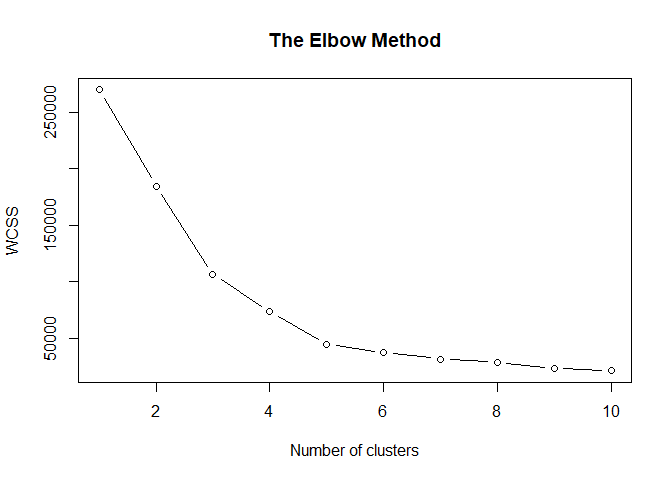
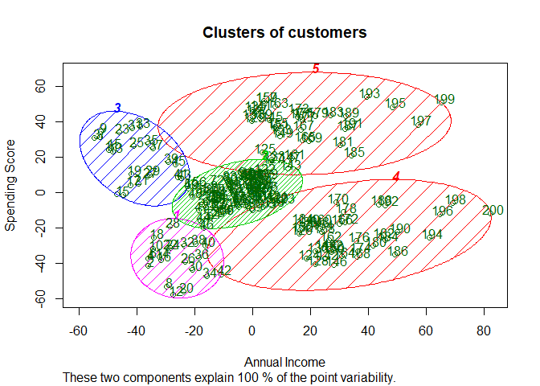

Customer Segmentation
================
Akash Lamba

### Overview

  - You are owning a supermarket mall and through membership cards.
  - You have some basic data about your customers like : + Customer ID +
    age + gender + annual income  
    \+ spending score
  - Spending Score is something you assign to the customer based on your
    defined parameters like customer behavior and purchasing data.
  - In our Dataset the spending score is between 1 to 100 for each
    customer.

### Problem Statement

You own the mall and want to understand the customers like who can be
easily converge \[Target Customers\] so that the sense can be given to
marketing team and plan the strategy accordingly.

### Loading Packages

``` r
library(cluster)
```

### Importing the data

``` r
customers = read.csv('Mall_Customers.csv')
```

### Structure

``` r
str(customers)
```

    ## 'data.frame':    200 obs. of  5 variables:
    ##  $ CustomerID            : int  1 2 3 4 5 6 7 8 9 10 ...
    ##  $ Genre                 : Factor w/ 2 levels "Female","Male": 2 2 1 1 1 1 1 1 2 1 ...
    ##  $ Age                   : int  19 21 20 23 31 22 35 23 64 30 ...
    ##  $ Annual.Income..k..    : int  15 15 16 16 17 17 18 18 19 19 ...
    ##  $ Spending.Score..1.100.: int  39 81 6 77 40 76 6 94 3 72 ...

*We have 200 observations and 5 variables in our dataset.*

### Data Glimpse

``` r
head(customers)
```

    ##   CustomerID  Genre Age Annual.Income..k.. Spending.Score..1.100.
    ## 1          1   Male  19                 15                     39
    ## 2          2   Male  21                 15                     81
    ## 3          3 Female  20                 16                      6
    ## 4          4 Female  23                 16                     77
    ## 5          5 Female  31                 17                     40
    ## 6          6 Female  22                 17                     76

``` r
customers<-customers[4:5]
```

*We are subsetting the last two columns only that are required for our
clustering analysis*

### K-Means Clustering

#### Determining number of Clusters

  - We will find the WCSS(within cluster sum of squares) first using the
    formula below and then find the elbow plot from it for 10 clusters.

<!-- end list -->

``` r
set.seed(6)
#wcss
wcss = vector()
for (i in 1:10) wcss[i] = sum(kmeans(customers, i)$withinss)
#Plot 10 clusters and their elbow
plot(1:10,
     wcss,
     type = 'b',
     main = paste('The Elbow Method'),
     xlab = 'Number of clusters',
     ylab = 'WCSS')
```

<!-- -->

*K=5 clusters will be the right number of clusters to take as WCSS is
not improving further after this point*

#### Building the Model

  - We will build our model using `kmeans()` and specify the number of
    clusters required.
  - All our 200 customers will be segmented to any of the 5 clusters
    using `kmeans()`.

<!-- end list -->

``` r
set.seed(29)
kmeans = kmeans(x = customers, centers = 5,iter.max = 300,nstart=10)
y_kmeans = kmeans$cluster
```

#### Visualising the clusters

  - We will use the `clusplot()` to see our 5 clusters

<!-- end list -->

``` r
clusplot(customers,
         y_kmeans,
         lines = 0,
         shade = TRUE,
         color = TRUE,
         labels = 2,
         plotchar = FALSE,
         span = FALSE,
         main = paste('Clusters of customers'),
         xlab = 'Annual Income',
         ylab = 'Spending Score')
```

<!-- -->

### Insights

  - Customers characteristics in each clusters on the basis of cluster
    plot :
      - **cluster 1**-low income and low spending score(Sensible
        Customers)
      - **cluster 2** -average income and avg spending score(Standard
        Customers)
      - **cluster 3**-low income and High spending score(Careless
        Customers)
      - **cluster 4**- high income and low spending score(Careful
        Customers)
      - **cluster 5**- high income and high spending score(Target
        Customers)
