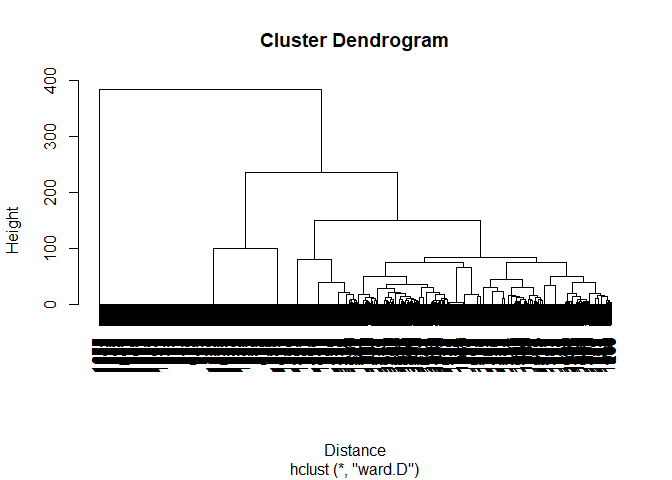

Movies Recommendation System Using Content Filtering
================
Akash Lamba

### Overview

  - <https://movielens.org> is a movie recommendations website run by
    the GroupLens Research Lab at the University of Minnesota.
  - They collect user preferences about movies and do collaborative
    filtering to make recommendations.
  - We will use their movie database to do content filtering using
    clustering technique.


### MovieLens Items Dataset

  - Movies in the dataset are categorized as belonging to different
    generes. 

  - Each movie may belong to many genres.

  - We will systematically group movies with similar set of genres using
    different clustering
techniques.

### Importing the data

``` r
movies<-read.csv("http://files.grouplens.org/datasets/movielens/ml-100k/u.item", header = FALSE, sep = "|")
```

### Structure

  - We have 1682 Observations of 24 different variables.

<!-- end list -->

``` r
str(movies)
```

    ## 'data.frame':    1682 obs. of  24 variables:
    ##  $ V1 : int  1 2 3 4 5 6 7 8 9 10 ...
    ##  $ V2 : Factor w/ 1664 levels "'Til There Was You (1997)",..: 1525 618 555 594 344 1318 1545 111 391 1240 ...
    ##  $ V3 : Factor w/ 241 levels "","01-Aug-1997",..: 71 71 71 71 71 71 71 71 71 182 ...
    ##  $ V4 : logi  NA NA NA NA NA NA ...
    ##  $ V5 : Factor w/ 1661 levels "","http://us.imdb.com/M/title-exact/Independence%20(1997)",..: 1431 565 505 543 310 1661 1453 103 357 1183 ...
    ##  $ V6 : int  0 0 0 0 0 0 0 0 0 0 ...
    ##  $ V7 : int  0 1 0 1 0 0 0 0 0 0 ...
    ##  $ V8 : int  0 1 0 0 0 0 0 0 0 0 ...
    ##  $ V9 : int  1 0 0 0 0 0 0 0 0 0 ...
    ##  $ V10: int  1 0 0 0 0 0 0 1 0 0 ...
    ##  $ V11: int  1 0 0 1 0 0 0 1 0 0 ...
    ##  $ V12: int  0 0 0 0 1 0 0 0 0 0 ...
    ##  $ V13: int  0 0 0 0 0 0 0 0 0 0 ...
    ##  $ V14: int  0 0 0 1 1 1 1 1 1 1 ...
    ##  $ V15: int  0 0 0 0 0 0 0 0 0 0 ...
    ##  $ V16: int  0 0 0 0 0 0 0 0 0 0 ...
    ##  $ V17: int  0 0 0 0 0 0 0 0 0 0 ...
    ##  $ V18: int  0 0 0 0 0 0 0 0 0 0 ...
    ##  $ V19: int  0 0 0 0 0 0 0 0 0 0 ...
    ##  $ V20: int  0 0 0 0 0 0 0 0 0 0 ...
    ##  $ V21: int  0 0 0 0 0 0 1 0 0 0 ...
    ##  $ V22: int  0 1 1 0 1 0 0 0 0 0 ...
    ##  $ V23: int  0 0 0 0 0 0 0 0 0 1 ...
    ##  $ V24: int  0 0 0 0 0 0 0 0 0 0 ...

### Preprocessing

  - Since there are no names of the columns, So we will give
them.

<!-- end list -->

``` r
colnames(movies)=c("ID", "Title", "ReleaseDate", "VideoReleaseDate", "IMDB", "Unknown", "Action", "Adventure", "Animation", "Children", "Comedy", "Crime", "Documentary", "Drama", "Fantasy", "FilmNoir", "Horror", "Musical", "Mystery", "Romance", "SciFi", "Thriller", "War", "Western") 
```

  - We won’t be using the ID,release date,video release date,or IMDB
    variables.

<!-- end list -->

``` r
movies$ID = NULL
movies$ReleaseDate = NULL
movies$VideoReleaseDate = NULL
movies$IMDB = NULL
```

  - We will also remove the duplicate entries in our dataset.

<!-- end list -->

``` r
movies <- unique(movies)
str(movies)
```

    ## 'data.frame':    1664 obs. of  20 variables:
    ##  $ Title      : Factor w/ 1664 levels "'Til There Was You (1997)",..: 1525 618 555 594 344 1318 1545 111 391 1240 ...
    ##  $ Unknown    : int  0 0 0 0 0 0 0 0 0 0 ...
    ##  $ Action     : int  0 1 0 1 0 0 0 0 0 0 ...
    ##  $ Adventure  : int  0 1 0 0 0 0 0 0 0 0 ...
    ##  $ Animation  : int  1 0 0 0 0 0 0 0 0 0 ...
    ##  $ Children   : int  1 0 0 0 0 0 0 1 0 0 ...
    ##  $ Comedy     : int  1 0 0 1 0 0 0 1 0 0 ...
    ##  $ Crime      : int  0 0 0 0 1 0 0 0 0 0 ...
    ##  $ Documentary: int  0 0 0 0 0 0 0 0 0 0 ...
    ##  $ Drama      : int  0 0 0 1 1 1 1 1 1 1 ...
    ##  $ Fantasy    : int  0 0 0 0 0 0 0 0 0 0 ...
    ##  $ FilmNoir   : int  0 0 0 0 0 0 0 0 0 0 ...
    ##  $ Horror     : int  0 0 0 0 0 0 0 0 0 0 ...
    ##  $ Musical    : int  0 0 0 0 0 0 0 0 0 0 ...
    ##  $ Mystery    : int  0 0 0 0 0 0 0 0 0 0 ...
    ##  $ Romance    : int  0 0 0 0 0 0 0 0 0 0 ...
    ##  $ SciFi      : int  0 0 0 0 0 0 1 0 0 0 ...
    ##  $ Thriller   : int  0 1 1 0 1 0 0 0 0 0 ...
    ##  $ War        : int  0 0 0 0 0 0 0 0 0 1 ...
    ##  $ Western    : int  0 0 0 0 0 0 0 0 0 0 ...

*Now we have 1,644 observations,a few less than before, and 20
variables*

### Hierarchical Clustering

  - We will use Hierarchical Clustering to cluster the movies in the
    movielens dataset by genre.
  - After we make clusters we will see how they can be used to make
    recommendations.
  - There are 2 steps to hierarchical clustering : + First we need to
    compute the distances between points + Second, we need to Cluster
    the points

#### Distance

  - We only want to cluster our movies on genre variable, not on the
    title variable, so we will calculate the distance on columns two
    through 20.

<!-- end list -->

``` r
Distance <- dist(movies[2:20],method="euclidean")
```

#### Clustering

  - We will cluster our movies using the `hclust()` for hierarchichal
    Clustering.
  - We will call the output `clusterMovies`.
  - We will use the `ward.D` method. The ward method cares about the
    distance between clusteres using centroid distance, and also the
    variance in each of the clusters.

<!-- end list -->

``` r
clusterMovies <- hclust(d=Distance,method ="ward.D")
plot(clusterMovies)
```

<!-- -->

*We will use 10 clusters for now from the dendogram*

#### Labelling of the Data Points

  - We need to label each of Data Points according to what cluster it
    belongs.
  - This can be done using the `cutree()`.

<!-- end list -->

``` r
clusterGroups <- cutree(clusterMovies,k=10)
```

  - We will use the `tapply()` to compute the percentage of movies in
    each genre and
    cluster.

<!-- end list -->

``` r
tapply(movies$Action, clusterGroups, mean)
```

    ##         1         2         3         4         5         6         7 
    ## 0.1784512 0.7839196 0.1238532 0.0000000 0.0000000 0.1015625 0.0000000 
    ##         8         9        10 
    ## 0.0000000 0.0000000 0.0000000

  - We wil use the `aggregate()` to compute the percentage of All the
    movies in each genre and cluster.

<!-- end list -->

``` r
agg <- aggregate(movies[2:20],list(clusterGroups),mean)
agg
```

    ##    Group.1     Unknown    Action  Adventure  Animation    Children
    ## 1        1 0.006734007 0.1784512 0.18518519 0.13468013 0.393939394
    ## 2        2 0.000000000 0.7839196 0.35175879 0.01005025 0.005025126
    ## 3        3 0.000000000 0.1238532 0.03669725 0.00000000 0.009174312
    ## 4        4 0.000000000 0.0000000 0.00000000 0.00000000 0.000000000
    ## 5        5 0.000000000 0.0000000 0.00000000 0.00000000 0.000000000
    ## 6        6 0.000000000 0.1015625 0.00000000 0.00000000 0.000000000
    ## 7        7 0.000000000 0.0000000 0.00000000 0.00000000 0.000000000
    ## 8        8 0.000000000 0.0000000 0.00000000 0.00000000 0.000000000
    ## 9        9 0.000000000 0.0000000 0.00000000 0.00000000 0.000000000
    ## 10      10 0.000000000 0.0000000 0.00000000 0.00000000 0.000000000
    ##        Comedy       Crime Documentary     Drama     Fantasy  FilmNoir
    ## 1  0.36363636 0.033670034  0.01010101 0.3063973 0.070707071 0.0000000
    ## 2  0.06532663 0.005025126  0.00000000 0.1105528 0.000000000 0.0000000
    ## 3  0.06422018 0.412844037  0.00000000 0.3807339 0.004587156 0.1055046
    ## 4  0.00000000 0.000000000  0.00000000 1.0000000 0.000000000 0.0000000
    ## 5  1.00000000 0.000000000  0.00000000 0.0000000 0.000000000 0.0000000
    ## 6  0.10937500 0.046875000  0.00000000 0.6640625 0.000000000 0.0078125
    ## 7  1.00000000 0.000000000  0.00000000 0.0000000 0.000000000 0.0000000
    ## 8  0.02127660 0.000000000  1.00000000 0.0000000 0.000000000 0.0000000
    ## 9  1.00000000 0.000000000  0.00000000 1.0000000 0.000000000 0.0000000
    ## 10 0.15873016 0.000000000  0.00000000 0.0000000 0.000000000 0.0000000
    ##        Horror   Musical   Mystery    Romance      SciFi   Thriller
    ## 1  0.01683502 0.1885522 0.0000000 0.10437710 0.07407407 0.04040404
    ## 2  0.08040201 0.0000000 0.0000000 0.04522613 0.34673367 0.37688442
    ## 3  0.01834862 0.0000000 0.2752294 0.03669725 0.04128440 0.61009174
    ## 4  0.00000000 0.0000000 0.0000000 0.00000000 0.00000000 0.00000000
    ## 5  0.00000000 0.0000000 0.0000000 0.00000000 0.00000000 0.00000000
    ## 6  0.01562500 0.0000000 0.0000000 1.00000000 0.00000000 0.14062500
    ## 7  0.00000000 0.0000000 0.0000000 1.00000000 0.00000000 0.00000000
    ## 8  0.00000000 0.0000000 0.0000000 0.00000000 0.00000000 0.00000000
    ## 9  0.00000000 0.0000000 0.0000000 0.00000000 0.00000000 0.00000000
    ## 10 1.00000000 0.0000000 0.0000000 0.00000000 0.00000000 0.15873016
    ##           War    Western
    ## 1  0.22558923 0.09090909
    ## 2  0.01507538 0.00000000
    ## 3  0.00000000 0.00000000
    ## 4  0.00000000 0.00000000
    ## 5  0.00000000 0.00000000
    ## 6  0.00000000 0.00000000
    ## 7  0.00000000 0.00000000
    ## 8  0.02127660 0.00000000
    ## 9  0.00000000 0.00000000
    ## 10 0.00000000 0.00000000

### Recommendation Systems

  - Suppose Amy liked movie Men in Black. We will try to recommend good
    movies to Amy, According to our clustering algorithm.
  - First let’s see Amy liked the movie Men in Black, So we will Figure
    out what cluster Men in Black is in.
  - We will use the `grep()` to find the cluster.

<!-- end list -->

``` r
grep(pattern = "Men in Black",x=movies$Title,ignore.case = T)
```

    ## [1] 257

*The movie “Men in Black” has 257 title in our dataset*

  - Now we will see to which cluster the 257 title movie i.e.“Men in
    Black” belongs to.

<!-- end list -->

``` r
clusterGroups[257]
```

    ## 257 
    ##   2

*“Men in Black” belongs to cluster number 2*

  - We will recommend all the movies in cluster number 2 to Amy since
    she liked “Men in black” which blongs to this cluster.

<!-- end list -->

``` r
movies2 <- subset(movies,clusterGroups==2)
movies2$Title[1:10]
```

    ##  [1] GoldenEye (1995)                              
    ##  [2] Bad Boys (1995)                               
    ##  [3] Apollo 13 (1995)                              
    ##  [4] Net, The (1995)                               
    ##  [5] Natural Born Killers (1994)                   
    ##  [6] Outbreak (1995)                               
    ##  [7] Stargate (1994)                               
    ##  [8] Fugitive, The (1993)                          
    ##  [9] Jurassic Park (1993)                          
    ## [10] Robert A. Heinlein's The Puppet Masters (1994)
    ## 1664 Levels: 'Til There Was You (1997) ... Zeus and Roxanne (1997)

*Amy would like all the above 10 movies*

### Conclusion

  - In today’s digital age, Businesses often have hundreds of thousands
    of items to offer their customers.
  - Excellent Recommendation systems can make or break their businesses.
  - Clustering Algorithms find similar customers or similar items and
    they form the backbone of these recommendation systems.
