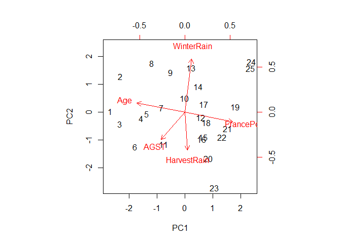
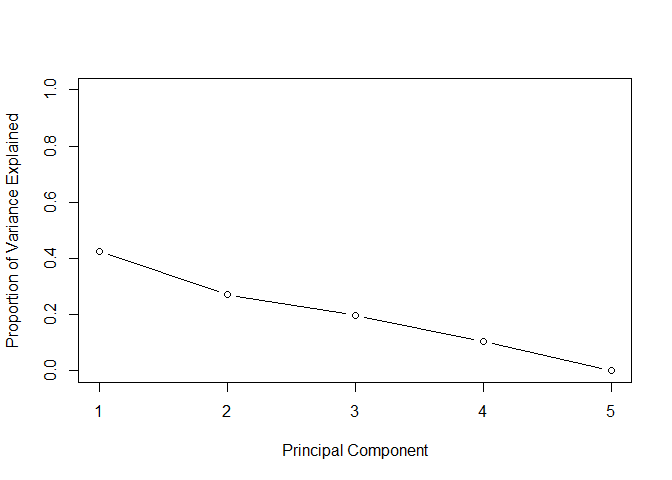
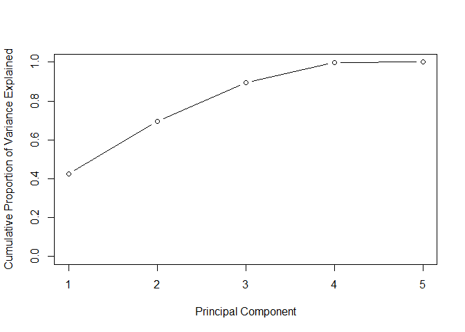

PCA on wine tasting
================
akash lamba
December 2, 2016

We will apply pca on wine dataset

``` r
wine = read.csv("https://storage.googleapis.com/dimensionless/Analytics/wine.csv")
```

Applying PCA on relevant predictors

``` r
pca<-prcomp(wine[,3:7],scale=TRUE)
```

Analyzing components of the output

``` r
#Std Dev
pca$sdev
```

    ## [1] 1.45691795 1.16557440 0.99526725 0.72328569 0.07160523

``` r
# Loadings
pca$rotation
```

    ##                     PC1        PC2        PC3         PC4         PC5
    ## WinterRain   0.09395915  0.7384046 -0.1256430 -0.65563602  0.01689675
    ## AGST        -0.32836427 -0.3806578  0.6264975 -0.59544647  0.01486508
    ## HarvestRain  0.03679770 -0.5244412 -0.7238807 -0.44675373 -0.00390888
    ## Age         -0.66342357  0.1258942 -0.1914225  0.10156506  0.70502609
    ## FrancePop    0.66472828 -0.1377328  0.1762640 -0.07536942  0.70881341

``` r
# Principal Components
pca$x
```

    ##               PC1         PC2         PC3         PC4          PC5
    ##  [1,] -2.66441523  0.01812071 -0.19940771 -0.26187403  0.017848626
    ##  [2,] -2.31090775  1.27230388  0.17749206  0.09070174 -0.006316369
    ##  [3,] -2.31872688 -0.42425903  0.34077385  0.31372038 -0.067315308
    ##  [4,] -1.55060520 -0.23588712 -0.23518124  1.69094289 -0.101731306
    ##  [5,] -1.35803408 -0.06913418 -0.82614968  0.15237445 -0.073508609
    ##  [6,] -1.77313036 -1.24596188  0.30308288 -0.33015372 -0.062254812
    ##  [7,] -0.83734190  0.14770821 -1.90545030 -1.40861601 -0.059226672
    ##  [8,] -1.17507833  1.74417439  1.38340778 -1.06038701 -0.003711288
    ##  [9,] -0.49978424  1.43298732  0.48615479  0.39280758  0.049944991
    ## [10,] -0.01341322  0.49601115 -0.91321708  0.70204963  0.066036711
    ## [11,] -0.75505205 -1.14907041  1.34584178  0.68608150  0.093179804
    ## [12,]  0.56223704 -0.19991293 -2.22360713  0.32097131  0.062303660
    ## [13,]  0.22813081  1.59605527  0.45968547 -0.71903876  0.121180565
    ## [14,]  0.47318950  0.92227025  0.01377674 -0.14755601  0.084300103
    ## [15,]  0.65743468 -0.89650446 -1.56747979 -0.66837607  0.043747752
    ## [16,]  0.60397262 -0.98362933 -0.69683131 -0.53748100  0.042134220
    ## [17,]  0.67149628  0.27205617  0.92090308  0.03475269  0.053849458
    ## [18,]  0.76315093 -0.37837929  0.90694860  0.13667046  0.053372925
    ## [19,]  1.81242805  0.18510809 -1.13339807  1.48444569  0.007580131
    ## [20,]  0.83436088 -1.66846501  1.33756198  0.62859729  0.028001330
    ## [21,]  1.52887804 -0.59071652 -0.11300095 -0.06358380  0.010558586
    ## [22,]  1.33939957 -0.90295396  0.65594023 -0.56734753 -0.015034228
    ## [23,]  1.05051137 -2.71675250  0.74697721 -0.89482443 -0.075496028
    ## [24,]  2.38846524  1.80061406  0.03888058 -0.12744556 -0.110346034
    ## [25,]  2.34283421  1.57421714  0.69629625  0.15256833 -0.159098209

``` r
pca$center
```

    ##  WinterRain        AGST HarvestRain         Age   FrancePop 
    ##   605.28000    16.50934   148.56000    17.20000 49694.43676

``` r
pca$scale
```

    ##   WinterRain         AGST  HarvestRain          Age    FrancePop 
    ##  132.2779649    0.6753968   74.4194643    7.6919872 3665.2702426

Creating biplot

``` r
biplot(pca,scale=0)
```

 Calculating proportion of variance

``` r
pr.var<-pca$sdev^2
pve<-pr.var/sum(pr.var)
pve
```

    ## [1] 0.424521981 0.271712738 0.198111381 0.104628438 0.001025462

Creating scree plot and cumulative plots

``` r
plot(pve, xlab ="Principal Component", 
     ylab ="Proportion of Variance Explained", ylim=c(0 ,1) ,type="b")
```



``` r
plot(cumsum (pve), xlab ="Principal Component", 
     ylab =" Cumulative Proportion of Variance Explained ", ylim=c(0 ,1), type="b")
```



Building model using PC1 to PC4

``` r
predictor<-pca$x[,1:5]
wine<-cbind(wine,predictor)
model<-lm(Price~PC1+PC2+PC3+PC4,data=wine)
summary(model)
```

    ## 
    ## Call:
    ## lm(formula = Price ~ PC1 + PC2 + PC3 + PC4, data = wine)
    ## 
    ## Residuals:
    ##      Min       1Q   Median       3Q      Max 
    ## -0.46899 -0.24789 -0.00215  0.20607  0.52709 
    ## 
    ## Coefficients:
    ##             Estimate Std. Error t value Pr(>|t|)    
    ## (Intercept)  7.06722    0.05889 120.016  < 2e-16 ***
    ## PC1         -0.25487    0.04125  -6.178 4.91e-06 ***
    ## PC2          0.12730    0.05156   2.469   0.0227 *  
    ## PC3          0.41744    0.06039   6.913 1.03e-06 ***
    ## PC4         -0.18647    0.08309  -2.244   0.0363 *  
    ## ---
    ## Signif. codes:  0 '***' 0.001 '**' 0.01 '*' 0.05 '.' 0.1 ' ' 1
    ## 
    ## Residual standard error: 0.2944 on 20 degrees of freedom
    ## Multiple R-squared:  0.8292, Adjusted R-squared:  0.795 
    ## F-statistic: 24.27 on 4 and 20 DF,  p-value: 1.964e-07

#### Making Predictions

We cannot convert test data into principal components, by applying pca. Instead we have to apply same transformations on test data as we did for train data

``` r
wineTest = read.csv("https://storage.googleapis.com/dimensionless/Analytics/wine_test.csv")
wineTest
```

    ##   Year  Price WinterRain    AGST HarvestRain Age FrancePop
    ## 1 1979 6.9541        717 16.1667         122   4  54835.83
    ## 2 1980 6.4979        578 16.0000          74   3  55110.24

``` r
wineTest[1,3:7]-pca$center
```

    ##   WinterRain      AGST HarvestRain   Age FrancePop
    ## 1     111.72 -0.342636      -26.56 -13.2  5141.395

``` r
wineTest[2,3:7]-pca$center
```

    ##   WinterRain      AGST HarvestRain   Age FrancePop
    ## 2     -27.28 -0.509336      -74.56 -14.2  5415.799

``` r
pca_test<-predict(pca,wineTest[,3:7])
class(pca_test)
```

    ## [1] "matrix"

``` r
pca_test
```

    ##           PC1       PC2       PC3        PC4        PC5
    ## [1,] 2.303725 0.5946824 0.4101509 -0.3722356 -0.2074747
    ## [2,] 2.398317 0.2242893 0.8925278  0.7329912 -0.2649691

``` r
# Converting to data frame
pca_test<-as.data.frame(pca_test)
pca_test
```

    ##        PC1       PC2       PC3        PC4        PC5
    ## 1 2.303725 0.5946824 0.4101509 -0.3722356 -0.2074747
    ## 2 2.398317 0.2242893 0.8925278  0.7329912 -0.2649691

Making predictions

``` r
pred_pca<-predict(object = model, newdata=pca_test)
pred_pca
```

    ##        1        2 
    ## 6.796398 6.720412

``` r
wineTest$Price
```

    ## [1] 6.9541 6.4979

### Calculating out of sample `R^2`

``` r
SSE<- sum((pred_pca-wineTest$Price)^2)
SST<-sum((wineTest$Price-mean(wine$Price))^2)
Rsq<-1-SSE/SST
```
