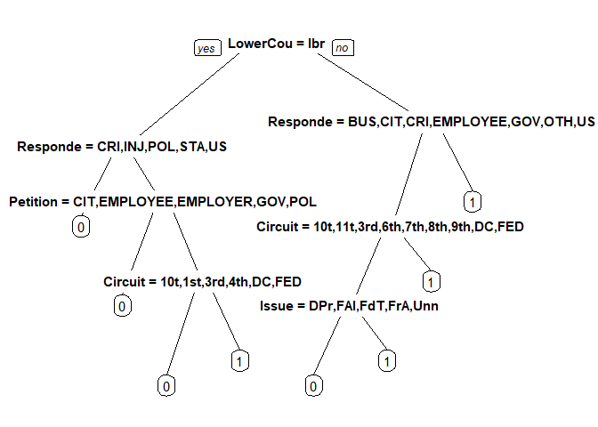

Predicting Supreme Court Cases
================
Akash Lamba

### Overview

  - The Dataset consist of cases from 1994 to 2001.
  - The Supreme Court of United States (SCOTUS) consists of 9 judges
    (“justices”) appointed by the president.
  - In this period 9 judges presided SCOTUS-
    Breyer,Ginsburg,Kennedy,O’Connor,Rehnquist,Scalia,Souter,Stevens
    and Thomas.
  - We will focus on predicting Justice Stevens decisions.

### Variables

  - **Dependent Variable**: Did Justice Stevens vote to reverse the
    lower Court Decision? 1 = “Reverese”,0=“affirm”
  - **Independent Variable**:Properties of the case.
  - **Circuit** Court of origin(1st - 11th,DC,FED).
  - **Issue** area of the case(e.g., Civil rights,Fedral Taxation).
  - Type of **petitioner**,Type of **respondent**(e.g.,US,an Employer).
  - Ideological direction of the **lower court** decision(conservative
    or liberal).
  - Whether petition argued that a law/practice was
    **unconstitutional**.

### Loading Packages

``` r
library(caTools)# Splitting
library(e1071)# SVM package download
library(caret)# Machine Learning
library(rpart)# Recursive partitioning of tres
library(rpart.plot)# Plot the trees
library(randomForest)# Machine Learning
library(knitr)# Table Building
library(rattle)#Fancy Tree Plots
library(xgboost)# Machine Learning
library(Matrix)# Matrix Formation
```

### Importing The Dataset

``` r
stevens <- read.csv("stevens.csv")
```

### Taking a glance at the data

Lets check the first 6 rows as well as the summary statistics of our
data to get a feel of how the data
    looks.

### Head

``` r
head(stevens)
```

    ##    Docket Term Circuit            Issue Petitioner Respondent LowerCourt
    ## 1 93-1408 1994     2nd EconomicActivity   BUSINESS   BUSINESS    liberal
    ## 2 93-1577 1994     9th EconomicActivity   BUSINESS   BUSINESS    liberal
    ## 3 93-1612 1994     5th EconomicActivity   BUSINESS   BUSINESS    liberal
    ## 4  94-623 1994     1st EconomicActivity   BUSINESS   BUSINESS     conser
    ## 5 94-1175 1995     7th    JudicialPower   BUSINESS   BUSINESS     conser
    ## 6  95-129 1995     9th EconomicActivity   BUSINESS   BUSINESS     conser
    ##   Unconst Reverse
    ## 1       0       1
    ## 2       0       1
    ## 3       0       1
    ## 4       0       1
    ## 5       0       1
    ## 6       1       0

### Summary

``` r
summary(stevens)
```

    ##      Docket         Term         Circuit                  Issue    
    ##  00-1011:  1   Min.   :1994   9th    :122   CriminalProcedure:132  
    ##  00-1045:  1   1st Qu.:1995   5th    : 53   JudicialPower    :102  
    ##  00-1072:  1   Median :1997   11th   : 49   EconomicActivity : 98  
    ##  00-1073:  1   Mean   :1997   7th    : 47   CivilRights      : 74  
    ##  00-1089:  1   3rd Qu.:1999   4th    : 46   DueProcess       : 43  
    ##  00-121 :  1   Max.   :2001   8th    : 44   FirstAmendment   : 39  
    ##  (Other):560                  (Other):205   (Other)          : 78  
    ##                Petitioner               Respondent    LowerCourt 
    ##  OTHER              :175   OTHER             :177   conser :293  
    ##  CRIMINAL.DEFENDENT : 89   BUSINESS          : 80   liberal:273  
    ##  BUSINESS           : 79   US                : 69                
    ##  STATE              : 48   CRIMINAL.DEFENDENT: 58                
    ##  US                 : 48   STATE             : 56                
    ##  GOVERNMENT.OFFICIAL: 38   EMPLOYEE          : 28                
    ##  (Other)            : 89   (Other)           : 98                
    ##     Unconst          Reverse      
    ##  Min.   :0.0000   Min.   :0.0000  
    ##  1st Qu.:0.0000   1st Qu.:0.0000  
    ##  Median :0.0000   Median :1.0000  
    ##  Mean   :0.2473   Mean   :0.5459  
    ##  3rd Qu.:0.0000   3rd Qu.:1.0000  
    ##  Max.   :1.0000   Max.   :1.0000  
    ## 

### Structure

``` r
str(stevens)
```

    ## 'data.frame':    566 obs. of  9 variables:
    ##  $ Docket    : Factor w/ 566 levels "00-1011","00-1045",..: 63 69 70 145 97 181 242 289 334 436 ...
    ##  $ Term      : int  1994 1994 1994 1994 1995 1995 1996 1997 1997 1999 ...
    ##  $ Circuit   : Factor w/ 13 levels "10th","11th",..: 4 11 7 3 9 11 13 11 12 2 ...
    ##  $ Issue     : Factor w/ 11 levels "Attorneys","CivilRights",..: 5 5 5 5 9 5 5 5 5 3 ...
    ##  $ Petitioner: Factor w/ 12 levels "AMERICAN.INDIAN",..: 2 2 2 2 2 2 2 2 2 2 ...
    ##  $ Respondent: Factor w/ 12 levels "AMERICAN.INDIAN",..: 2 2 2 2 2 2 2 2 2 2 ...
    ##  $ LowerCourt: Factor w/ 2 levels "conser","liberal": 2 2 2 1 1 1 1 1 1 1 ...
    ##  $ Unconst   : int  0 0 0 0 0 1 0 1 0 0 ...
    ##  $ Reverse   : int  1 1 1 1 1 0 1 1 1 1 ...

### Checking Missing Values

``` r
any(is.na(stevens))
```

    ## [1] FALSE

### Data partitioning

``` r
set.seed(3000)
spl <- sample.split(stevens$Reverse,SplitRatio = 0.7)
train <- subset(stevens,spl==T)
test <- subset(stevens,spl==F)
```

### Machine Learning

  - Decision Tree
  - Random Forest
  - Boosting
  - SVM

### 1\. Decision Tree

#### Create Model

``` r
#Comparing the dependant variable with 6 Independant variables
stevenstree <- rpart(Reverse~Circuit+Issue+Petitioner+Respondent+LowerCourt+Unconst,data=train,
                     method="class",minbucket=25)
```

#### Plot Tree

``` r
prp(stevenstree)
```

<!-- -->

#### Prediction on Train Data

``` r
predTrain <- predict(stevenstree,type = "class")
```

#### Accuracy on Train Data

``` r
table(train$Reverse,predTrain)
```

    ##    predTrain
    ##       0   1
    ##   0 114  66
    ##   1  40 176

``` r
cm_predTrain <- confusionMatrix(table(train$Reverse,predTrain))
cm_predTrain$overall[1]
```

    ##  Accuracy 
    ## 0.7323232

#### Prediction on Test Data

``` r
PredictCart <- predict(stevenstree,newdata = test,type = "class")
```

#### Accuracy on Test Data

``` r
cm_predTest <- confusionMatrix(table(test$Reverse,PredictCart))
cm_predTest$overall[1]
```

    ##  Accuracy 
    ## 0.6588235

``` r
accuracy_DecisionTree1 <- cm_predTest$overall[1]
```

#### Pruning the tree using Cross-Validation

``` r
numfolds <- trainControl(method='cv',number = 10)#Cross- Validation with 10 folds
cpGrid <- expand.grid(cp = seq(0.01,1,0.01))#range
model_cv <- train(as.factor(Reverse)~Circuit+Issue+Petitioner+Respondent+LowerCourt+Unconst,data=train,
                  method="rpart",trControl=numfolds,tuneGrid=cpGrid)
model_cv
```

    ## CART 
    ## 
    ## 396 samples
    ##   6 predictor
    ##   2 classes: '0', '1' 
    ## 
    ## No pre-processing
    ## Resampling: Cross-Validated (10 fold) 
    ## Summary of sample sizes: 356, 357, 357, 356, 356, 356, ... 
    ## Resampling results across tuning parameters:
    ## 
    ##   cp    Accuracy   Kappa     
    ##   0.01  0.6261538  0.22890165
    ##   0.02  0.6210256  0.22538001
    ##   0.03  0.6084615  0.20344621
    ##   0.04  0.6134615  0.21566113
    ##   0.05  0.6434615  0.28269075
    ##   0.06  0.6434615  0.28269075
    ##   0.07  0.6434615  0.28269075
    ##   0.08  0.6434615  0.28269075
    ##   0.09  0.6434615  0.28269075
    ##   0.10  0.6434615  0.28269075
    ##   0.11  0.6434615  0.28269075
    ##   0.12  0.6434615  0.28269075
    ##   0.13  0.6434615  0.28269075
    ##   0.14  0.6434615  0.28269075
    ##   0.15  0.6434615  0.28269075
    ##   0.16  0.6434615  0.28269075
    ##   0.17  0.6434615  0.28269075
    ##   0.18  0.6184615  0.22392786
    ##   0.19  0.6184615  0.22392786
    ##   0.20  0.5784615  0.12393786
    ##   0.21  0.5505769  0.05020199
    ##   0.22  0.5505769  0.05020199
    ##   0.23  0.5428846  0.02727709
    ##   0.24  0.5403205  0.01675078
    ##   0.25  0.5453846  0.00000000
    ##   0.26  0.5453846  0.00000000
    ##   0.27  0.5453846  0.00000000
    ##   0.28  0.5453846  0.00000000
    ##   0.29  0.5453846  0.00000000
    ##   0.30  0.5453846  0.00000000
    ##   0.31  0.5453846  0.00000000
    ##   0.32  0.5453846  0.00000000
    ##   0.33  0.5453846  0.00000000
    ##   0.34  0.5453846  0.00000000
    ##   0.35  0.5453846  0.00000000
    ##   0.36  0.5453846  0.00000000
    ##   0.37  0.5453846  0.00000000
    ##   0.38  0.5453846  0.00000000
    ##   0.39  0.5453846  0.00000000
    ##   0.40  0.5453846  0.00000000
    ##   0.41  0.5453846  0.00000000
    ##   0.42  0.5453846  0.00000000
    ##   0.43  0.5453846  0.00000000
    ##   0.44  0.5453846  0.00000000
    ##   0.45  0.5453846  0.00000000
    ##   0.46  0.5453846  0.00000000
    ##   0.47  0.5453846  0.00000000
    ##   0.48  0.5453846  0.00000000
    ##   0.49  0.5453846  0.00000000
    ##   0.50  0.5453846  0.00000000
    ##   0.51  0.5453846  0.00000000
    ##   0.52  0.5453846  0.00000000
    ##   0.53  0.5453846  0.00000000
    ##   0.54  0.5453846  0.00000000
    ##   0.55  0.5453846  0.00000000
    ##   0.56  0.5453846  0.00000000
    ##   0.57  0.5453846  0.00000000
    ##   0.58  0.5453846  0.00000000
    ##   0.59  0.5453846  0.00000000
    ##   0.60  0.5453846  0.00000000
    ##   0.61  0.5453846  0.00000000
    ##   0.62  0.5453846  0.00000000
    ##   0.63  0.5453846  0.00000000
    ##   0.64  0.5453846  0.00000000
    ##   0.65  0.5453846  0.00000000
    ##   0.66  0.5453846  0.00000000
    ##   0.67  0.5453846  0.00000000
    ##   0.68  0.5453846  0.00000000
    ##   0.69  0.5453846  0.00000000
    ##   0.70  0.5453846  0.00000000
    ##   0.71  0.5453846  0.00000000
    ##   0.72  0.5453846  0.00000000
    ##   0.73  0.5453846  0.00000000
    ##   0.74  0.5453846  0.00000000
    ##   0.75  0.5453846  0.00000000
    ##   0.76  0.5453846  0.00000000
    ##   0.77  0.5453846  0.00000000
    ##   0.78  0.5453846  0.00000000
    ##   0.79  0.5453846  0.00000000
    ##   0.80  0.5453846  0.00000000
    ##   0.81  0.5453846  0.00000000
    ##   0.82  0.5453846  0.00000000
    ##   0.83  0.5453846  0.00000000
    ##   0.84  0.5453846  0.00000000
    ##   0.85  0.5453846  0.00000000
    ##   0.86  0.5453846  0.00000000
    ##   0.87  0.5453846  0.00000000
    ##   0.88  0.5453846  0.00000000
    ##   0.89  0.5453846  0.00000000
    ##   0.90  0.5453846  0.00000000
    ##   0.91  0.5453846  0.00000000
    ##   0.92  0.5453846  0.00000000
    ##   0.93  0.5453846  0.00000000
    ##   0.94  0.5453846  0.00000000
    ##   0.95  0.5453846  0.00000000
    ##   0.96  0.5453846  0.00000000
    ##   0.97  0.5453846  0.00000000
    ##   0.98  0.5453846  0.00000000
    ##   0.99  0.5453846  0.00000000
    ##   1.00  0.5453846  0.00000000
    ## 
    ## Accuracy was used to select the optimal model using the largest value.
    ## The final value used for the model was cp = 0.17.

#### Building the Final Model with cp=0.17

``` r
stevenstreeCV <- rpart(Reverse~Circuit+Issue+Petitioner+Respondent+LowerCourt+Unconst,data=train,
                       method="class",cp=0.17)
```

#### Prediction on the Test Data

``` r
predictTreeCV <- predict(stevenstreeCV ,newdata = test)
```

#### Model Accuracy

``` r
dt <- ifelse(predictTreeCV[,2]>0.5,1,0)#greater than 50% than 1 else 0
tb_dt2 <- table(test$Reverse,dt)#table
cm_dt2 <- confusionMatrix(tb_dt2)#confusion Matrix
cm_dt2$overall[1]
```

    ##  Accuracy 
    ## 0.7235294

``` r
accuracy_decisionTree <- cm_dt2$overall[1]#accuracy
```

### 2\. Random Forest

#### Create Model

``` r
Stevensforest <- randomForest(as.factor(Reverse) ~ Circuit + Issue + Petitioner + Respondent + LowerCourt + Unconst,data = train,ntree=500,nodesize=5)
```

#### Plot the Model

``` r
plot(Stevensforest)
```

<!-- -->

#### Cross Validation

``` r
set.seed(50)
cv_rf <- rfcv(trainx = train[,3:8],trainy = as.factor(train$Reverse),cv.fold = 10,step = 0.95,
              nodesize=1,ntree=500)
min(cv_rf$error.cv)#Checking the least error for mtry
```

    ## [1] 0.3409091

#### Rebuilding the Model with mtry=3

``` r
Stevensforest <- randomForest(as.factor(Reverse) ~ Circuit + Issue + Petitioner + Respondent + LowerCourt + Unconst,data = train,ntree=500,nodesize=5,mtry=3)
```

#### Predictions on the Test Data

``` r
predict_Stevens <- predict(Stevensforest,newdata =test)
```

#### Model Accuracy

``` r
cm_Rf <- confusionMatrix(table(test$Reverse,predict_Stevens))#confusion Matrix
cm_Rf
```

    ## Confusion Matrix and Statistics
    ## 
    ##    predict_Stevens
    ##      0  1
    ##   0 35 42
    ##   1 15 78
    ##                                           
    ##                Accuracy : 0.6647          
    ##                  95% CI : (0.5884, 0.7352)
    ##     No Information Rate : 0.7059          
    ##     P-Value [Acc > NIR] : 0.8955143       
    ##                                           
    ##                   Kappa : 0.3024          
    ##                                           
    ##  Mcnemar's Test P-Value : 0.0005736       
    ##                                           
    ##             Sensitivity : 0.7000          
    ##             Specificity : 0.6500          
    ##          Pos Pred Value : 0.4545          
    ##          Neg Pred Value : 0.8387          
    ##              Prevalence : 0.2941          
    ##          Detection Rate : 0.2059          
    ##    Detection Prevalence : 0.4529          
    ##       Balanced Accuracy : 0.6750          
    ##                                           
    ##        'Positive' Class : 0               
    ## 

``` r
accuracy_randomForest <- cm_Rf$overall[1]#Accuracy
```

### 3\. XGBoost

#### Create Model

``` r
#Sparse for train data
sparse <- sparse.model.matrix(Reverse ~ Circuit + Issue + Petitioner + Respondent + LowerCourt + Unconst,data=train)

#Boosting on train data
dtrain <- xgb.DMatrix(data=sparse,label= train$Reverse)

#Sparse for test data
sparse_test <- sparse.model.matrix(Reverse ~ Circuit + Issue + Petitioner + Respondent + LowerCourt + Unconst,data=test)

#boosting on test data
dtest <- xgb.DMatrix(data=sparse_test,label=test$Reverse)

#Watchlist
watchlist = list(train = dtrain,test=dtest)

#Model building on dtrain data
model_xgb <- xgb.train(data=dtrain,nrounds = 5000,objective="binary:logistic",verbose=1,
                       eta=0.1,max_depth=1,watchlist= watchlist,early_stopping_rounds=200)
```

    ## [1]  train-error:0.356061    test-error:0.276471 
    ## Multiple eval metrics are present. Will use test_error for early stopping.
    ## Will train until test_error hasn't improved in 200 rounds.
    ## 
    ## [2]  train-error:0.356061    test-error:0.276471 
    ## [3]  train-error:0.356061    test-error:0.276471 
    ## [4]  train-error:0.356061    test-error:0.276471 
    ## [5]  train-error:0.356061    test-error:0.276471 
    ## [6]  train-error:0.356061    test-error:0.276471 
    ## [7]  train-error:0.356061    test-error:0.276471 
    ## [8]  train-error:0.356061    test-error:0.276471 
    ## [9]  train-error:0.356061    test-error:0.276471 
    ## [10] train-error:0.356061    test-error:0.276471 
    ## [11] train-error:0.356061    test-error:0.276471 
    ## [12] train-error:0.356061    test-error:0.276471 
    ## [13] train-error:0.356061    test-error:0.276471 
    ## [14] train-error:0.361111    test-error:0.288235 
    ## [15] train-error:0.361111    test-error:0.288235 
    ## [16] train-error:0.361111    test-error:0.288235 
    ## [17] train-error:0.361111    test-error:0.288235 
    ## [18] train-error:0.361111    test-error:0.288235 
    ## [19] train-error:0.361111    test-error:0.288235 
    ## [20] train-error:0.361111    test-error:0.288235 
    ## [21] train-error:0.361111    test-error:0.288235 
    ## [22] train-error:0.361111    test-error:0.288235 
    ## [23] train-error:0.361111    test-error:0.288235 
    ## [24] train-error:0.361111    test-error:0.288235 
    ## [25] train-error:0.361111    test-error:0.288235 
    ## [26] train-error:0.361111    test-error:0.288235 
    ## [27] train-error:0.361111    test-error:0.288235 
    ## [28] train-error:0.361111    test-error:0.288235 
    ## [29] train-error:0.361111    test-error:0.288235 
    ## [30] train-error:0.361111    test-error:0.288235 
    ## [31] train-error:0.361111    test-error:0.288235 
    ## [32] train-error:0.361111    test-error:0.288235 
    ## [33] train-error:0.361111    test-error:0.288235 
    ## [34] train-error:0.361111    test-error:0.288235 
    ## [35] train-error:0.361111    test-error:0.288235 
    ## [36] train-error:0.361111    test-error:0.288235 
    ## [37] train-error:0.361111    test-error:0.288235 
    ## [38] train-error:0.361111    test-error:0.288235 
    ## [39] train-error:0.361111    test-error:0.288235 
    ## [40] train-error:0.361111    test-error:0.288235 
    ## [41] train-error:0.361111    test-error:0.288235 
    ## [42] train-error:0.361111    test-error:0.288235 
    ## [43] train-error:0.351010    test-error:0.294118 
    ## [44] train-error:0.361111    test-error:0.294118 
    ## [45] train-error:0.361111    test-error:0.294118 
    ## [46] train-error:0.358586    test-error:0.300000 
    ## [47] train-error:0.358586    test-error:0.300000 
    ## [48] train-error:0.361111    test-error:0.305882 
    ## [49] train-error:0.361111    test-error:0.305882 
    ## [50] train-error:0.366162    test-error:0.300000 
    ## [51] train-error:0.366162    test-error:0.300000 
    ## [52] train-error:0.358586    test-error:0.300000 
    ## [53] train-error:0.358586    test-error:0.300000 
    ## [54] train-error:0.353535    test-error:0.300000 
    ## [55] train-error:0.356061    test-error:0.300000 
    ## [56] train-error:0.356061    test-error:0.300000 
    ## [57] train-error:0.358586    test-error:0.300000 
    ## [58] train-error:0.353535    test-error:0.305882 
    ## [59] train-error:0.356061    test-error:0.305882 
    ## [60] train-error:0.353535    test-error:0.305882 
    ## [61] train-error:0.356061    test-error:0.305882 
    ## [62] train-error:0.361111    test-error:0.317647 
    ## [63] train-error:0.356061    test-error:0.311765 
    ## [64] train-error:0.353535    test-error:0.311765 
    ## [65] train-error:0.348485    test-error:0.305882 
    ## [66] train-error:0.348485    test-error:0.305882 
    ## [67] train-error:0.348485    test-error:0.305882 
    ## [68] train-error:0.348485    test-error:0.305882 
    ## [69] train-error:0.348485    test-error:0.305882 
    ## [70] train-error:0.356061    test-error:0.311765 
    ## [71] train-error:0.356061    test-error:0.311765 
    ## [72] train-error:0.356061    test-error:0.311765 
    ## [73] train-error:0.356061    test-error:0.311765 
    ## [74] train-error:0.348485    test-error:0.311765 
    ## [75] train-error:0.345960    test-error:0.311765 
    ## [76] train-error:0.351010    test-error:0.311765 
    ## [77] train-error:0.351010    test-error:0.311765 
    ## [78] train-error:0.340909    test-error:0.311765 
    ## [79] train-error:0.343434    test-error:0.311765 
    ## [80] train-error:0.343434    test-error:0.311765 
    ## [81] train-error:0.343434    test-error:0.311765 
    ## [82] train-error:0.343434    test-error:0.311765 
    ## [83] train-error:0.343434    test-error:0.311765 
    ## [84] train-error:0.343434    test-error:0.311765 
    ## [85] train-error:0.343434    test-error:0.311765 
    ## [86] train-error:0.343434    test-error:0.311765 
    ## [87] train-error:0.343434    test-error:0.311765 
    ## [88] train-error:0.340909    test-error:0.311765 
    ## [89] train-error:0.338384    test-error:0.311765 
    ## [90] train-error:0.338384    test-error:0.311765 
    ## [91] train-error:0.338384    test-error:0.311765 
    ## [92] train-error:0.335859    test-error:0.311765 
    ## [93] train-error:0.338384    test-error:0.317647 
    ## [94] train-error:0.338384    test-error:0.311765 
    ## [95] train-error:0.338384    test-error:0.311765 
    ## [96] train-error:0.338384    test-error:0.311765 
    ## [97] train-error:0.338384    test-error:0.317647 
    ## [98] train-error:0.338384    test-error:0.317647 
    ## [99] train-error:0.338384    test-error:0.317647 
    ## [100]    train-error:0.340909    test-error:0.317647 
    ## [101]    train-error:0.335859    test-error:0.317647 
    ## [102]    train-error:0.335859    test-error:0.317647 
    ## [103]    train-error:0.335859    test-error:0.311765 
    ## [104]    train-error:0.335859    test-error:0.311765 
    ## [105]    train-error:0.335859    test-error:0.311765 
    ## [106]    train-error:0.335859    test-error:0.311765 
    ## [107]    train-error:0.335859    test-error:0.317647 
    ## [108]    train-error:0.335859    test-error:0.317647 
    ## [109]    train-error:0.333333    test-error:0.323529 
    ## [110]    train-error:0.335859    test-error:0.329412 
    ## [111]    train-error:0.335859    test-error:0.329412 
    ## [112]    train-error:0.333333    test-error:0.329412 
    ## [113]    train-error:0.333333    test-error:0.329412 
    ## [114]    train-error:0.333333    test-error:0.311765 
    ## [115]    train-error:0.333333    test-error:0.317647 
    ## [116]    train-error:0.333333    test-error:0.317647 
    ## [117]    train-error:0.335859    test-error:0.317647 
    ## [118]    train-error:0.335859    test-error:0.317647 
    ## [119]    train-error:0.333333    test-error:0.323529 
    ## [120]    train-error:0.335859    test-error:0.317647 
    ## [121]    train-error:0.338384    test-error:0.311765 
    ## [122]    train-error:0.338384    test-error:0.317647 
    ## [123]    train-error:0.338384    test-error:0.311765 
    ## [124]    train-error:0.335859    test-error:0.311765 
    ## [125]    train-error:0.333333    test-error:0.311765 
    ## [126]    train-error:0.333333    test-error:0.317647 
    ## [127]    train-error:0.330808    test-error:0.317647 
    ## [128]    train-error:0.330808    test-error:0.317647 
    ## [129]    train-error:0.330808    test-error:0.317647 
    ## [130]    train-error:0.330808    test-error:0.317647 
    ## [131]    train-error:0.330808    test-error:0.317647 
    ## [132]    train-error:0.333333    test-error:0.317647 
    ## [133]    train-error:0.333333    test-error:0.317647 
    ## [134]    train-error:0.335859    test-error:0.317647 
    ## [135]    train-error:0.335859    test-error:0.317647 
    ## [136]    train-error:0.335859    test-error:0.317647 
    ## [137]    train-error:0.333333    test-error:0.317647 
    ## [138]    train-error:0.333333    test-error:0.317647 
    ## [139]    train-error:0.333333    test-error:0.317647 
    ## [140]    train-error:0.333333    test-error:0.317647 
    ## [141]    train-error:0.328283    test-error:0.317647 
    ## [142]    train-error:0.325758    test-error:0.317647 
    ## [143]    train-error:0.325758    test-error:0.317647 
    ## [144]    train-error:0.325758    test-error:0.317647 
    ## [145]    train-error:0.328283    test-error:0.317647 
    ## [146]    train-error:0.328283    test-error:0.317647 
    ## [147]    train-error:0.328283    test-error:0.317647 
    ## [148]    train-error:0.328283    test-error:0.317647 
    ## [149]    train-error:0.328283    test-error:0.317647 
    ## [150]    train-error:0.328283    test-error:0.317647 
    ## [151]    train-error:0.333333    test-error:0.317647 
    ## [152]    train-error:0.333333    test-error:0.317647 
    ## [153]    train-error:0.328283    test-error:0.317647 
    ## [154]    train-error:0.325758    test-error:0.317647 
    ## [155]    train-error:0.325758    test-error:0.317647 
    ## [156]    train-error:0.323232    test-error:0.311765 
    ## [157]    train-error:0.323232    test-error:0.311765 
    ## [158]    train-error:0.323232    test-error:0.311765 
    ## [159]    train-error:0.323232    test-error:0.311765 
    ## [160]    train-error:0.325758    test-error:0.311765 
    ## [161]    train-error:0.328283    test-error:0.311765 
    ## [162]    train-error:0.325758    test-error:0.311765 
    ## [163]    train-error:0.328283    test-error:0.311765 
    ## [164]    train-error:0.328283    test-error:0.311765 
    ## [165]    train-error:0.328283    test-error:0.311765 
    ## [166]    train-error:0.328283    test-error:0.311765 
    ## [167]    train-error:0.328283    test-error:0.311765 
    ## [168]    train-error:0.333333    test-error:0.323529 
    ## [169]    train-error:0.330808    test-error:0.323529 
    ## [170]    train-error:0.328283    test-error:0.323529 
    ## [171]    train-error:0.330808    test-error:0.323529 
    ## [172]    train-error:0.328283    test-error:0.323529 
    ## [173]    train-error:0.328283    test-error:0.323529 
    ## [174]    train-error:0.330808    test-error:0.323529 
    ## [175]    train-error:0.330808    test-error:0.311765 
    ## [176]    train-error:0.325758    test-error:0.311765 
    ## [177]    train-error:0.330808    test-error:0.311765 
    ## [178]    train-error:0.330808    test-error:0.311765 
    ## [179]    train-error:0.328283    test-error:0.311765 
    ## [180]    train-error:0.325758    test-error:0.311765 
    ## [181]    train-error:0.323232    test-error:0.311765 
    ## [182]    train-error:0.328283    test-error:0.311765 
    ## [183]    train-error:0.323232    test-error:0.311765 
    ## [184]    train-error:0.323232    test-error:0.311765 
    ## [185]    train-error:0.323232    test-error:0.311765 
    ## [186]    train-error:0.328283    test-error:0.329412 
    ## [187]    train-error:0.328283    test-error:0.329412 
    ## [188]    train-error:0.323232    test-error:0.317647 
    ## [189]    train-error:0.328283    test-error:0.329412 
    ## [190]    train-error:0.330808    test-error:0.317647 
    ## [191]    train-error:0.330808    test-error:0.329412 
    ## [192]    train-error:0.330808    test-error:0.317647 
    ## [193]    train-error:0.325758    test-error:0.329412 
    ## [194]    train-error:0.328283    test-error:0.317647 
    ## [195]    train-error:0.330808    test-error:0.329412 
    ## [196]    train-error:0.330808    test-error:0.329412 
    ## [197]    train-error:0.330808    test-error:0.317647 
    ## [198]    train-error:0.330808    test-error:0.317647 
    ## [199]    train-error:0.325758    test-error:0.329412 
    ## [200]    train-error:0.323232    test-error:0.317647 
    ## [201]    train-error:0.325758    test-error:0.329412 
    ## Stopping. Best iteration:
    ## [1]  train-error:0.356061    test-error:0.276471

#### Cross Validation

``` r
#number of folds
numFolds <- trainControl(method = "cv",number = 5)

#tune grid
tunegrid <- expand.grid(max_depth= 1,eta=0.01,nrounds=1000,gamma=0,min_child_weight=1,
                        subsample=1,colsample_bytree=1)

#Cross-validation
model_xgb_caret <- train(as.factor(Reverse)~.-Docket-Term,data=train,method="xgbTree",trControl=numFolds,
                         tuneGrid=tunegrid,early_stopping_rounds=100,watchlist=watchlist,maximize=T)
```

    ## [1]  train-error:0.545455    test-error:0.517647 
    ## Multiple eval metrics are present. Will use test_error for early stopping.
    ## Will train until test_error hasn't improved in 100 rounds.
    ## 
    ## [2]  train-error:0.545455    test-error:0.517647 
    ## [3]  train-error:0.545455    test-error:0.517647 
    ## [4]  train-error:0.545455    test-error:0.517647 
    ## [5]  train-error:0.545455    test-error:0.517647 
    ## [6]  train-error:0.545455    test-error:0.517647 
    ## [7]  train-error:0.545455    test-error:0.517647 
    ## [8]  train-error:0.545455    test-error:0.517647 
    ## [9]  train-error:0.545455    test-error:0.517647 
    ## [10] train-error:0.545455    test-error:0.517647 
    ## [11] train-error:0.545455    test-error:0.517647 
    ## [12] train-error:0.545455    test-error:0.517647 
    ## [13] train-error:0.545455    test-error:0.517647 
    ## [14] train-error:0.545455    test-error:0.517647 
    ## [15] train-error:0.545455    test-error:0.517647 
    ## [16] train-error:0.545455    test-error:0.517647 
    ## [17] train-error:0.545455    test-error:0.517647 
    ## [18] train-error:0.545455    test-error:0.517647 
    ## [19] train-error:0.545455    test-error:0.517647 
    ## [20] train-error:0.545455    test-error:0.517647 
    ## [21] train-error:0.545455    test-error:0.517647 
    ## [22] train-error:0.545455    test-error:0.517647 
    ## [23] train-error:0.545455    test-error:0.517647 
    ## [24] train-error:0.545455    test-error:0.517647 
    ## [25] train-error:0.545455    test-error:0.517647 
    ## [26] train-error:0.545455    test-error:0.517647 
    ## [27] train-error:0.545455    test-error:0.517647 
    ## [28] train-error:0.545455    test-error:0.517647 
    ## [29] train-error:0.545455    test-error:0.517647 
    ## [30] train-error:0.545455    test-error:0.517647 
    ## [31] train-error:0.545455    test-error:0.517647 
    ## [32] train-error:0.545455    test-error:0.517647 
    ## [33] train-error:0.545455    test-error:0.517647 
    ## [34] train-error:0.545455    test-error:0.517647 
    ## [35] train-error:0.545455    test-error:0.517647 
    ## [36] train-error:0.545455    test-error:0.517647 
    ## [37] train-error:0.545455    test-error:0.517647 
    ## [38] train-error:0.545455    test-error:0.517647 
    ## [39] train-error:0.545455    test-error:0.517647 
    ## [40] train-error:0.545455    test-error:0.517647 
    ## [41] train-error:0.545455    test-error:0.517647 
    ## [42] train-error:0.545455    test-error:0.517647 
    ## [43] train-error:0.545455    test-error:0.517647 
    ## [44] train-error:0.545455    test-error:0.517647 
    ## [45] train-error:0.545455    test-error:0.517647 
    ## [46] train-error:0.545455    test-error:0.517647 
    ## [47] train-error:0.545455    test-error:0.517647 
    ## [48] train-error:0.545455    test-error:0.517647 
    ## [49] train-error:0.545455    test-error:0.517647 
    ## [50] train-error:0.545455    test-error:0.517647 
    ## [51] train-error:0.545455    test-error:0.517647 
    ## [52] train-error:0.545455    test-error:0.517647 
    ## [53] train-error:0.545455    test-error:0.517647 
    ## [54] train-error:0.545455    test-error:0.517647 
    ## [55] train-error:0.545455    test-error:0.517647 
    ## [56] train-error:0.545455    test-error:0.517647 
    ## [57] train-error:0.545455    test-error:0.517647 
    ## [58] train-error:0.545455    test-error:0.517647 
    ## [59] train-error:0.545455    test-error:0.517647 
    ## [60] train-error:0.545455    test-error:0.517647 
    ## [61] train-error:0.545455    test-error:0.517647 
    ## [62] train-error:0.545455    test-error:0.517647 
    ## [63] train-error:0.545455    test-error:0.517647 
    ## [64] train-error:0.545455    test-error:0.517647 
    ## [65] train-error:0.545455    test-error:0.517647 
    ## [66] train-error:0.545455    test-error:0.517647 
    ## [67] train-error:0.545455    test-error:0.517647 
    ## [68] train-error:0.545455    test-error:0.517647 
    ## [69] train-error:0.545455    test-error:0.517647 
    ## [70] train-error:0.545455    test-error:0.517647 
    ## [71] train-error:0.545455    test-error:0.517647 
    ## [72] train-error:0.545455    test-error:0.517647 
    ## [73] train-error:0.545455    test-error:0.517647 
    ## [74] train-error:0.545455    test-error:0.517647 
    ## [75] train-error:0.545455    test-error:0.517647 
    ## [76] train-error:0.545455    test-error:0.517647 
    ## [77] train-error:0.545455    test-error:0.517647 
    ## [78] train-error:0.545455    test-error:0.517647 
    ## [79] train-error:0.545455    test-error:0.517647 
    ## [80] train-error:0.545455    test-error:0.517647 
    ## [81] train-error:0.545455    test-error:0.517647 
    ## [82] train-error:0.545455    test-error:0.517647 
    ## [83] train-error:0.545455    test-error:0.517647 
    ## [84] train-error:0.545455    test-error:0.517647 
    ## [85] train-error:0.545455    test-error:0.517647 
    ## [86] train-error:0.545455    test-error:0.517647 
    ## [87] train-error:0.545455    test-error:0.517647 
    ## [88] train-error:0.545455    test-error:0.517647 
    ## [89] train-error:0.545455    test-error:0.517647 
    ## [90] train-error:0.545455    test-error:0.517647 
    ## [91] train-error:0.545455    test-error:0.517647 
    ## [92] train-error:0.545455    test-error:0.517647 
    ## [93] train-error:0.545455    test-error:0.517647 
    ## [94] train-error:0.545455    test-error:0.517647 
    ## [95] train-error:0.545455    test-error:0.517647 
    ## [96] train-error:0.545455    test-error:0.517647 
    ## [97] train-error:0.545455    test-error:0.517647 
    ## [98] train-error:0.545455    test-error:0.517647 
    ## [99] train-error:0.545455    test-error:0.517647 
    ## [100]    train-error:0.545455    test-error:0.517647 
    ## [101]    train-error:0.545455    test-error:0.517647 
    ## Stopping. Best iteration:
    ## [1]  train-error:0.545455    test-error:0.517647
    ## 
    ## [1]  train-error:0.545455    test-error:0.517647 
    ## Multiple eval metrics are present. Will use test_error for early stopping.
    ## Will train until test_error hasn't improved in 100 rounds.
    ## 
    ## [2]  train-error:0.545455    test-error:0.517647 
    ## [3]  train-error:0.545455    test-error:0.517647 
    ## [4]  train-error:0.545455    test-error:0.517647 
    ## [5]  train-error:0.545455    test-error:0.517647 
    ## [6]  train-error:0.545455    test-error:0.517647 
    ## [7]  train-error:0.545455    test-error:0.517647 
    ## [8]  train-error:0.545455    test-error:0.517647 
    ## [9]  train-error:0.545455    test-error:0.517647 
    ## [10] train-error:0.545455    test-error:0.517647 
    ## [11] train-error:0.545455    test-error:0.517647 
    ## [12] train-error:0.545455    test-error:0.517647 
    ## [13] train-error:0.545455    test-error:0.517647 
    ## [14] train-error:0.545455    test-error:0.517647 
    ## [15] train-error:0.545455    test-error:0.517647 
    ## [16] train-error:0.545455    test-error:0.517647 
    ## [17] train-error:0.545455    test-error:0.517647 
    ## [18] train-error:0.545455    test-error:0.517647 
    ## [19] train-error:0.545455    test-error:0.517647 
    ## [20] train-error:0.545455    test-error:0.517647 
    ## [21] train-error:0.545455    test-error:0.517647 
    ## [22] train-error:0.545455    test-error:0.517647 
    ## [23] train-error:0.545455    test-error:0.517647 
    ## [24] train-error:0.545455    test-error:0.517647 
    ## [25] train-error:0.545455    test-error:0.517647 
    ## [26] train-error:0.545455    test-error:0.517647 
    ## [27] train-error:0.545455    test-error:0.517647 
    ## [28] train-error:0.545455    test-error:0.517647 
    ## [29] train-error:0.545455    test-error:0.517647 
    ## [30] train-error:0.545455    test-error:0.517647 
    ## [31] train-error:0.545455    test-error:0.517647 
    ## [32] train-error:0.545455    test-error:0.517647 
    ## [33] train-error:0.545455    test-error:0.517647 
    ## [34] train-error:0.545455    test-error:0.517647 
    ## [35] train-error:0.545455    test-error:0.517647 
    ## [36] train-error:0.545455    test-error:0.517647 
    ## [37] train-error:0.545455    test-error:0.517647 
    ## [38] train-error:0.545455    test-error:0.517647 
    ## [39] train-error:0.545455    test-error:0.517647 
    ## [40] train-error:0.545455    test-error:0.517647 
    ## [41] train-error:0.545455    test-error:0.517647 
    ## [42] train-error:0.545455    test-error:0.517647 
    ## [43] train-error:0.545455    test-error:0.517647 
    ## [44] train-error:0.545455    test-error:0.517647 
    ## [45] train-error:0.545455    test-error:0.517647 
    ## [46] train-error:0.545455    test-error:0.517647 
    ## [47] train-error:0.545455    test-error:0.517647 
    ## [48] train-error:0.545455    test-error:0.517647 
    ## [49] train-error:0.545455    test-error:0.517647 
    ## [50] train-error:0.545455    test-error:0.517647 
    ## [51] train-error:0.545455    test-error:0.517647 
    ## [52] train-error:0.545455    test-error:0.517647 
    ## [53] train-error:0.545455    test-error:0.517647 
    ## [54] train-error:0.545455    test-error:0.517647 
    ## [55] train-error:0.545455    test-error:0.517647 
    ## [56] train-error:0.545455    test-error:0.517647 
    ## [57] train-error:0.545455    test-error:0.517647 
    ## [58] train-error:0.545455    test-error:0.517647 
    ## [59] train-error:0.545455    test-error:0.517647 
    ## [60] train-error:0.545455    test-error:0.517647 
    ## [61] train-error:0.545455    test-error:0.517647 
    ## [62] train-error:0.545455    test-error:0.517647 
    ## [63] train-error:0.545455    test-error:0.517647 
    ## [64] train-error:0.545455    test-error:0.517647 
    ## [65] train-error:0.545455    test-error:0.517647 
    ## [66] train-error:0.545455    test-error:0.517647 
    ## [67] train-error:0.545455    test-error:0.517647 
    ## [68] train-error:0.545455    test-error:0.517647 
    ## [69] train-error:0.545455    test-error:0.517647 
    ## [70] train-error:0.545455    test-error:0.517647 
    ## [71] train-error:0.545455    test-error:0.517647 
    ## [72] train-error:0.545455    test-error:0.517647 
    ## [73] train-error:0.545455    test-error:0.517647 
    ## [74] train-error:0.545455    test-error:0.517647 
    ## [75] train-error:0.545455    test-error:0.517647 
    ## [76] train-error:0.545455    test-error:0.517647 
    ## [77] train-error:0.545455    test-error:0.517647 
    ## [78] train-error:0.545455    test-error:0.517647 
    ## [79] train-error:0.545455    test-error:0.517647 
    ## [80] train-error:0.545455    test-error:0.517647 
    ## [81] train-error:0.545455    test-error:0.517647 
    ## [82] train-error:0.545455    test-error:0.517647 
    ## [83] train-error:0.545455    test-error:0.517647 
    ## [84] train-error:0.545455    test-error:0.517647 
    ## [85] train-error:0.545455    test-error:0.517647 
    ## [86] train-error:0.545455    test-error:0.517647 
    ## [87] train-error:0.545455    test-error:0.517647 
    ## [88] train-error:0.545455    test-error:0.517647 
    ## [89] train-error:0.545455    test-error:0.517647 
    ## [90] train-error:0.545455    test-error:0.517647 
    ## [91] train-error:0.545455    test-error:0.517647 
    ## [92] train-error:0.545455    test-error:0.517647 
    ## [93] train-error:0.545455    test-error:0.517647 
    ## [94] train-error:0.545455    test-error:0.517647 
    ## [95] train-error:0.545455    test-error:0.517647 
    ## [96] train-error:0.545455    test-error:0.517647 
    ## [97] train-error:0.545455    test-error:0.517647 
    ## [98] train-error:0.545455    test-error:0.517647 
    ## [99] train-error:0.545455    test-error:0.517647 
    ## [100]    train-error:0.545455    test-error:0.517647 
    ## [101]    train-error:0.545455    test-error:0.517647 
    ## Stopping. Best iteration:
    ## [1]  train-error:0.545455    test-error:0.517647
    ## 
    ## [1]  train-error:0.545455    test-error:0.517647 
    ## Multiple eval metrics are present. Will use test_error for early stopping.
    ## Will train until test_error hasn't improved in 100 rounds.
    ## 
    ## [2]  train-error:0.545455    test-error:0.517647 
    ## [3]  train-error:0.545455    test-error:0.517647 
    ## [4]  train-error:0.545455    test-error:0.517647 
    ## [5]  train-error:0.545455    test-error:0.517647 
    ## [6]  train-error:0.545455    test-error:0.517647 
    ## [7]  train-error:0.545455    test-error:0.517647 
    ## [8]  train-error:0.545455    test-error:0.517647 
    ## [9]  train-error:0.545455    test-error:0.517647 
    ## [10] train-error:0.545455    test-error:0.517647 
    ## [11] train-error:0.545455    test-error:0.517647 
    ## [12] train-error:0.545455    test-error:0.517647 
    ## [13] train-error:0.545455    test-error:0.517647 
    ## [14] train-error:0.545455    test-error:0.517647 
    ## [15] train-error:0.545455    test-error:0.517647 
    ## [16] train-error:0.545455    test-error:0.517647 
    ## [17] train-error:0.545455    test-error:0.517647 
    ## [18] train-error:0.545455    test-error:0.517647 
    ## [19] train-error:0.545455    test-error:0.517647 
    ## [20] train-error:0.545455    test-error:0.517647 
    ## [21] train-error:0.545455    test-error:0.517647 
    ## [22] train-error:0.545455    test-error:0.517647 
    ## [23] train-error:0.545455    test-error:0.517647 
    ## [24] train-error:0.545455    test-error:0.517647 
    ## [25] train-error:0.545455    test-error:0.517647 
    ## [26] train-error:0.545455    test-error:0.517647 
    ## [27] train-error:0.545455    test-error:0.517647 
    ## [28] train-error:0.545455    test-error:0.517647 
    ## [29] train-error:0.545455    test-error:0.517647 
    ## [30] train-error:0.545455    test-error:0.517647 
    ## [31] train-error:0.545455    test-error:0.517647 
    ## [32] train-error:0.545455    test-error:0.517647 
    ## [33] train-error:0.545455    test-error:0.517647 
    ## [34] train-error:0.545455    test-error:0.517647 
    ## [35] train-error:0.545455    test-error:0.517647 
    ## [36] train-error:0.545455    test-error:0.517647 
    ## [37] train-error:0.545455    test-error:0.517647 
    ## [38] train-error:0.545455    test-error:0.517647 
    ## [39] train-error:0.545455    test-error:0.517647 
    ## [40] train-error:0.545455    test-error:0.517647 
    ## [41] train-error:0.545455    test-error:0.517647 
    ## [42] train-error:0.545455    test-error:0.517647 
    ## [43] train-error:0.545455    test-error:0.517647 
    ## [44] train-error:0.545455    test-error:0.517647 
    ## [45] train-error:0.545455    test-error:0.517647 
    ## [46] train-error:0.545455    test-error:0.517647 
    ## [47] train-error:0.545455    test-error:0.517647 
    ## [48] train-error:0.545455    test-error:0.517647 
    ## [49] train-error:0.545455    test-error:0.517647 
    ## [50] train-error:0.545455    test-error:0.517647 
    ## [51] train-error:0.545455    test-error:0.517647 
    ## [52] train-error:0.545455    test-error:0.517647 
    ## [53] train-error:0.545455    test-error:0.517647 
    ## [54] train-error:0.545455    test-error:0.517647 
    ## [55] train-error:0.545455    test-error:0.517647 
    ## [56] train-error:0.545455    test-error:0.517647 
    ## [57] train-error:0.545455    test-error:0.517647 
    ## [58] train-error:0.545455    test-error:0.517647 
    ## [59] train-error:0.545455    test-error:0.517647 
    ## [60] train-error:0.545455    test-error:0.517647 
    ## [61] train-error:0.545455    test-error:0.517647 
    ## [62] train-error:0.545455    test-error:0.517647 
    ## [63] train-error:0.545455    test-error:0.517647 
    ## [64] train-error:0.545455    test-error:0.517647 
    ## [65] train-error:0.545455    test-error:0.517647 
    ## [66] train-error:0.545455    test-error:0.517647 
    ## [67] train-error:0.545455    test-error:0.517647 
    ## [68] train-error:0.545455    test-error:0.517647 
    ## [69] train-error:0.545455    test-error:0.517647 
    ## [70] train-error:0.545455    test-error:0.517647 
    ## [71] train-error:0.545455    test-error:0.517647 
    ## [72] train-error:0.545455    test-error:0.517647 
    ## [73] train-error:0.545455    test-error:0.517647 
    ## [74] train-error:0.545455    test-error:0.517647 
    ## [75] train-error:0.545455    test-error:0.517647 
    ## [76] train-error:0.545455    test-error:0.517647 
    ## [77] train-error:0.545455    test-error:0.517647 
    ## [78] train-error:0.545455    test-error:0.517647 
    ## [79] train-error:0.545455    test-error:0.517647 
    ## [80] train-error:0.545455    test-error:0.517647 
    ## [81] train-error:0.545455    test-error:0.517647 
    ## [82] train-error:0.545455    test-error:0.517647 
    ## [83] train-error:0.545455    test-error:0.517647 
    ## [84] train-error:0.545455    test-error:0.517647 
    ## [85] train-error:0.545455    test-error:0.517647 
    ## [86] train-error:0.545455    test-error:0.517647 
    ## [87] train-error:0.545455    test-error:0.517647 
    ## [88] train-error:0.545455    test-error:0.517647 
    ## [89] train-error:0.545455    test-error:0.517647 
    ## [90] train-error:0.545455    test-error:0.517647 
    ## [91] train-error:0.545455    test-error:0.517647 
    ## [92] train-error:0.545455    test-error:0.517647 
    ## [93] train-error:0.545455    test-error:0.517647 
    ## [94] train-error:0.545455    test-error:0.517647 
    ## [95] train-error:0.545455    test-error:0.517647 
    ## [96] train-error:0.545455    test-error:0.517647 
    ## [97] train-error:0.545455    test-error:0.517647 
    ## [98] train-error:0.545455    test-error:0.517647 
    ## [99] train-error:0.545455    test-error:0.517647 
    ## [100]    train-error:0.545455    test-error:0.517647 
    ## [101]    train-error:0.545455    test-error:0.517647 
    ## Stopping. Best iteration:
    ## [1]  train-error:0.545455    test-error:0.517647
    ## 
    ## [1]  train-error:0.545455    test-error:0.517647 
    ## Multiple eval metrics are present. Will use test_error for early stopping.
    ## Will train until test_error hasn't improved in 100 rounds.
    ## 
    ## [2]  train-error:0.545455    test-error:0.517647 
    ## [3]  train-error:0.545455    test-error:0.517647 
    ## [4]  train-error:0.545455    test-error:0.517647 
    ## [5]  train-error:0.545455    test-error:0.517647 
    ## [6]  train-error:0.545455    test-error:0.517647 
    ## [7]  train-error:0.545455    test-error:0.517647 
    ## [8]  train-error:0.545455    test-error:0.517647 
    ## [9]  train-error:0.545455    test-error:0.517647 
    ## [10] train-error:0.545455    test-error:0.517647 
    ## [11] train-error:0.545455    test-error:0.517647 
    ## [12] train-error:0.545455    test-error:0.517647 
    ## [13] train-error:0.545455    test-error:0.517647 
    ## [14] train-error:0.545455    test-error:0.517647 
    ## [15] train-error:0.545455    test-error:0.517647 
    ## [16] train-error:0.545455    test-error:0.517647 
    ## [17] train-error:0.545455    test-error:0.517647 
    ## [18] train-error:0.545455    test-error:0.517647 
    ## [19] train-error:0.545455    test-error:0.517647 
    ## [20] train-error:0.545455    test-error:0.517647 
    ## [21] train-error:0.545455    test-error:0.517647 
    ## [22] train-error:0.545455    test-error:0.517647 
    ## [23] train-error:0.545455    test-error:0.517647 
    ## [24] train-error:0.545455    test-error:0.517647 
    ## [25] train-error:0.545455    test-error:0.517647 
    ## [26] train-error:0.545455    test-error:0.517647 
    ## [27] train-error:0.545455    test-error:0.517647 
    ## [28] train-error:0.545455    test-error:0.517647 
    ## [29] train-error:0.545455    test-error:0.517647 
    ## [30] train-error:0.545455    test-error:0.517647 
    ## [31] train-error:0.545455    test-error:0.517647 
    ## [32] train-error:0.545455    test-error:0.517647 
    ## [33] train-error:0.545455    test-error:0.517647 
    ## [34] train-error:0.545455    test-error:0.517647 
    ## [35] train-error:0.545455    test-error:0.517647 
    ## [36] train-error:0.545455    test-error:0.517647 
    ## [37] train-error:0.545455    test-error:0.517647 
    ## [38] train-error:0.545455    test-error:0.517647 
    ## [39] train-error:0.545455    test-error:0.517647 
    ## [40] train-error:0.545455    test-error:0.517647 
    ## [41] train-error:0.545455    test-error:0.517647 
    ## [42] train-error:0.545455    test-error:0.517647 
    ## [43] train-error:0.545455    test-error:0.517647 
    ## [44] train-error:0.545455    test-error:0.517647 
    ## [45] train-error:0.545455    test-error:0.517647 
    ## [46] train-error:0.545455    test-error:0.517647 
    ## [47] train-error:0.545455    test-error:0.517647 
    ## [48] train-error:0.545455    test-error:0.517647 
    ## [49] train-error:0.545455    test-error:0.517647 
    ## [50] train-error:0.545455    test-error:0.517647 
    ## [51] train-error:0.545455    test-error:0.517647 
    ## [52] train-error:0.545455    test-error:0.517647 
    ## [53] train-error:0.545455    test-error:0.517647 
    ## [54] train-error:0.545455    test-error:0.517647 
    ## [55] train-error:0.545455    test-error:0.517647 
    ## [56] train-error:0.545455    test-error:0.517647 
    ## [57] train-error:0.545455    test-error:0.517647 
    ## [58] train-error:0.545455    test-error:0.517647 
    ## [59] train-error:0.545455    test-error:0.517647 
    ## [60] train-error:0.545455    test-error:0.517647 
    ## [61] train-error:0.545455    test-error:0.517647 
    ## [62] train-error:0.545455    test-error:0.517647 
    ## [63] train-error:0.545455    test-error:0.517647 
    ## [64] train-error:0.545455    test-error:0.517647 
    ## [65] train-error:0.545455    test-error:0.517647 
    ## [66] train-error:0.545455    test-error:0.517647 
    ## [67] train-error:0.545455    test-error:0.517647 
    ## [68] train-error:0.545455    test-error:0.517647 
    ## [69] train-error:0.545455    test-error:0.517647 
    ## [70] train-error:0.545455    test-error:0.517647 
    ## [71] train-error:0.545455    test-error:0.517647 
    ## [72] train-error:0.545455    test-error:0.517647 
    ## [73] train-error:0.545455    test-error:0.517647 
    ## [74] train-error:0.545455    test-error:0.517647 
    ## [75] train-error:0.545455    test-error:0.517647 
    ## [76] train-error:0.545455    test-error:0.517647 
    ## [77] train-error:0.545455    test-error:0.517647 
    ## [78] train-error:0.545455    test-error:0.517647 
    ## [79] train-error:0.545455    test-error:0.517647 
    ## [80] train-error:0.545455    test-error:0.517647 
    ## [81] train-error:0.545455    test-error:0.517647 
    ## [82] train-error:0.545455    test-error:0.517647 
    ## [83] train-error:0.545455    test-error:0.517647 
    ## [84] train-error:0.545455    test-error:0.517647 
    ## [85] train-error:0.545455    test-error:0.517647 
    ## [86] train-error:0.545455    test-error:0.517647 
    ## [87] train-error:0.545455    test-error:0.517647 
    ## [88] train-error:0.545455    test-error:0.517647 
    ## [89] train-error:0.545455    test-error:0.517647 
    ## [90] train-error:0.545455    test-error:0.517647 
    ## [91] train-error:0.545455    test-error:0.517647 
    ## [92] train-error:0.545455    test-error:0.517647 
    ## [93] train-error:0.545455    test-error:0.517647 
    ## [94] train-error:0.545455    test-error:0.517647 
    ## [95] train-error:0.545455    test-error:0.517647 
    ## [96] train-error:0.545455    test-error:0.517647 
    ## [97] train-error:0.545455    test-error:0.517647 
    ## [98] train-error:0.545455    test-error:0.517647 
    ## [99] train-error:0.545455    test-error:0.517647 
    ## [100]    train-error:0.545455    test-error:0.517647 
    ## [101]    train-error:0.545455    test-error:0.517647 
    ## Stopping. Best iteration:
    ## [1]  train-error:0.545455    test-error:0.517647
    ## 
    ## [1]  train-error:0.545455    test-error:0.517647 
    ## Multiple eval metrics are present. Will use test_error for early stopping.
    ## Will train until test_error hasn't improved in 100 rounds.
    ## 
    ## [2]  train-error:0.545455    test-error:0.517647 
    ## [3]  train-error:0.545455    test-error:0.517647 
    ## [4]  train-error:0.545455    test-error:0.517647 
    ## [5]  train-error:0.545455    test-error:0.517647 
    ## [6]  train-error:0.545455    test-error:0.517647 
    ## [7]  train-error:0.545455    test-error:0.517647 
    ## [8]  train-error:0.545455    test-error:0.517647 
    ## [9]  train-error:0.545455    test-error:0.517647 
    ## [10] train-error:0.545455    test-error:0.517647 
    ## [11] train-error:0.545455    test-error:0.517647 
    ## [12] train-error:0.545455    test-error:0.517647 
    ## [13] train-error:0.545455    test-error:0.517647 
    ## [14] train-error:0.545455    test-error:0.517647 
    ## [15] train-error:0.545455    test-error:0.517647 
    ## [16] train-error:0.545455    test-error:0.517647 
    ## [17] train-error:0.545455    test-error:0.517647 
    ## [18] train-error:0.545455    test-error:0.517647 
    ## [19] train-error:0.545455    test-error:0.517647 
    ## [20] train-error:0.545455    test-error:0.517647 
    ## [21] train-error:0.545455    test-error:0.517647 
    ## [22] train-error:0.545455    test-error:0.517647 
    ## [23] train-error:0.545455    test-error:0.517647 
    ## [24] train-error:0.545455    test-error:0.517647 
    ## [25] train-error:0.545455    test-error:0.517647 
    ## [26] train-error:0.545455    test-error:0.517647 
    ## [27] train-error:0.545455    test-error:0.517647 
    ## [28] train-error:0.545455    test-error:0.517647 
    ## [29] train-error:0.545455    test-error:0.517647 
    ## [30] train-error:0.545455    test-error:0.517647 
    ## [31] train-error:0.545455    test-error:0.517647 
    ## [32] train-error:0.545455    test-error:0.517647 
    ## [33] train-error:0.545455    test-error:0.517647 
    ## [34] train-error:0.545455    test-error:0.517647 
    ## [35] train-error:0.545455    test-error:0.517647 
    ## [36] train-error:0.545455    test-error:0.517647 
    ## [37] train-error:0.545455    test-error:0.517647 
    ## [38] train-error:0.545455    test-error:0.517647 
    ## [39] train-error:0.545455    test-error:0.517647 
    ## [40] train-error:0.545455    test-error:0.517647 
    ## [41] train-error:0.545455    test-error:0.517647 
    ## [42] train-error:0.545455    test-error:0.517647 
    ## [43] train-error:0.545455    test-error:0.517647 
    ## [44] train-error:0.545455    test-error:0.517647 
    ## [45] train-error:0.545455    test-error:0.517647 
    ## [46] train-error:0.545455    test-error:0.517647 
    ## [47] train-error:0.545455    test-error:0.517647 
    ## [48] train-error:0.545455    test-error:0.517647 
    ## [49] train-error:0.545455    test-error:0.517647 
    ## [50] train-error:0.545455    test-error:0.517647 
    ## [51] train-error:0.545455    test-error:0.517647 
    ## [52] train-error:0.545455    test-error:0.517647 
    ## [53] train-error:0.545455    test-error:0.517647 
    ## [54] train-error:0.545455    test-error:0.517647 
    ## [55] train-error:0.545455    test-error:0.517647 
    ## [56] train-error:0.545455    test-error:0.517647 
    ## [57] train-error:0.545455    test-error:0.517647 
    ## [58] train-error:0.545455    test-error:0.517647 
    ## [59] train-error:0.545455    test-error:0.517647 
    ## [60] train-error:0.545455    test-error:0.517647 
    ## [61] train-error:0.545455    test-error:0.517647 
    ## [62] train-error:0.545455    test-error:0.517647 
    ## [63] train-error:0.545455    test-error:0.517647 
    ## [64] train-error:0.545455    test-error:0.517647 
    ## [65] train-error:0.545455    test-error:0.517647 
    ## [66] train-error:0.545455    test-error:0.517647 
    ## [67] train-error:0.545455    test-error:0.517647 
    ## [68] train-error:0.545455    test-error:0.517647 
    ## [69] train-error:0.545455    test-error:0.517647 
    ## [70] train-error:0.545455    test-error:0.517647 
    ## [71] train-error:0.545455    test-error:0.517647 
    ## [72] train-error:0.545455    test-error:0.517647 
    ## [73] train-error:0.545455    test-error:0.517647 
    ## [74] train-error:0.545455    test-error:0.517647 
    ## [75] train-error:0.545455    test-error:0.517647 
    ## [76] train-error:0.545455    test-error:0.517647 
    ## [77] train-error:0.545455    test-error:0.517647 
    ## [78] train-error:0.545455    test-error:0.517647 
    ## [79] train-error:0.545455    test-error:0.517647 
    ## [80] train-error:0.545455    test-error:0.517647 
    ## [81] train-error:0.545455    test-error:0.517647 
    ## [82] train-error:0.545455    test-error:0.517647 
    ## [83] train-error:0.545455    test-error:0.517647 
    ## [84] train-error:0.545455    test-error:0.517647 
    ## [85] train-error:0.545455    test-error:0.517647 
    ## [86] train-error:0.545455    test-error:0.517647 
    ## [87] train-error:0.545455    test-error:0.517647 
    ## [88] train-error:0.545455    test-error:0.517647 
    ## [89] train-error:0.545455    test-error:0.517647 
    ## [90] train-error:0.545455    test-error:0.517647 
    ## [91] train-error:0.545455    test-error:0.517647 
    ## [92] train-error:0.545455    test-error:0.517647 
    ## [93] train-error:0.545455    test-error:0.517647 
    ## [94] train-error:0.545455    test-error:0.517647 
    ## [95] train-error:0.545455    test-error:0.517647 
    ## [96] train-error:0.545455    test-error:0.517647 
    ## [97] train-error:0.545455    test-error:0.517647 
    ## [98] train-error:0.545455    test-error:0.517647 
    ## [99] train-error:0.545455    test-error:0.517647 
    ## [100]    train-error:0.545455    test-error:0.517647 
    ## [101]    train-error:0.545455    test-error:0.517647 
    ## Stopping. Best iteration:
    ## [1]  train-error:0.545455    test-error:0.517647
    ## 
    ## [1]  train-error:0.545455    test-error:0.517647 
    ## Multiple eval metrics are present. Will use test_error for early stopping.
    ## Will train until test_error hasn't improved in 100 rounds.
    ## 
    ## [2]  train-error:0.545455    test-error:0.517647 
    ## [3]  train-error:0.545455    test-error:0.517647 
    ## [4]  train-error:0.545455    test-error:0.517647 
    ## [5]  train-error:0.545455    test-error:0.517647 
    ## [6]  train-error:0.545455    test-error:0.517647 
    ## [7]  train-error:0.545455    test-error:0.517647 
    ## [8]  train-error:0.545455    test-error:0.517647 
    ## [9]  train-error:0.545455    test-error:0.517647 
    ## [10] train-error:0.545455    test-error:0.517647 
    ## [11] train-error:0.545455    test-error:0.517647 
    ## [12] train-error:0.545455    test-error:0.517647 
    ## [13] train-error:0.545455    test-error:0.517647 
    ## [14] train-error:0.545455    test-error:0.517647 
    ## [15] train-error:0.545455    test-error:0.517647 
    ## [16] train-error:0.545455    test-error:0.517647 
    ## [17] train-error:0.545455    test-error:0.517647 
    ## [18] train-error:0.545455    test-error:0.517647 
    ## [19] train-error:0.545455    test-error:0.517647 
    ## [20] train-error:0.545455    test-error:0.517647 
    ## [21] train-error:0.545455    test-error:0.517647 
    ## [22] train-error:0.545455    test-error:0.517647 
    ## [23] train-error:0.545455    test-error:0.517647 
    ## [24] train-error:0.545455    test-error:0.517647 
    ## [25] train-error:0.545455    test-error:0.517647 
    ## [26] train-error:0.545455    test-error:0.517647 
    ## [27] train-error:0.545455    test-error:0.517647 
    ## [28] train-error:0.545455    test-error:0.517647 
    ## [29] train-error:0.545455    test-error:0.517647 
    ## [30] train-error:0.545455    test-error:0.517647 
    ## [31] train-error:0.545455    test-error:0.517647 
    ## [32] train-error:0.545455    test-error:0.517647 
    ## [33] train-error:0.545455    test-error:0.517647 
    ## [34] train-error:0.545455    test-error:0.517647 
    ## [35] train-error:0.545455    test-error:0.517647 
    ## [36] train-error:0.545455    test-error:0.517647 
    ## [37] train-error:0.545455    test-error:0.517647 
    ## [38] train-error:0.545455    test-error:0.517647 
    ## [39] train-error:0.545455    test-error:0.517647 
    ## [40] train-error:0.545455    test-error:0.517647 
    ## [41] train-error:0.545455    test-error:0.517647 
    ## [42] train-error:0.545455    test-error:0.517647 
    ## [43] train-error:0.545455    test-error:0.517647 
    ## [44] train-error:0.545455    test-error:0.517647 
    ## [45] train-error:0.545455    test-error:0.517647 
    ## [46] train-error:0.545455    test-error:0.517647 
    ## [47] train-error:0.545455    test-error:0.517647 
    ## [48] train-error:0.545455    test-error:0.517647 
    ## [49] train-error:0.545455    test-error:0.517647 
    ## [50] train-error:0.545455    test-error:0.517647 
    ## [51] train-error:0.545455    test-error:0.517647 
    ## [52] train-error:0.545455    test-error:0.517647 
    ## [53] train-error:0.545455    test-error:0.517647 
    ## [54] train-error:0.545455    test-error:0.517647 
    ## [55] train-error:0.545455    test-error:0.517647 
    ## [56] train-error:0.545455    test-error:0.517647 
    ## [57] train-error:0.545455    test-error:0.517647 
    ## [58] train-error:0.545455    test-error:0.517647 
    ## [59] train-error:0.545455    test-error:0.517647 
    ## [60] train-error:0.545455    test-error:0.517647 
    ## [61] train-error:0.545455    test-error:0.517647 
    ## [62] train-error:0.545455    test-error:0.517647 
    ## [63] train-error:0.545455    test-error:0.517647 
    ## [64] train-error:0.545455    test-error:0.517647 
    ## [65] train-error:0.545455    test-error:0.517647 
    ## [66] train-error:0.545455    test-error:0.517647 
    ## [67] train-error:0.545455    test-error:0.517647 
    ## [68] train-error:0.545455    test-error:0.517647 
    ## [69] train-error:0.545455    test-error:0.517647 
    ## [70] train-error:0.545455    test-error:0.517647 
    ## [71] train-error:0.545455    test-error:0.517647 
    ## [72] train-error:0.545455    test-error:0.517647 
    ## [73] train-error:0.545455    test-error:0.517647 
    ## [74] train-error:0.545455    test-error:0.517647 
    ## [75] train-error:0.545455    test-error:0.517647 
    ## [76] train-error:0.545455    test-error:0.517647 
    ## [77] train-error:0.545455    test-error:0.517647 
    ## [78] train-error:0.545455    test-error:0.517647 
    ## [79] train-error:0.545455    test-error:0.517647 
    ## [80] train-error:0.545455    test-error:0.517647 
    ## [81] train-error:0.545455    test-error:0.517647 
    ## [82] train-error:0.545455    test-error:0.517647 
    ## [83] train-error:0.545455    test-error:0.517647 
    ## [84] train-error:0.545455    test-error:0.517647 
    ## [85] train-error:0.545455    test-error:0.517647 
    ## [86] train-error:0.545455    test-error:0.517647 
    ## [87] train-error:0.545455    test-error:0.517647 
    ## [88] train-error:0.545455    test-error:0.517647 
    ## [89] train-error:0.545455    test-error:0.517647 
    ## [90] train-error:0.545455    test-error:0.517647 
    ## [91] train-error:0.545455    test-error:0.517647 
    ## [92] train-error:0.545455    test-error:0.517647 
    ## [93] train-error:0.545455    test-error:0.517647 
    ## [94] train-error:0.545455    test-error:0.517647 
    ## [95] train-error:0.545455    test-error:0.517647 
    ## [96] train-error:0.545455    test-error:0.517647 
    ## [97] train-error:0.545455    test-error:0.517647 
    ## [98] train-error:0.545455    test-error:0.517647 
    ## [99] train-error:0.545455    test-error:0.517647 
    ## [100]    train-error:0.545455    test-error:0.517647 
    ## [101]    train-error:0.545455    test-error:0.517647 
    ## Stopping. Best iteration:
    ## [1]  train-error:0.545455    test-error:0.517647

#### Prediction on the Test Data

``` r
pred_xgb_caret <- predict(model_xgb_caret,newdata = test)
```

#### Model Accuracy

``` r
cm_xgb <- confusionMatrix(table(test$Reverse,pred_xgb_caret))
cm_xgb
```

    ## Confusion Matrix and Statistics
    ## 
    ##    pred_xgb_caret
    ##      0  1
    ##   0 59 18
    ##   1 29 64
    ##                                           
    ##                Accuracy : 0.7235          
    ##                  95% CI : (0.6498, 0.7893)
    ##     No Information Rate : 0.5176          
    ##     P-Value [Acc > NIR] : 3.383e-08       
    ##                                           
    ##                   Kappa : 0.4489          
    ##                                           
    ##  Mcnemar's Test P-Value : 0.1447          
    ##                                           
    ##             Sensitivity : 0.6705          
    ##             Specificity : 0.7805          
    ##          Pos Pred Value : 0.7662          
    ##          Neg Pred Value : 0.6882          
    ##              Prevalence : 0.5176          
    ##          Detection Rate : 0.3471          
    ##    Detection Prevalence : 0.4529          
    ##       Balanced Accuracy : 0.7255          
    ##                                           
    ##        'Positive' Class : 0               
    ## 

``` r
accuracy_XGBoost <- cm_xgb$overall[1]
```

### 4\. SVM

#### Create Model

``` r
svmfit= svm(as.factor(Reverse)~Circuit+Issue+Petitioner+Respondent+LowerCourt+Unconst,
            data=train,kernel="linear",cost=100,scale=F)
```

#### Cross validation

``` r
tune.out = tune(svm,as.factor(Reverse)~Circuit+Issue+Petitioner+Respondent+LowerCourt+Unconst,
                data=train,kernel="linear",ranges = list(cost=c(0.001,0.01,0.1,1,10,100)),
                tunecontrol = tune.control(cross = 10))
tune.out$best.model
```

    ## 
    ## Call:
    ## best.tune(method = svm, train.x = as.factor(Reverse) ~ Circuit + 
    ##     Issue + Petitioner + Respondent + LowerCourt + Unconst, data = train, 
    ##     ranges = list(cost = c(0.001, 0.01, 0.1, 1, 10, 100)), tunecontrol = tune.control(cross = 10), 
    ##     kernel = "linear")
    ## 
    ## 
    ## Parameters:
    ##    SVM-Type:  C-classification 
    ##  SVM-Kernel:  linear 
    ##        cost:  0.1 
    ##       gamma:  0.0212766 
    ## 
    ## Number of Support Vectors:  318

#### Model Building with cost = 0.1

``` r
svmfit= svm(as.factor(Reverse)~Circuit+Issue+Petitioner+Respondent+LowerCourt+Unconst,
            data=train,kernel="linear",cost=0.1,scale=F)
```

#### Prediction on the Test Data

``` r
pred_test<- predict(svmfit,newdata = test)
```

#### Model Accuracy

``` r
cm_SVMLinear <- confusionMatrix(table(test$Reverse,pred_test))
cm_SVMLinear
```

    ## Confusion Matrix and Statistics
    ## 
    ##    pred_test
    ##      0  1
    ##   0 53 24
    ##   1 26 67
    ##                                           
    ##                Accuracy : 0.7059          
    ##                  95% CI : (0.6313, 0.7732)
    ##     No Information Rate : 0.5353          
    ##     P-Value [Acc > NIR] : 4.111e-06       
    ##                                           
    ##                   Kappa : 0.4078          
    ##                                           
    ##  Mcnemar's Test P-Value : 0.8875          
    ##                                           
    ##             Sensitivity : 0.6709          
    ##             Specificity : 0.7363          
    ##          Pos Pred Value : 0.6883          
    ##          Neg Pred Value : 0.7204          
    ##              Prevalence : 0.4647          
    ##          Detection Rate : 0.3118          
    ##    Detection Prevalence : 0.4529          
    ##       Balanced Accuracy : 0.7036          
    ##                                           
    ##        'Positive' Class : 0               
    ## 

``` r
accuracy_SVMLinear <- cm_SVMLinear$overall[1]
```

### Result Comparision

``` r
Model <- c("Decision Trees","Random Forest","Boosting","SVM")
Accuracy <- c(accuracy_decisionTree,accuracy_randomForest,accuracy_XGBoost,accuracy_SVMLinear)
Model_Evaluation <- data.frame(Model,Accuracy)
kable(Model_Evaluation,caption = "A Model Accuracy Evaluation")
```

| Model          |  Accuracy |
| :------------- | --------: |
| Decision Trees | 0.7235294 |
| Random Forest  | 0.6647059 |
| Boosting       | 0.7235294 |
| SVM            | 0.7058824 |

A Model Accuracy Evaluation

For our data it looks like the **Decision Tree** and **XGBoost** models
performed the best.
