Social Network Ads
================
Akash

### Content

A categorical dataset to determine whether a user purchased a particular
product.

### Loading Packages

``` r
library(caTools)
library(e1071)
library(caret)
library(rpart)
library(rpart.plot)
library(randomForest)
library(class)
library(ElemStatLearn)
library(knitr)
```

### Modelling Algorithms

  - Logistic Regression
  - Decision Trees
  - Random Forest
  - KNN
  - Naive Bayes
  - SVM

### Importing The Dataset

``` r
dataset = read.csv('Social_Network_Ads.csv')
dataset = dataset[3:5]
```

### Factor Conversion

``` r
# Encoding the target feature as factor
dataset$Purchased = factor(dataset$Purchased, levels = c(0, 1))
```

### Splitting The Dataset

``` r
# install.packages('caTools')
library(caTools)
set.seed(123)
#75% in train and 25% in test
split = sample.split(dataset$Purchased, SplitRatio = 0.75)
training_set = subset(dataset, split == TRUE)
test_set = subset(dataset, split == FALSE)
```

### Feature Scaling

``` r
# Feature Scaling
#scale 1 and 2 column
training_set[-3] = scale(training_set[-3])
test_set[-3] = scale(test_set[-3])
```

### Modelling

#### 1\. Logistic Regression

``` r
#Fitting Logistic Regression to the Training Set
classifier <- glm(Purchased~.,family = binomial,data=training_set)

#summary
summary(classifier)
```

    ## 
    ## Call:
    ## glm(formula = Purchased ~ ., family = binomial, data = training_set)
    ## 
    ## Deviance Residuals: 
    ##     Min       1Q   Median       3Q      Max  
    ## -3.0753  -0.5235  -0.1161   0.3224   2.3977  
    ## 
    ## Coefficients:
    ##                 Estimate Std. Error z value Pr(>|z|)    
    ## (Intercept)      -1.1923     0.2018  -5.908 3.47e-09 ***
    ## Age               2.6324     0.3461   7.606 2.83e-14 ***
    ## EstimatedSalary   1.3947     0.2326   5.996 2.03e-09 ***
    ## ---
    ## Signif. codes:  0 '***' 0.001 '**' 0.01 '*' 0.05 '.' 0.1 ' ' 1
    ## 
    ## (Dispersion parameter for binomial family taken to be 1)
    ## 
    ##     Null deviance: 390.89  on 299  degrees of freedom
    ## Residual deviance: 199.78  on 297  degrees of freedom
    ## AIC: 205.78
    ## 
    ## Number of Fisher Scoring iterations: 6

``` r
#Predicting the test set results
prob_pred <- predict(classifier,type="response",newdata = test_set[-3])

#probabilities into class 
y_pred <- ifelse(prob_pred>0.5,1,0)

#Performance Metrics
confusionMatrix(table(y_pred,test_set$Purchased))
```

    ## Confusion Matrix and Statistics
    ## 
    ##       
    ## y_pred  0  1
    ##      0 57 10
    ##      1  7 26
    ##                                           
    ##                Accuracy : 0.83            
    ##                  95% CI : (0.7418, 0.8977)
    ##     No Information Rate : 0.64            
    ##     P-Value [Acc > NIR] : 2.389e-05       
    ##                                           
    ##                   Kappa : 0.6242          
    ##                                           
    ##  Mcnemar's Test P-Value : 0.6276          
    ##                                           
    ##             Sensitivity : 0.8906          
    ##             Specificity : 0.7222          
    ##          Pos Pred Value : 0.8507          
    ##          Neg Pred Value : 0.7879          
    ##              Prevalence : 0.6400          
    ##          Detection Rate : 0.5700          
    ##    Detection Prevalence : 0.6700          
    ##       Balanced Accuracy : 0.8064          
    ##                                           
    ##        'Positive' Class : 0               
    ## 

``` r
table_logistic <- table(y_pred,test_set$Purchased)

#Accuracy
Accuracy_Logistic <- sum(diag(table_logistic))/nrow(test_set)
```

### Visualization

#### Visualizing the Train Results

``` r
set= training_set
#range set for age and salary
X1 = seq(min(set[,1])-1,max(set[,1])+1,by=0.01)
X2=  seq(min(set[,2])-1,max(set[,2])+1,by=0.01)
#setting X1 and X2 to the grid of matrix
grid_set=expand.grid(X1,X2)
#naming the columns in the matrix
colnames(grid_set) <- c("Age","EstimatedSalary")
 #Predictions
prob_set= predict(classifier,type="response",newdata = grid_set)
y_grid=ifelse(prob_set>0.5,1,0)
#Ploting the data points of age and salary
plot(set[,-3],
     main="Logistic Regression(Training Set)",
     xlab="Age",ylab="Estimated Salary",
     xlim=range(X1),ylim=range(X2))
#Classifier Line in the plot
contour(X1,X2,matrix(as.numeric(y_grid),length(X1),length(X2)),add=TRUE)
#Points and Prediction region colour
#data points colour(high salary =1,0)
points(grid_set,pch=".",col=ifelse(y_grid==1,"springgreen3","tomato"))
#region color[purchased(green),not purchased(red)]
points(set,pch=21,bg=ifelse(set[,3]==1,"green4","red3"))
```

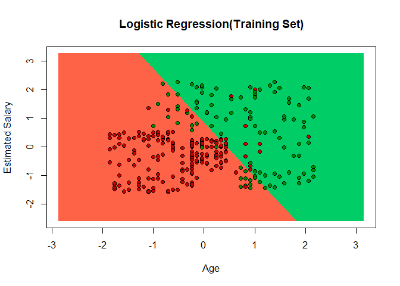<!-- -->

#### Visualizing the Test Results

``` r
set= test_set
#range set for age and salary
X1 = seq(min(set[,1])-1,max(set[,1])+1,by=0.01)
X2=  seq(min(set[,2])-1,max(set[,2])+1,by=0.01)
#setting X1 and X2 to the grid of matrix
grid_set=expand.grid(X1,X2)
#naming the columns in the matrix
colnames(grid_set) <- c("Age","EstimatedSalary")
#Predictions
prob_set= predict(classifier,type="response",newdata = grid_set)
y_grid=ifelse(prob_set>0.5,1,0)
#Ploting the data points of age and salary
plot(set[,-3],
     main="Logistic Regression(Test Set)",
     xlab="Age",ylab="Estimated Salary",
     xlim=range(X1),ylim=range(X2))
#Classifier Line in the plot
contour(X1,X2,matrix(as.numeric(y_grid),length(X1),length(X2)),add=TRUE)
#Points and Prediction region colour
#data points colour(high salary =1,0)
points(grid_set,pch=".",col=ifelse(y_grid==1,"springgreen3","tomato"))
#region color[purchased(green),not purchased(red)]
points(set,pch=21,bg=ifelse(set[,3]==1,"green4","red3"))
```

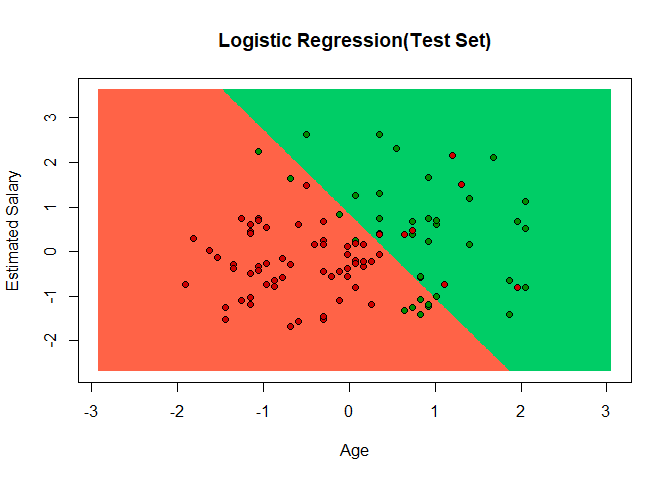<!-- -->

#### 2\. Decision Tree

``` r
#Fitting Decision Tree to the Training Set
classifier = rpart(Purchased~.,
                   data=training_set)


# Predicting the Test set results
y_pred = predict(classifier, newdata = test_set[-3],type="class")

#Performance Metrics
confusionMatrix(table(test_set[, 3], y_pred))
```

    ## Confusion Matrix and Statistics
    ## 
    ##    y_pred
    ##      0  1
    ##   0 53 11
    ##   1  6 30
    ##                                           
    ##                Accuracy : 0.83            
    ##                  95% CI : (0.7418, 0.8977)
    ##     No Information Rate : 0.59            
    ##     P-Value [Acc > NIR] : 2.321e-07       
    ##                                           
    ##                   Kappa : 0.642           
    ##                                           
    ##  Mcnemar's Test P-Value : 0.332           
    ##                                           
    ##             Sensitivity : 0.8983          
    ##             Specificity : 0.7317          
    ##          Pos Pred Value : 0.8281          
    ##          Neg Pred Value : 0.8333          
    ##              Prevalence : 0.5900          
    ##          Detection Rate : 0.5300          
    ##    Detection Prevalence : 0.6400          
    ##       Balanced Accuracy : 0.8150          
    ##                                           
    ##        'Positive' Class : 0               
    ## 

``` r
table_DecisionTree <- table(test_set[, 3], y_pred)

#Accuracy
Accuracy_DecisionTree <- sum(diag(table_DecisionTree))/nrow(test_set)
```

### Visualization

#### Visualizing The Train Results

``` r
set = training_set
X1 = seq(min(set[, 1]) - 1, max(set[, 1]) + 1, by = 0.01)
X2 = seq(min(set[, 2]) - 1, max(set[, 2]) + 1, by = 0.01)
grid_set = expand.grid(X1, X2)
colnames(grid_set) = c('Age', 'EstimatedSalary')
y_grid = predict(classifier, newdata = grid_set,type="class")
plot(set[, -3],
     main = 'Decision Trees (Training set)',
     xlab = 'Age', ylab = 'Estimated Salary',
     xlim = range(X1), ylim = range(X2))
contour(X1, X2, matrix(as.numeric(y_grid), length(X1), length(X2)), add = TRUE)
points(grid_set, pch = '.', col = ifelse(y_grid == 1, 'springgreen3', 'tomato'))
points(set, pch = 21, bg = ifelse(set[, 3] == 1, 'green4', 'red3'))
```

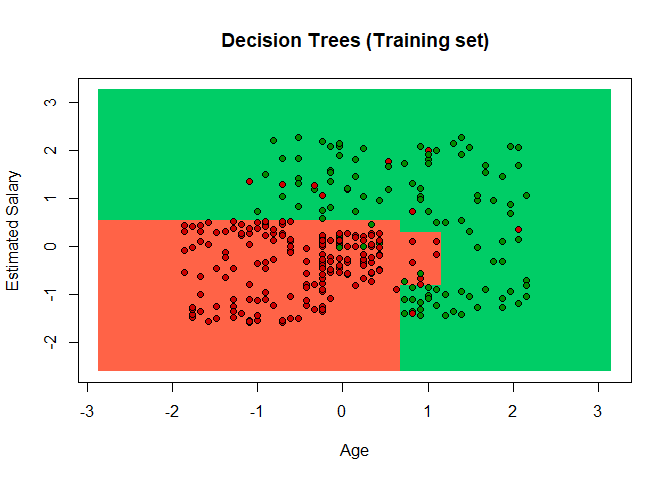<!-- -->

#### Visualising The Test Results

``` r
set = test_set
X1 = seq(min(set[, 1]) - 1, max(set[, 1]) + 1, by = 0.01)
X2 = seq(min(set[, 2]) - 1, max(set[, 2]) + 1, by = 0.01)
grid_set = expand.grid(X1, X2)
colnames(grid_set) = c('Age', 'EstimatedSalary')
y_grid = predict(classifier, newdata = grid_set,type="class")
plot(set[, -3], main = 'Decision Trees (Test set)',
     xlab = 'Age', ylab = 'Estimated Salary',
     xlim = range(X1), ylim = range(X2))
contour(X1, X2, matrix(as.numeric(y_grid), length(X1), length(X2)), add = TRUE)
points(grid_set, pch = '.', col = ifelse(y_grid == 1, 'springgreen3', 'tomato'))
points(set, pch = 21, bg = ifelse(set[, 3] == 1, 'green4', 'red3'))
```

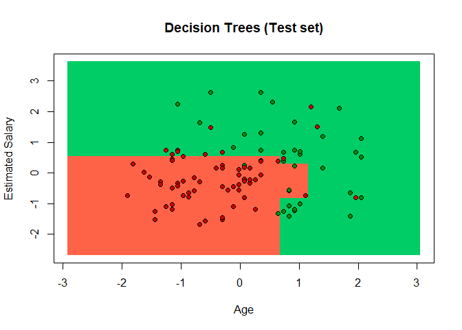<!-- -->

#### 3\. Random Forest

``` r
#Fitting Random Forest to the Training Set
classifier <- randomForest(training_set[-3],
                           training_set$Purchased,
                           ntree = 10)

# Predicting the Test set results
y_pred = predict(classifier, newdata = test_set[-3])

#Performance Metrics
confusionMatrix(table(test_set[, 3], y_pred))
```

    ## Confusion Matrix and Statistics
    ## 
    ##    y_pred
    ##      0  1
    ##   0 54 10
    ##   1  5 31
    ##                                           
    ##                Accuracy : 0.85            
    ##                  95% CI : (0.7647, 0.9135)
    ##     No Information Rate : 0.59            
    ##     P-Value [Acc > NIR] : 1.737e-08       
    ##                                           
    ##                   Kappa : 0.6841          
    ##                                           
    ##  Mcnemar's Test P-Value : 0.3017          
    ##                                           
    ##             Sensitivity : 0.9153          
    ##             Specificity : 0.7561          
    ##          Pos Pred Value : 0.8438          
    ##          Neg Pred Value : 0.8611          
    ##              Prevalence : 0.5900          
    ##          Detection Rate : 0.5400          
    ##    Detection Prevalence : 0.6400          
    ##       Balanced Accuracy : 0.8357          
    ##                                           
    ##        'Positive' Class : 0               
    ## 

``` r
table_randomForest <- table(test_set[, 3], y_pred)

#Accuracy
accuracy_randomForest <- sum(diag(table_randomForest))/nrow(test_set)
```

### Visualizations

#### Visualizing The Train Results

``` r
set = training_set
X1 = seq(min(set[, 1]) - 1, max(set[, 1]) + 1, by = 0.01)
X2 = seq(min(set[, 2]) - 1, max(set[, 2]) + 1, by = 0.01)
grid_set = expand.grid(X1, X2)
colnames(grid_set) = c('Age', 'EstimatedSalary')
y_grid = predict(classifier, newdata = grid_set)
plot(set[, -3],
     main = 'Random Forest Classification (Training set)',
     xlab = 'Age', ylab = 'Estimated Salary',
     xlim = range(X1), ylim = range(X2))
contour(X1, X2, matrix(as.numeric(y_grid), length(X1), length(X2)), add = TRUE)
points(grid_set, pch = '.', col = ifelse(y_grid == 1, 'springgreen3', 'tomato'))
points(set, pch = 21, bg = ifelse(set[, 3] == 1, 'green4', 'red3'))
```

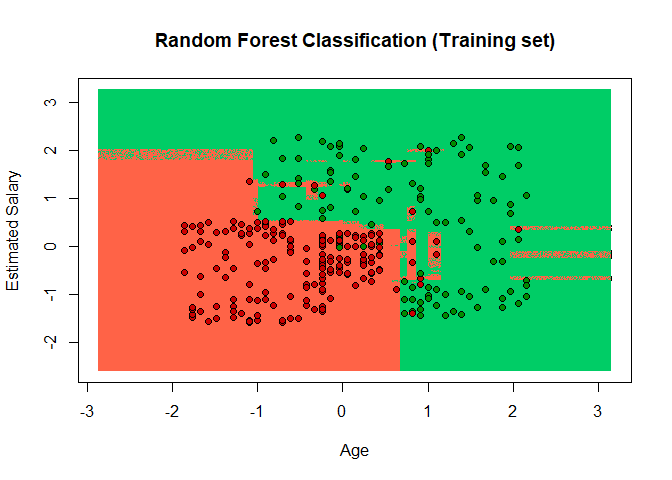<!-- -->

#### Visualising The Test Results

``` r
set = test_set
X1 = seq(min(set[, 1]) - 1, max(set[, 1]) + 1, by = 0.01)
X2 = seq(min(set[, 2]) - 1, max(set[, 2]) + 1, by = 0.01)
grid_set = expand.grid(X1, X2)
colnames(grid_set) = c('Age', 'EstimatedSalary')
y_grid = predict(classifier, newdata = grid_set)
plot(set[, -3], main = 'Random Forest Classification (Test set)',
     xlab = 'Age', ylab = 'Estimated Salary',
     xlim = range(X1), ylim = range(X2))
contour(X1, X2, matrix(as.numeric(y_grid), length(X1), length(X2)), add = TRUE)
points(grid_set, pch = '.', col = ifelse(y_grid == 1, 'springgreen3', 'tomato'))
points(set, pch = 21, bg = ifelse(set[, 3] == 1, 'green4', 'red3'))
```

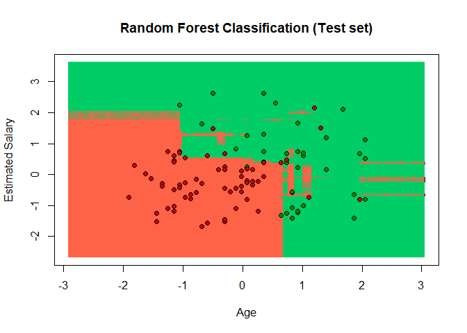<!-- -->

### 4\. SVM

``` r
#Fitting SVM to the Training Set
classifier <- svm(Purchased~.,data=training_set,type="C-classification",kernel="linear")

#summary
summary(classifier)
```

    ## 
    ## Call:
    ## svm(formula = Purchased ~ ., data = training_set, type = "C-classification", 
    ##     kernel = "linear")
    ## 
    ## 
    ## Parameters:
    ##    SVM-Type:  C-classification 
    ##  SVM-Kernel:  linear 
    ##        cost:  1 
    ##       gamma:  0.5 
    ## 
    ## Number of Support Vectors:  116
    ## 
    ##  ( 58 58 )
    ## 
    ## 
    ## Number of Classes:  2 
    ## 
    ## Levels: 
    ##  0 1

``` r
#Predicting the test set results
y_pred<- predict(classifier,newdata = test_set[-3])

#Performance Metrics
confusionMatrix(table(test_set$Purchased,y_pred))
```

    ## Confusion Matrix and Statistics
    ## 
    ##    y_pred
    ##      0  1
    ##   0 57  7
    ##   1 13 23
    ##                                           
    ##                Accuracy : 0.8             
    ##                  95% CI : (0.7082, 0.8733)
    ##     No Information Rate : 0.7             
    ##     P-Value [Acc > NIR] : 0.01646         
    ##                                           
    ##                   Kappa : 0.5495          
    ##                                           
    ##  Mcnemar's Test P-Value : 0.26355         
    ##                                           
    ##             Sensitivity : 0.8143          
    ##             Specificity : 0.7667          
    ##          Pos Pred Value : 0.8906          
    ##          Neg Pred Value : 0.6389          
    ##              Prevalence : 0.7000          
    ##          Detection Rate : 0.5700          
    ##    Detection Prevalence : 0.6400          
    ##       Balanced Accuracy : 0.7905          
    ##                                           
    ##        'Positive' Class : 0               
    ## 

``` r
table_SVM <- table(test_set$Purchased,y_pred)

#Accuracy
accuracy_SVM <- sum(diag(table_SVM))/nrow(test_set)
```

### Visualization

#### Visualizing The Train Results

``` r
set= training_set
#range set for age and salary
X1 = seq(min(set[,1])-1,max(set[,1])+1,by=0.01)
X2=  seq(min(set[,2])-1,max(set[,2])+1,by=0.01)
#setting X1 and X2 to the grid of matrix
grid_set=expand.grid(X1,X2)
#naming the columns in the matrix
colnames(grid_set) <- c("Age","EstimatedSalary")
#Predictions
y_grid= predict(classifier,newdata = grid_set)
#Ploting the data points of age and salary
plot(set[,-3],
     main="SVM(Training Set)",
     xlab="Age",ylab="Estimated Salary",
     xlim=range(X1),ylim=range(X2))
#Classifier Line in the plot
contour(X1,X2,matrix(as.numeric(y_grid),length(X1),length(X2)),add=TRUE)
#Points and Prediction region colour
#data points colour(high salary =1,0)
points(grid_set,pch=".",col=ifelse(y_grid==1,"springgreen3","tomato"))
#region color[purchased(green),not purchased(red)]
points(set,pch=21,bg=ifelse(set[,3]==1,"green4","red3"))
```

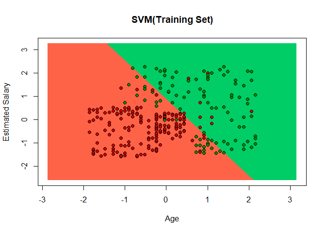<!-- -->

#### Visualising The Test Results

``` r
set= test_set
#range set for age and salary
X1 = seq(min(set[,1])-1,max(set[,1])+1,by=0.01)
X2=  seq(min(set[,2])-1,max(set[,2])+1,by=0.01)
#setting X1 and X2 to the grid of matrix
grid_set=expand.grid(X1,X2)
#naming the columns in the matrix
colnames(grid_set) <- c("Age","EstimatedSalary")
#Predictions
y_grid= predict(classifier,newdata = grid_set)
#Ploting the data points of age and salary
plot(set[,-3],
     main="SVM(Test Set)",
     xlab="Age",ylab="Estimated Salary",
     xlim=range(X1),ylim=range(X2))
#Classifier Line in the plot
contour(X1,X2,matrix(as.numeric(y_grid),length(X1),length(X2)),add=TRUE)
#Points and Prediction region colour
#data points colour(high salary =1,0)
points(grid_set,pch=".",col=ifelse(y_grid==1,"springgreen3","tomato"))
#region color[purchased(green),not purchased(red)]
points(set,pch=21,bg=ifelse(set[,3]==1,"green4","red3"))
```

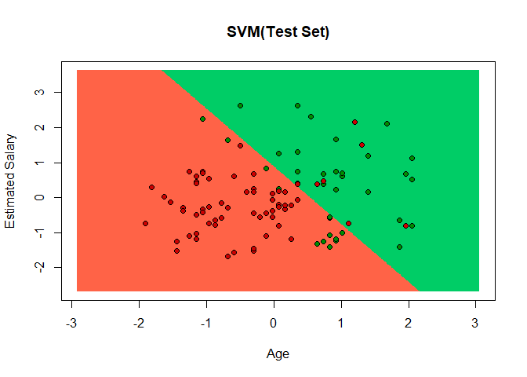<!-- -->

#### SVM KERNEL

``` r
#Fitting SVM Radial Kernel to the Training Set
classifier <- svm(Purchased~.,data=training_set,type="C-classification",kernel="radial")

#summary
summary(classifier)
```

    ## 
    ## Call:
    ## svm(formula = Purchased ~ ., data = training_set, type = "C-classification", 
    ##     kernel = "radial")
    ## 
    ## 
    ## Parameters:
    ##    SVM-Type:  C-classification 
    ##  SVM-Kernel:  radial 
    ##        cost:  1 
    ##       gamma:  0.5 
    ## 
    ## Number of Support Vectors:  77
    ## 
    ##  ( 39 38 )
    ## 
    ## 
    ## Number of Classes:  2 
    ## 
    ## Levels: 
    ##  0 1

``` r
#Predicting the test set results
y_pred<- predict(classifier,newdata = test_set[-3])

#Performance Metrics
confusionMatrix(table(test_set$Purchased,y_pred))
```

    ## Confusion Matrix and Statistics
    ## 
    ##    y_pred
    ##      0  1
    ##   0 58  6
    ##   1  4 32
    ##                                          
    ##                Accuracy : 0.9            
    ##                  95% CI : (0.8238, 0.951)
    ##     No Information Rate : 0.62           
    ##     P-Value [Acc > NIR] : 2.723e-10      
    ##                                          
    ##                   Kappa : 0.7856         
    ##                                          
    ##  Mcnemar's Test P-Value : 0.7518         
    ##                                          
    ##             Sensitivity : 0.9355         
    ##             Specificity : 0.8421         
    ##          Pos Pred Value : 0.9062         
    ##          Neg Pred Value : 0.8889         
    ##              Prevalence : 0.6200         
    ##          Detection Rate : 0.5800         
    ##    Detection Prevalence : 0.6400         
    ##       Balanced Accuracy : 0.8888         
    ##                                          
    ##        'Positive' Class : 0              
    ## 

``` r
table_SVM_KERNEL <- table(test_set$Purchased,y_pred)

#Accuracy
accuracy_SVM_KERNEL <- sum(diag(table_SVM_KERNEL))/nrow(test_set)
```

### Visualization

#### Visualizing The Train Results

``` r
set= training_set
#range set for age and salary
X1 = seq(min(set[,1])-1,max(set[,1])+1,by=0.01)
X2=  seq(min(set[,2])-1,max(set[,2])+1,by=0.01)
#setting X1 and X2 to the grid of matrix
grid_set=expand.grid(X1,X2)
#naming the columns in the matrix
colnames(grid_set) <- c("Age","EstimatedSalary")
#Predictions
y_grid= predict(classifier,newdata = grid_set)
#Ploting the data points of age and salary
plot(set[,-3],
     main="Kernel SVM(Training Set)",
     xlab="Age",ylab="Estimated Salary",
     xlim=range(X1),ylim=range(X2))
#Classifier Line in the plot
contour(X1,X2,matrix(as.numeric(y_grid),length(X1),length(X2)),add=TRUE)
#Points and Prediction region colour
#data points colour(high salary =1,0)
points(grid_set,pch=".",col=ifelse(y_grid==1,"springgreen3","tomato"))
#region color[purchased(green),not purchased(red)]
points(set,pch=21,bg=ifelse(set[,3]==1,"green4","red3"))
```

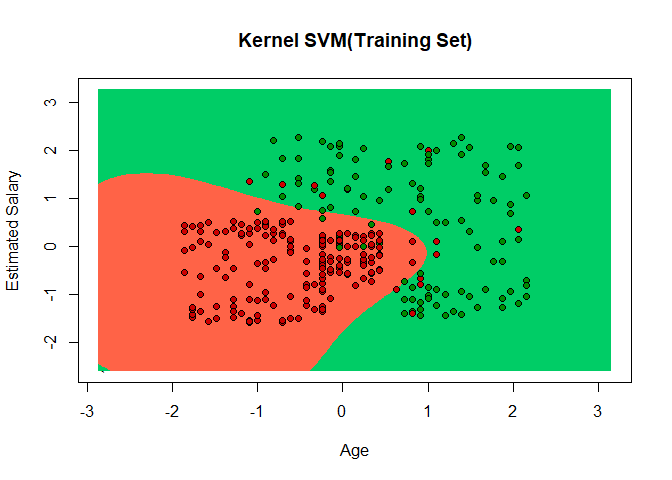<!-- -->

\#\#\#\#Visualising The Test Results

``` r
set= test_set
#range set for age and salary
X1 = seq(min(set[,1])-1,max(set[,1])+1,by=0.01)
X2=  seq(min(set[,2])-1,max(set[,2])+1,by=0.01)
#setting X1 and X2 to the grid of matrix
grid_set=expand.grid(X1,X2)
#naming the columns in the matrix
colnames(grid_set) <- c("Age","EstimatedSalary")
#Predictions
y_grid= predict(classifier,newdata = grid_set)
#Ploting the data points of age and salary
plot(set[,-3],
     main="Kernel SVM(Test Set)",
     xlab="Age",ylab="Estimated Salary",
     xlim=range(X1),ylim=range(X2))
#Classifier Line in the plot
contour(X1,X2,matrix(as.numeric(y_grid),length(X1),length(X2)),add=TRUE)
#Points and Prediction region colour
#data points colour(high salary =1,0)
points(grid_set,pch=".",col=ifelse(y_grid==1,"springgreen3","tomato"))
#region color[purchased(green),not purchased(red)]
points(set,pch=21,bg=ifelse(set[,3]==1,"green4","red3"))
```

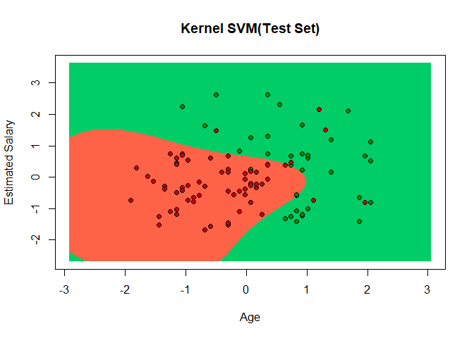<!-- -->

### 5\. KNN

``` r
#Fitting K-NN Model to train set and predicting on the test set
y_pred <- knn(train=training_set[-3],
               test = test_set[-3],
               cl=training_set[,3],
               k=5)

#Performance Metrics
confusionMatrix(table(test_set$Purchased,y_pred))
```

    ## Confusion Matrix and Statistics
    ## 
    ##    y_pred
    ##      0  1
    ##   0 59  5
    ##   1  6 30
    ##                                           
    ##                Accuracy : 0.89            
    ##                  95% CI : (0.8117, 0.9438)
    ##     No Information Rate : 0.65            
    ##     P-Value [Acc > NIR] : 3.922e-08       
    ##                                           
    ##                   Kappa : 0.7598          
    ##                                           
    ##  Mcnemar's Test P-Value : 1               
    ##                                           
    ##             Sensitivity : 0.9077          
    ##             Specificity : 0.8571          
    ##          Pos Pred Value : 0.9219          
    ##          Neg Pred Value : 0.8333          
    ##              Prevalence : 0.6500          
    ##          Detection Rate : 0.5900          
    ##    Detection Prevalence : 0.6400          
    ##       Balanced Accuracy : 0.8824          
    ##                                           
    ##        'Positive' Class : 0               
    ## 

``` r
table_KNN <- table(test_set$Purchased,y_pred)

#Accuracy
accuracy_KNN <- sum(diag(table_KNN))/nrow(test_set)
```

### Visualization

#### Visualizing The Train Results

``` r
set= training_set
#range set for age and salary
X1 = seq(min(set[,1])-1,max(set[,1])+1,by=0.01)
X2=  seq(min(set[,2])-1,max(set[,2])+1,by=0.01)
#setting X1 and X2 to the grid of matrix
grid_set=expand.grid(X1,X2)
#naming the columns in the matrix
colnames(grid_set) <- c("Age","EstimatedSalary")
#Predictions
y_grid<- knn(train=training_set[-3],
             test = grid_set,
             cl=training_set[,3],
             k=5)
#Ploting the data points of age and salary
plot(set[,-3],
     main="KNN(Train Set)",
     xlab="Age",ylab="Estimated Salary",
     xlim=range(X1),ylim=range(X2))
#Classifier Line in the plot
contour(X1,X2,matrix(as.numeric(y_grid),length(X1),length(X2)),add=TRUE)
#Points and Prediction region colour
#data points colour(high salary =1,0)
points(grid_set,pch=".",col=ifelse(y_grid==1,"springgreen3","tomato"))
#region color[purchased(green),not purchased(red)]
points(set,pch=21,bg=ifelse(set[,3]==1,"green4","red3"))
```

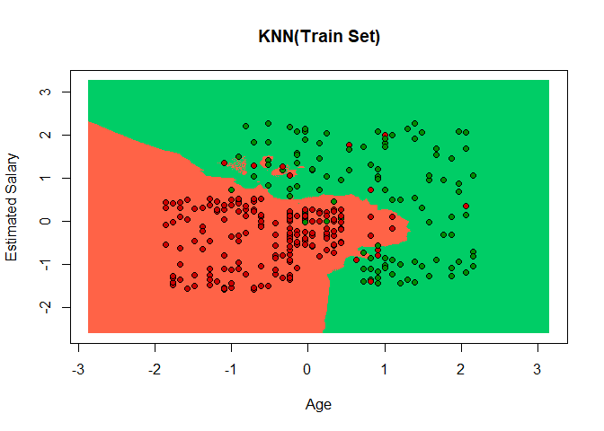<!-- -->

#### Visualising The Test Results

``` r
set= test_set
#range set for age and salary
X1 = seq(min(set[,1])-1,max(set[,1])+1,by=0.01)
X2=  seq(min(set[,2])-1,max(set[,2])+1,by=0.01)
#setting X1 and X2 to the grid of matrix
grid_set=expand.grid(X1,X2)
#naming the columns in the matrix
colnames(grid_set) <- c("Age","EstimatedSalary")
#Predictions
y_grid<- knn(train=training_set[-3],
             test = grid_set,
             cl=training_set[,3],
             k=5)
#Ploting the data points of age and salary
plot(set[,-3],
     main="KNN(Test Set)",
     xlab="Age",ylab="Estimated Salary",
     xlim=range(X1),ylim=range(X2))
#Classifier Line in the plot
contour(X1,X2,matrix(as.numeric(y_grid),length(X1),length(X2)),add=TRUE)
#Points and Prediction region colour
#data points colour(high salary =1,0)
points(grid_set,pch=".",col=ifelse(y_grid==1,"springgreen3","tomato"))
#region color[purchased(green),not purchased(red)]
points(set,pch=21,bg=ifelse(set[,3]==1,"green4","red3"))
```

<!-- -->

### 6\. Naive Bayes

``` r
#Fitting Naive Bayes to the Training Set
classifier <- naiveBayes(x = training_set[-3],
                         y = training_set$Purchased)

#Predicting the test set results
y_pred <- predict(classifier,newdata = test_set[,-3])

#Performance Metrics
confusionMatrix(table(test_set$Purchased,y_pred))
```

    ## Confusion Matrix and Statistics
    ## 
    ##    y_pred
    ##      0  1
    ##   0 57  7
    ##   1  7 29
    ##                                           
    ##                Accuracy : 0.86            
    ##                  95% CI : (0.7763, 0.9213)
    ##     No Information Rate : 0.64            
    ##     P-Value [Acc > NIR] : 8.057e-07       
    ##                                           
    ##                   Kappa : 0.6962          
    ##                                           
    ##  Mcnemar's Test P-Value : 1               
    ##                                           
    ##             Sensitivity : 0.8906          
    ##             Specificity : 0.8056          
    ##          Pos Pred Value : 0.8906          
    ##          Neg Pred Value : 0.8056          
    ##              Prevalence : 0.6400          
    ##          Detection Rate : 0.5700          
    ##    Detection Prevalence : 0.6400          
    ##       Balanced Accuracy : 0.8481          
    ##                                           
    ##        'Positive' Class : 0               
    ## 

``` r
table_naiveBayes <- table(test_set$Purchased,y_pred)

#Accuracy
accuracy_naiveBayes <- sum(diag(table_naiveBayes))/nrow(test_set)
```

### Visualization

#### Visualizing The Train Results

``` r
set= training_set
#range set for age and salary
X1 = seq(min(set[,1])-1,max(set[,1])+1,by=0.01)
X2=  seq(min(set[,2])-1,max(set[,2])+1,by=0.01)
#setting X1 and X2 to the grid of matrix
grid_set=expand.grid(X1,X2)
#naming the columns in the matrix
colnames(grid_set) <- c("Age","EstimatedSalary")
#Predictions
y_grid <- predict(classifier,newdata = grid_set)
#Ploting the data points of age and salary
plot(set[,-3],
     main="Naive Bayes(Train Set)",
     xlab="Age",ylab="Estimated Salary",
     xlim=range(X1),ylim=range(X2))
#Classifier Line in the plot
contour(X1,X2,matrix(as.numeric(y_grid),length(X1),length(X2)),add=TRUE)
#Points and Prediction region colour
#data points colour(high salary =1,0)
points(grid_set,pch=".",col=ifelse(y_grid==1,"springgreen3","tomato"))
#region color[purchased(green),not purchased(red)]
points(set,pch=21,bg=ifelse(set[,3]==1,"green4","red3"))
```

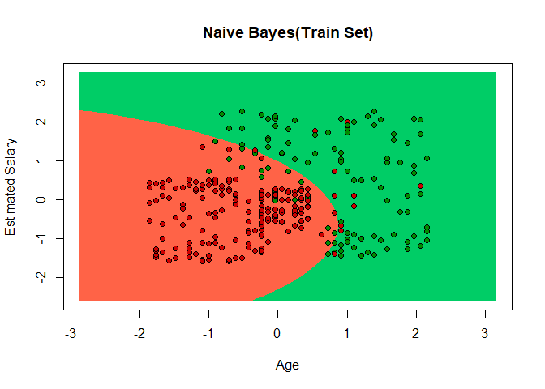<!-- -->

\#\#\#\#Visualising The Test Results

``` r
set= test_set
#range set for age and salary
X1 = seq(min(set[,1])-1,max(set[,1])+1,by=0.01)
X2=  seq(min(set[,2])-1,max(set[,2])+1,by=0.01)
#setting X1 and X2 to the grid of matrix
grid_set=expand.grid(X1,X2)
#naming the columns in the matrix
colnames(grid_set) <- c("Age","EstimatedSalary")
#Predictions
y_grid <- predict(classifier,newdata = grid_set)
#Ploting the data points of age and salary
plot(set[,-3],
     main="Naive Bayes(Test Set)",
     xlab="Age",ylab="Estimated Salary",
     xlim=range(X1),ylim=range(X2))
#Classifier Line in the plot
contour(X1,X2,matrix(as.numeric(y_grid),length(X1),length(X2)),add=TRUE)
#Points and Prediction region colour
#region colour(high salary =1,0)
points(grid_set,pch=".",col=ifelse(y_grid==1,"springgreen3","tomato"))
#data points color[purchased(green),not purchased(red)]
points(set,pch=21,bg=ifelse(set[,3]==1,"green4","red3"))
```

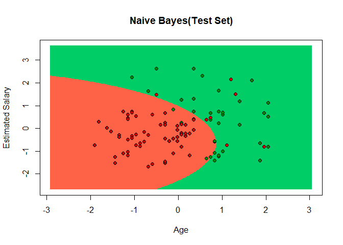<!-- -->

### Model Evaluation

``` r
Model <- c("Logistic Regression","Decision Tree","Random Forest","SVM","SVM Kernel","KNN","Naive Bayes")
Accuracy <- c(Accuracy_Logistic,Accuracy_DecisionTree,accuracy_randomForest,accuracy_SVM,accuracy_SVM_KERNEL,accuracy_KNN,accuracy_naiveBayes)
Model_Evaluation <- data.frame(Model,Accuracy)
kable(Model_Evaluation,caption = "A Model Accuracy Evaluation")
```

| Model               | Accuracy |
| :------------------ | -------: |
| Logistic Regression |     0.83 |
| Decision Tree       |     0.83 |
| Random Forest       |     0.85 |
| SVM                 |     0.80 |
| SVM Kernel          |     0.90 |
| KNN                 |     0.89 |
| Naive Bayes         |     0.86 |

A Model Accuracy Evaluation

### Best Model

  - SVM Kernel model with the highest accuracy of 90% performed better
    than compared to other Algorithms.
