Titanic Survival Analysis
================
Akash

### Titanic Dataset

### Overview

The data has been split into two groups:

  - **training set (train.csv)**
  - **test set (test.csv)**

The training set should be used to build machine learning models. For
the training set, we provide the outcome (also known as the “ground
truth”) for each passenger. The model will be based on “features” like
passengers’ gender and class. You can also use feature engineering to
create new features.

The test set should be used to see how well our model performs on unseen
data. For the test set, we do not provide the ground truth for each
passenger. It is your job to predict these outcomes. For each passenger
in the test set, use the model you trained to predict whether or not
they survived the sinking of the Titanic.

We also include **gender\_submission.csv**, a set of predictions that
assume all and only female passengers survive, as an example of what a
submission file should look like.


### Dataset Variables

  - **survival:** 0 = No, 1 = Yes
  - **sex**
  - **ticket**
  - **fare:** Passenger Fare
  - **cabin:** Cabin number
  - **embarked:** Port of Embarkation C = Cherbourg Q = Queenstown S =
    Southampton
  - **pclass:** A proxy for socio-economic status (SES) 1st = Upper 2nd
    = Middle 3rd = Lower
  - **age:** Age is fractional if less than 1. If the age is estimated,
    is it in the form of xx.5
  - **sibsp:** The dataset defines family relations in this way Sibling
    = brother, sister, stepbrother, stepsister Spouse = husband, wife
    (mistresses and fiancés were ignored)
  - **parch:** The dataset defines family relations in this way Parent =
    mother, father Child = daughter, son, stepdaughter, stepson Some
    children travelled only with a nanny, therefore parch=0 for them.
    \#\#\# Import The Train and Test
Dataset

<!-- end list -->

``` r
train <- read.csv (file.choose(), stringsAsFactors = F,na.strings=c("","NA"," "))
test <- read.csv (file.choose(), stringsAsFactors = F,na.strings=c("","NA"," "))

#checking the Structure and Summary
str(train)
```

    ## 'data.frame':    891 obs. of  12 variables:
    ##  $ PassengerId: int  1 2 3 4 5 6 7 8 9 10 ...
    ##  $ Survived   : int  0 1 1 1 0 0 0 0 1 1 ...
    ##  $ Pclass     : int  3 1 3 1 3 3 1 3 3 2 ...
    ##  $ Name       : chr  "Braund, Mr. Owen Harris" "Cumings, Mrs. John Bradley (Florence Briggs Thayer)" "Heikkinen, Miss. Laina" "Futrelle, Mrs. Jacques Heath (Lily May Peel)" ...
    ##  $ Sex        : chr  "male" "female" "female" "female" ...
    ##  $ Age        : num  22 38 26 35 35 NA 54 2 27 14 ...
    ##  $ SibSp      : int  1 1 0 1 0 0 0 3 0 1 ...
    ##  $ Parch      : int  0 0 0 0 0 0 0 1 2 0 ...
    ##  $ Ticket     : chr  "A/5 21171" "PC 17599" "STON/O2. 3101282" "113803" ...
    ##  $ Fare       : num  7.25 71.28 7.92 53.1 8.05 ...
    ##  $ Cabin      : chr  NA "C85" NA "C123" ...
    ##  $ Embarked   : chr  "S" "C" "S" "S" ...

``` r
str(test)
```

    ## 'data.frame':    418 obs. of  11 variables:
    ##  $ PassengerId: int  892 893 894 895 896 897 898 899 900 901 ...
    ##  $ Pclass     : int  3 3 2 3 3 3 3 2 3 3 ...
    ##  $ Name       : chr  "Kelly, Mr. James" "Wilkes, Mrs. James (Ellen Needs)" "Myles, Mr. Thomas Francis" "Wirz, Mr. Albert" ...
    ##  $ Sex        : chr  "male" "female" "male" "male" ...
    ##  $ Age        : num  34.5 47 62 27 22 14 30 26 18 21 ...
    ##  $ SibSp      : int  0 1 0 0 1 0 0 1 0 2 ...
    ##  $ Parch      : int  0 0 0 0 1 0 0 1 0 0 ...
    ##  $ Ticket     : chr  "330911" "363272" "240276" "315154" ...
    ##  $ Fare       : num  7.83 7 9.69 8.66 12.29 ...
    ##  $ Cabin      : chr  NA NA NA NA ...
    ##  $ Embarked   : chr  "Q" "S" "Q" "S" ...

``` r
summary(train)
```

    ##   PassengerId       Survived          Pclass          Name          
    ##  Min.   :  1.0   Min.   :0.0000   Min.   :1.000   Length:891        
    ##  1st Qu.:223.5   1st Qu.:0.0000   1st Qu.:2.000   Class :character  
    ##  Median :446.0   Median :0.0000   Median :3.000   Mode  :character  
    ##  Mean   :446.0   Mean   :0.3838   Mean   :2.309                     
    ##  3rd Qu.:668.5   3rd Qu.:1.0000   3rd Qu.:3.000                     
    ##  Max.   :891.0   Max.   :1.0000   Max.   :3.000                     
    ##                                                                     
    ##      Sex                 Age            SibSp           Parch       
    ##  Length:891         Min.   : 0.42   Min.   :0.000   Min.   :0.0000  
    ##  Class :character   1st Qu.:20.12   1st Qu.:0.000   1st Qu.:0.0000  
    ##  Mode  :character   Median :28.00   Median :0.000   Median :0.0000  
    ##                     Mean   :29.70   Mean   :0.523   Mean   :0.3816  
    ##                     3rd Qu.:38.00   3rd Qu.:1.000   3rd Qu.:0.0000  
    ##                     Max.   :80.00   Max.   :8.000   Max.   :6.0000  
    ##                     NA's   :177                                     
    ##     Ticket               Fare           Cabin             Embarked        
    ##  Length:891         Min.   :  0.00   Length:891         Length:891        
    ##  Class :character   1st Qu.:  7.91   Class :character   Class :character  
    ##  Mode  :character   Median : 14.45   Mode  :character   Mode  :character  
    ##                     Mean   : 32.20                                        
    ##                     3rd Qu.: 31.00                                        
    ##                     Max.   :512.33                                        
    ## 

``` r
summary(test)
```

    ##   PassengerId         Pclass          Name               Sex           
    ##  Min.   : 892.0   Min.   :1.000   Length:418         Length:418        
    ##  1st Qu.: 996.2   1st Qu.:1.000   Class :character   Class :character  
    ##  Median :1100.5   Median :3.000   Mode  :character   Mode  :character  
    ##  Mean   :1100.5   Mean   :2.266                                        
    ##  3rd Qu.:1204.8   3rd Qu.:3.000                                        
    ##  Max.   :1309.0   Max.   :3.000                                        
    ##                                                                        
    ##       Age            SibSp            Parch           Ticket         
    ##  Min.   : 0.17   Min.   :0.0000   Min.   :0.0000   Length:418        
    ##  1st Qu.:21.00   1st Qu.:0.0000   1st Qu.:0.0000   Class :character  
    ##  Median :27.00   Median :0.0000   Median :0.0000   Mode  :character  
    ##  Mean   :30.27   Mean   :0.4474   Mean   :0.3923                     
    ##  3rd Qu.:39.00   3rd Qu.:1.0000   3rd Qu.:0.0000                     
    ##  Max.   :76.00   Max.   :8.0000   Max.   :9.0000                     
    ##  NA's   :86                                                          
    ##       Fare            Cabin             Embarked        
    ##  Min.   :  0.000   Length:418         Length:418        
    ##  1st Qu.:  7.896   Class :character   Class :character  
    ##  Median : 14.454   Mode  :character   Mode  :character  
    ##  Mean   : 35.627                                        
    ##  3rd Qu.: 31.500                                        
    ##  Max.   :512.329                                        
    ##  NA's   :1

### Base Model

``` r
#Base Model
table(train$Sex,train$Survived)
```

    ##         
    ##            0   1
    ##   female  81 233
    ##   male   468 109

``` r
prop.table(table(train$Sex,train$Survived))
```

    ##         
    ##                   0          1
    ##   female 0.09090909 0.26150393
    ##   male   0.52525253 0.12233446

``` r
#Initialize a Survived column to 0
test$Survived <- 0
my_solution <- data.frame(PassengerId = test$PassengerId, Survived = test$Survived)
nrow(my_solution)
```

    ## [1] 418

``` r
#write the solution for submission
write.csv(my_solution, file = "Lazy_Predictor.csv", row.names = FALSE)

#Lazy Predictor Model
#First Predictor Model with Gender
table(train$Survived)
```

    ## 
    ##   0   1 
    ## 549 342

``` r
prop.table(table(train$Survived))
```

    ## 
    ##         0         1 
    ## 0.6161616 0.3838384

``` r
#Set Survived to 1 if Sex equals "female"
test$Survived [test$Sex == "female"] <- 1
my_solution <- data.frame(PassengerId = test$PassengerId, Survived = test$Survived)
nrow(my_solution)
```

    ## [1] 418

``` r
#write the solution for submission
write.csv(my_solution, file = "Gender_Model.csv", row.names = FALSE)
```

### Data Cleaning and Preparation

### Preparation

``` r
#Combine train and test data for Data Cleaning and Preparation
Full <- rbind(train,test)

#Structure of the Full data
str(Full)
```

    ## 'data.frame':    1309 obs. of  12 variables:
    ##  $ PassengerId: int  1 2 3 4 5 6 7 8 9 10 ...
    ##  $ Survived   : num  0 1 1 1 0 0 0 0 1 1 ...
    ##  $ Pclass     : int  3 1 3 1 3 3 1 3 3 2 ...
    ##  $ Name       : chr  "Braund, Mr. Owen Harris" "Cumings, Mrs. John Bradley (Florence Briggs Thayer)" "Heikkinen, Miss. Laina" "Futrelle, Mrs. Jacques Heath (Lily May Peel)" ...
    ##  $ Sex        : chr  "male" "female" "female" "female" ...
    ##  $ Age        : num  22 38 26 35 35 NA 54 2 27 14 ...
    ##  $ SibSp      : int  1 1 0 1 0 0 0 3 0 1 ...
    ##  $ Parch      : int  0 0 0 0 0 0 0 1 2 0 ...
    ##  $ Ticket     : chr  "A/5 21171" "PC 17599" "STON/O2. 3101282" "113803" ...
    ##  $ Fare       : num  7.25 71.28 7.92 53.1 8.05 ...
    ##  $ Cabin      : chr  NA "C85" NA "C123" ...
    ##  $ Embarked   : chr  "S" "C" "S" "S" ...

``` r
summary(Full)
```

    ##   PassengerId      Survived          Pclass          Name          
    ##  Min.   :   1   Min.   :0.0000   Min.   :1.000   Length:1309       
    ##  1st Qu.: 328   1st Qu.:0.0000   1st Qu.:2.000   Class :character  
    ##  Median : 655   Median :0.0000   Median :3.000   Mode  :character  
    ##  Mean   : 655   Mean   :0.3774   Mean   :2.295                     
    ##  3rd Qu.: 982   3rd Qu.:1.0000   3rd Qu.:3.000                     
    ##  Max.   :1309   Max.   :1.0000   Max.   :3.000                     
    ##                                                                    
    ##      Sex                 Age            SibSp            Parch      
    ##  Length:1309        Min.   : 0.17   Min.   :0.0000   Min.   :0.000  
    ##  Class :character   1st Qu.:21.00   1st Qu.:0.0000   1st Qu.:0.000  
    ##  Mode  :character   Median :28.00   Median :0.0000   Median :0.000  
    ##                     Mean   :29.88   Mean   :0.4989   Mean   :0.385  
    ##                     3rd Qu.:39.00   3rd Qu.:1.0000   3rd Qu.:0.000  
    ##                     Max.   :80.00   Max.   :8.0000   Max.   :9.000  
    ##                     NA's   :263                                     
    ##     Ticket               Fare            Cabin          
    ##  Length:1309        Min.   :  0.000   Length:1309       
    ##  Class :character   1st Qu.:  7.896   Class :character  
    ##  Mode  :character   Median : 14.454   Mode  :character  
    ##                     Mean   : 33.295                     
    ##                     3rd Qu.: 31.275                     
    ##                     Max.   :512.329                     
    ##                     NA's   :1                           
    ##    Embarked        
    ##  Length:1309       
    ##  Class :character  
    ##  Mode  :character  
    ##                    
    ##                    
    ##                    
    ## 

``` r
#Survival rates in absolute numbers
table(Full$Survived)
```

    ## 
    ##   0   1 
    ## 815 494

``` r
#Survival rates in proportions
prop.table(table(Full$Survived))
```

    ## 
    ##         0         1 
    ## 0.6226127 0.3773873

``` r
#Data Type conversion
Full$Pclass = as.factor(Full$Pclass)
```

### Checking the Missing Values

``` r
sapply(Full, function(df)
{
  sum(is.na(df)==T)/length(df)
})
```

    ##  PassengerId     Survived       Pclass         Name          Sex 
    ## 0.0000000000 0.0000000000 0.0000000000 0.0000000000 0.0000000000 
    ##          Age        SibSp        Parch       Ticket         Fare 
    ## 0.2009167303 0.0000000000 0.0000000000 0.0000000000 0.0007639419 
    ##        Cabin     Embarked 
    ## 0.7746371276 0.0015278839

``` r
#Amelia Package
#install.packages("Amelia")
library("Amelia")
```

    ## Warning: package 'Amelia' was built under R version 3.5.3

    ## Loading required package: Rcpp

    ## ## 
    ## ## Amelia II: Multiple Imputation
    ## ## (Version 1.7.5, built: 2018-05-07)
    ## ## Copyright (C) 2005-2019 James Honaker, Gary King and Matthew Blackwell
    ## ## Refer to http://gking.harvard.edu/amelia/ for more information
    ## ##

``` r
missmap(Full, main = "Missing Map")
```

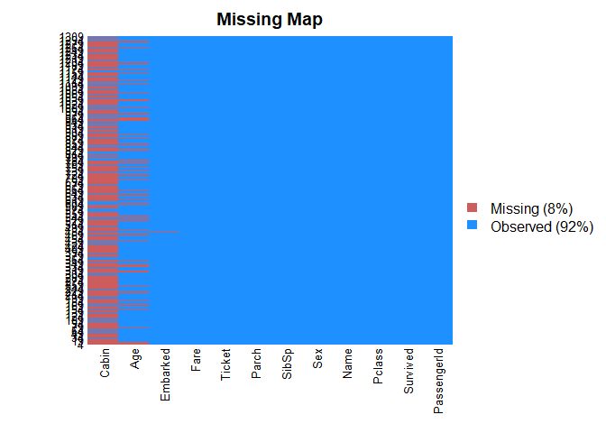<!-- -->

### Imputing the Missing Value

``` r
# Missing Value Imputation - Age
Full$Age[is.na(Full$Age)] <- mean(Full$Age,na.rm=T)
sum(is.na(Full$Age))
```

    ## [1] 0

``` r
# Missing Value Imputation - Embarked
table(Full$Embarked, useNA = "always")
```

    ## 
    ##    C    Q    S <NA> 
    ##  270  123  914    2

``` r
# Substitute the missing values with the mode value
Full$Embarked[is.na(Full$Embarked)] <- 'S'
sum(is.na(Full$Embarked))
```

    ## [1] 0

``` r
table(Full$Embarked, useNA = "always")
```

    ## 
    ##    C    Q    S <NA> 
    ##  270  123  916    0

``` r
# Missing Value Imputation - Fare
# Substitute the missing values with the average value
Full$Fare[is.na(Full$Fare)] <- mean(Full$Fare,na.rm=T)
sum(is.na(Full$Fare))
```

    ## [1] 0

``` r
# Missing Value Imputation - Cabin
#Drop the variable as the missing value is more than 20%
Full <- Full[-11]


#Check again for NA
sapply(Full, function(df)
{
  sum(is.na(df)==T)/length(df)
})
```

    ## PassengerId    Survived      Pclass        Name         Sex         Age 
    ##           0           0           0           0           0           0 
    ##       SibSp       Parch      Ticket        Fare    Embarked 
    ##           0           0           0           0           0

``` r
# Data Cleaning is done, now we will again split back the data into train and test
# Train test splitting - Why do we need it?
train_cleaned <- Full[1:891,]
test_cleaned <- Full[892:1309,]
```

## Data Exploration

  - Univariate EDA
  - Bivariate EDA
  - Multivariate EDA

### Univariate EDA

### Categorical Variables

#### 1\. Survived

``` r
library(ggplot2)
summary(train_cleaned$Survived)
```

    ##    Min. 1st Qu.  Median    Mean 3rd Qu.    Max. 
    ##  0.0000  0.0000  0.0000  0.3838  1.0000  1.0000

``` r
ggplot(train_cleaned) + geom_bar(aes(x=Survived))
```

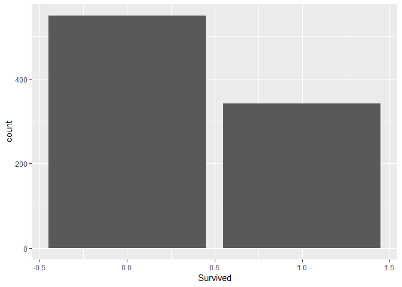<!-- -->

*Survival Rate was very less.*

#### 2\. Sex

``` r
summary(train_cleaned$Sex)
```

    ##    Length     Class      Mode 
    ##       891 character character

``` r
ggplot(train_cleaned) + geom_bar(aes(x=Sex))
```

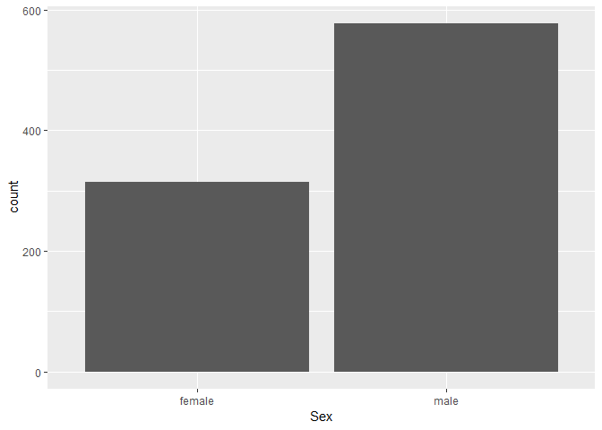<!-- -->

*Gender Male was more than Gender Female on the Titanic.*

#### 3\. Pclass

``` r
summary(train_cleaned$Pclass)
```

    ##   1   2   3 
    ## 216 184 491

``` r
ggplot(train_cleaned) + geom_bar(aes(x=Pclass))
```

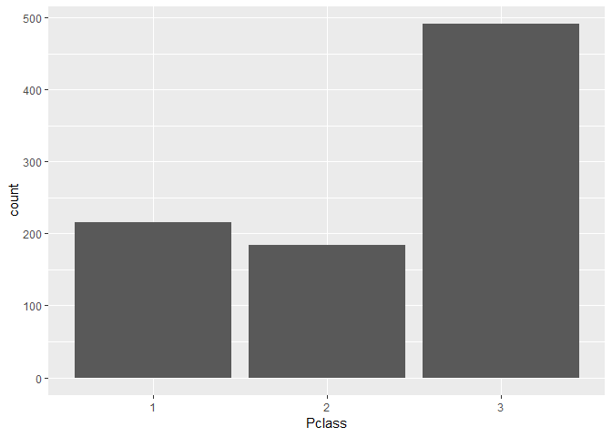<!-- -->

*Passenger Class 3rd People were the most on Titanic with Cheap Ticket.*

### Numerical Variables

#### 1\. Fare

``` r
summary(train_cleaned$Fare)
```

    ##    Min. 1st Qu.  Median    Mean 3rd Qu.    Max. 
    ##    0.00    7.91   14.45   32.20   31.00  512.33

``` r
ggplot(train_cleaned) + geom_histogram(aes(x=Fare),fill = "white", colour = "black")
```

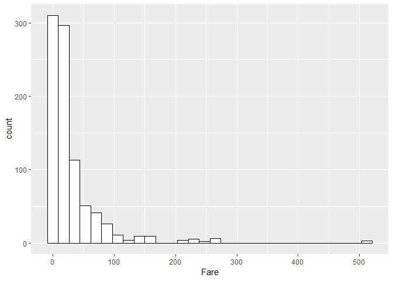<!-- -->

``` r
ggplot(train_cleaned) + geom_boxplot(aes(x=factor(0),y=Fare)) + coord_flip()
```

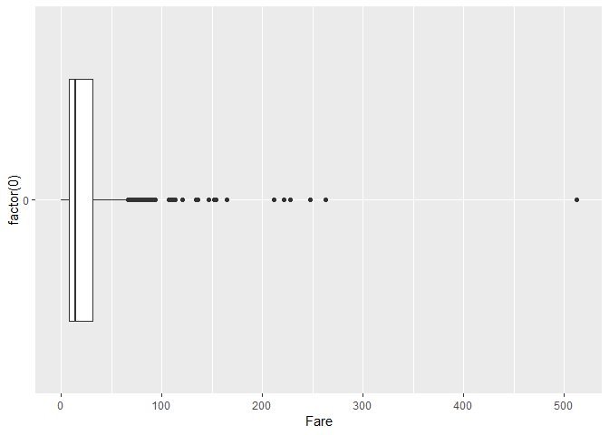<!-- -->

*Lots of people are travelling for free and More than 500 dollar Ticket
Fee people are very Less.*

#### 2\. Age

``` r
summary(train_cleaned$Age)
```

    ##    Min. 1st Qu.  Median    Mean 3rd Qu.    Max. 
    ##    0.42   22.00   29.88   29.74   35.00   80.00

``` r
ggplot(train_cleaned) + geom_histogram(aes(x=Age),fill = "white", colour = "black")
```

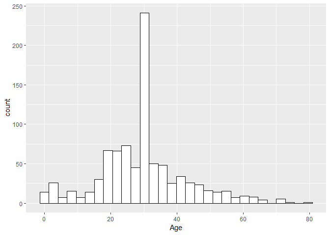<!-- -->

``` r
ggplot(train_cleaned) + geom_boxplot(aes(x=factor(0),y=Age)) + coord_flip()
```

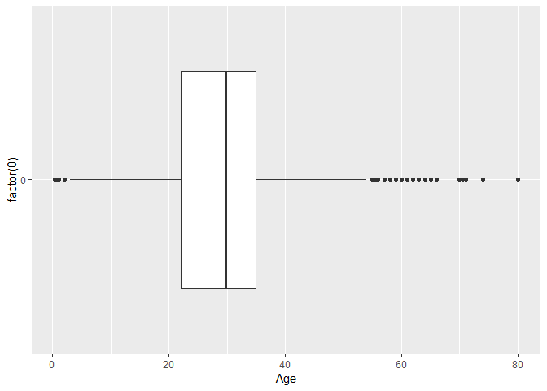<!-- -->

*People with the 30 years of age of median are the maximum on Titanic.*

### Bivariate EDA

### Categorical-Categorical relationships

#### 1\. Survived vs Sex

``` r
xtabs(~Survived+Sex,train_cleaned)
```

    ##         Sex
    ## Survived female male
    ##        0     81  468
    ##        1    233  109

``` r
ggplot(train_cleaned) + geom_bar(aes(x=Sex, fill=factor(Survived)))
```

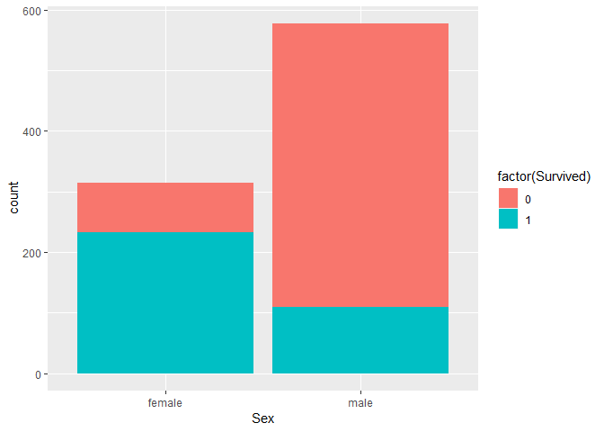<!-- -->

*Survival Rate of Female was Higher than Male on that day.*

#### 2\. Survived vs Passenger Class

``` r
xtabs(~Survived+Pclass,train_cleaned)
```

    ##         Pclass
    ## Survived   1   2   3
    ##        0  80  97 372
    ##        1 136  87 119

``` r
ggplot(train_cleaned) + geom_bar(aes(x=Pclass, fill=factor(Survived)))
```

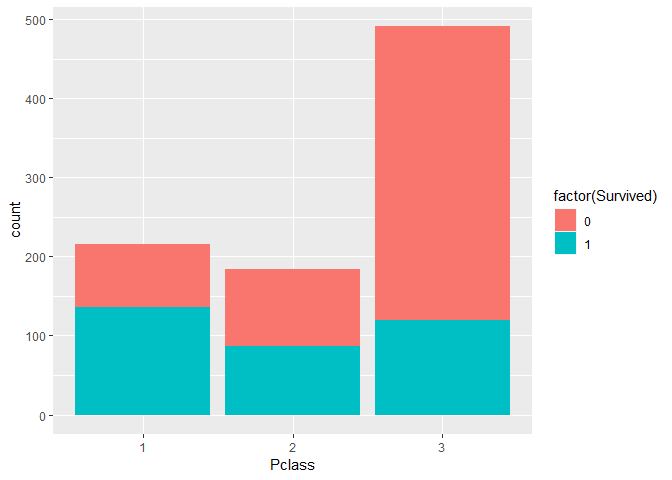<!-- -->

*Survival Rate of PClass 3 was very less Compared to PClass 1 and 2.*

#### 3\. Survived vs Embarked Class

``` r
xtabs(~Survived+Embarked,train_cleaned)
```

    ##         Embarked
    ## Survived   C   Q   S
    ##        0  75  47 427
    ##        1  93  30 219

``` r
ggplot(train_cleaned) + geom_bar(aes(x=Embarked, fill=factor(Survived)))
```

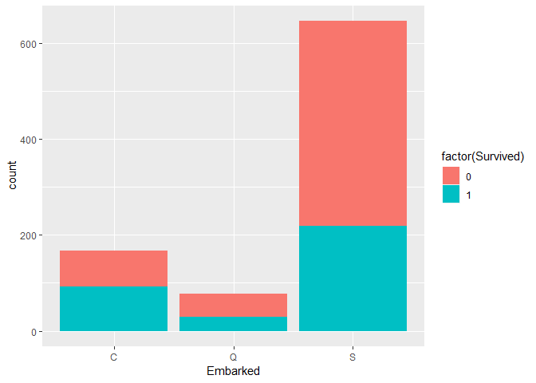<!-- -->

*Survival Rate of “S” Embarkment was very less Compared to “C” and
“Q”.*

### Numerical-Categorical relationships

#### 1\. Survived vs Age

``` r
ggplot(train_cleaned) + geom_boxplot(aes(x = factor(Survived), y = Age))
```

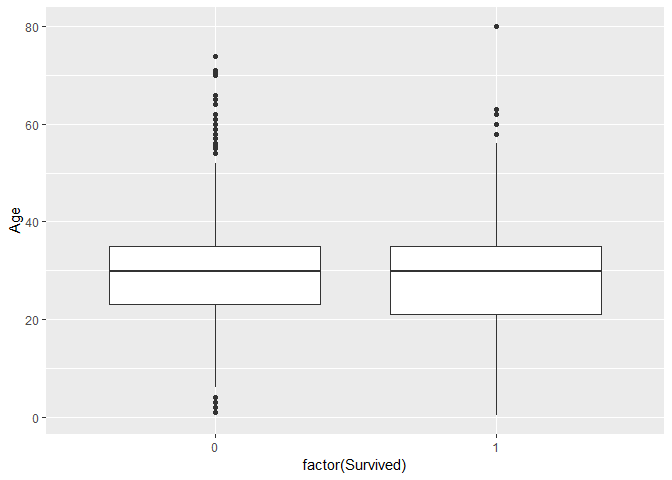<!-- -->

``` r
ggplot(train_cleaned) + geom_histogram(aes(x = Age),fill = "white", colour = "black") + facet_grid(factor(Survived) ~ .)
```

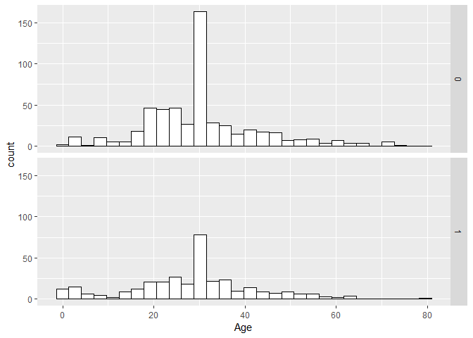<!-- -->

*Maximum people whose Age was above 60 had less Survival Rate compared
to young people with median age
30*

#### 2\. Survied vs Fare

``` r
ggplot(train_cleaned) + geom_boxplot(aes(x = factor(Survived), y = Fare))
```

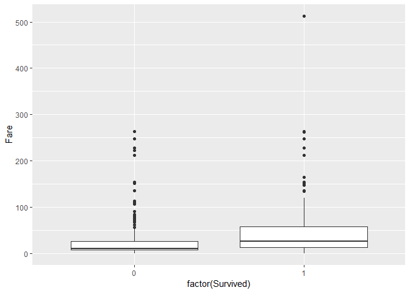<!-- -->

``` r
ggplot(train_cleaned) + geom_histogram(aes(x = Fare),fill = "white", colour = "black") + facet_grid(factor(Survived) ~ .)
```

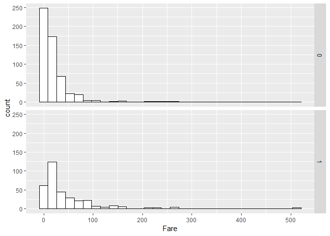<!-- -->

*People with low ticket Fare between 0 dollars to 60 dollar had very low
Survival Rate.*

### Multivariate EDA

#### Survived vs Pclass vs Sex

``` r
xtabs(~factor(Survived)+Pclass+Sex,train_cleaned)
```

    ## , , Sex = female
    ## 
    ##                 Pclass
    ## factor(Survived)   1   2   3
    ##                0   3   6  72
    ##                1  91  70  72
    ## 
    ## , , Sex = male
    ## 
    ##                 Pclass
    ## factor(Survived)   1   2   3
    ##                0  77  91 300
    ##                1  45  17  47

``` r
ggplot(train_cleaned) + geom_bar(aes(x=Sex, fill=factor(Survived))) + facet_grid(Pclass ~ .)
```

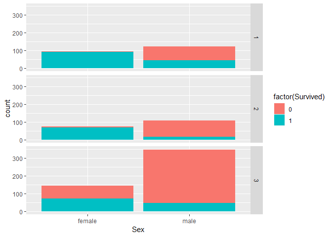<!-- -->

  - *Survival Rate was high for 1st and 2nd class and Most of females
    survived.*

  - *Survival Rate was Low for 3rd class and Most of Males died.*

### Feature Engineering

  - Engineered variable 1: Child
  - Engineered variable 2: Title
  - Engineered variable 3: Family Size

#### Engineered variable 1: Child

``` r
Full$Child <- NA
Full$Child[Full$Age < 18] <- 1
Full$Child[Full$Age >= 18] <- 0
str(Full$Child)
```

    ##  num [1:1309] 0 0 0 0 0 0 0 1 0 1 ...

``` r
table(Full$Child)
```

    ## 
    ##    0    1 
    ## 1155  154

``` r
ggplot(Full) + geom_bar(aes(x=Child))
```

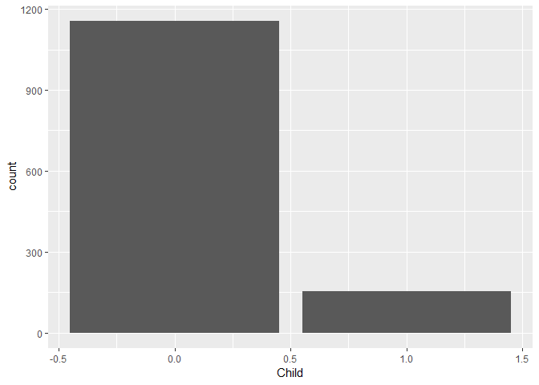<!-- -->

#### Engineered variable 2: Title

``` r
# Extract the title - Mr, Mrs, Miss
Full$Title <- sapply(Full$Name, FUN=function(x) {strsplit(x, split='[,.]')[[1]][2]})

# Remove the white space or blank
Full$Title <- sub(' ', '', Full$Title)
table(Full$Title)
```

    ## 
    ##         Capt          Col          Don         Dona           Dr 
    ##            1            4            1            1            8 
    ##     Jonkheer         Lady        Major       Master         Miss 
    ##            1            1            2           61          260 
    ##         Mlle          Mme           Mr          Mrs           Ms 
    ##            2            1          757          197            2 
    ##          Rev          Sir the Countess 
    ##            8            1            1

``` r
# Combine small title groups
Full$Title[Full$Title %in% c('Mme', 'Mlle')] <- 'Mlle'
Full$Title[Full$Title %in% c('Capt', 'Don', 'Major', 'Sir')] <- 'Sir'
Full$Title[Full$Title %in% c('Dona', 'Lady', 'the Countess', 'Jonkheer')] <- 'Lady'
ggplot(Full) + geom_bar(aes(x=Title))
```

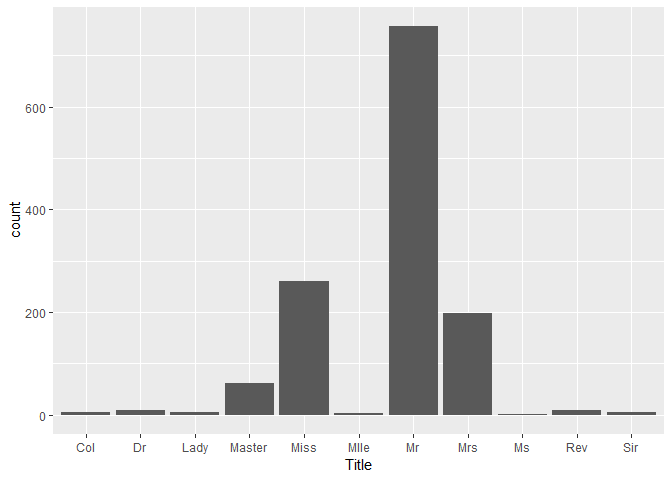<!-- -->

``` r
# Convert to a factor
Full$Title <- factor(Full$Title)
table(Full$Title)
```

    ## 
    ##    Col     Dr   Lady Master   Miss   Mlle     Mr    Mrs     Ms    Rev 
    ##      4      8      4     61    260      3    757    197      2      8 
    ##    Sir 
    ##      5

``` r
ggplot(Full) + geom_bar(aes(x=Title))
```

<!-- -->

#### Engineered variable 3: Family size

``` r
Full$FamilySize <- Full$SibSp + Full$Parch + 1
table(Full$FamilySize)
```

    ## 
    ##   1   2   3   4   5   6   7   8  11 
    ## 790 235 159  43  22  25  16   8  11

``` r
ggplot(Full) + geom_bar(aes(x=FamilySize))
```

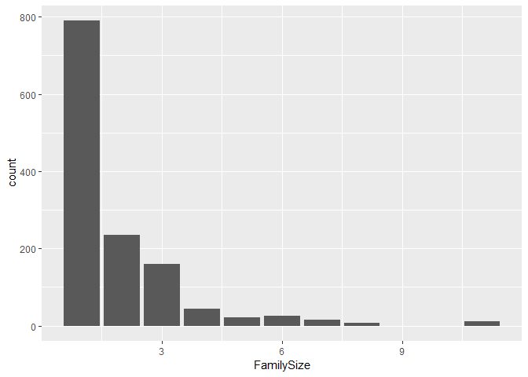<!-- -->

#### Split into Train and Test

``` r
# Split back into test and train sets
train_Featured <- Full[1:891,]
test_Featured <- Full[892:1309,]
```

#### Convert to Factors

``` r
train_Featured$Survived <- as.factor(train_Featured$Survived)
train_Featured$Sex <- as.factor(train_Featured$Sex)
train_Featured$Embarked <- as.factor(train_Featured$Embarked)

test_Featured$Sex <- as.factor(test_Featured$Sex)
test_Featured$Embarked <- as.factor(test_Featured$Embarked)
```

### Model Building

  - Logistic Regression
  - Decision Tree
  - Random Forest
  - SVM

### Logistic Regression

#### Split data in train and test data

``` r
library(caTools)
set.seed(390)
split <- sample.split(train_Featured, SplitRatio = 0.8)
split
```

    ##  [1] FALSE  TRUE  TRUE  TRUE  TRUE  TRUE  TRUE  TRUE FALSE FALSE  TRUE
    ## [12]  TRUE  TRUE  TRUE

``` r
train.data <- subset(train_Featured, split== "TRUE")
test.data <- subset(train_Featured, split== "FALSE")
```

#### Model fitting:without Feature Enginnering

``` r
#After removing Passenger ID, Name and Ticket, Child, Title. Family Size
logit_model1 <- glm(Survived ~ .,family=binomial(link='logit'),data = train.data[-c(1,4,9,12,13,14)])
summary(logit_model1)
```

    ## 
    ## Call:
    ## glm(formula = Survived ~ ., family = binomial(link = "logit"), 
    ##     data = train.data[-c(1, 4, 9, 12, 13, 14)])
    ## 
    ## Deviance Residuals: 
    ##     Min       1Q   Median       3Q      Max  
    ## -2.7190  -0.5816  -0.3844   0.6019   2.4832  
    ## 
    ## Coefficients:
    ##              Estimate Std. Error z value Pr(>|z|)    
    ## (Intercept)  4.421672   0.552400   8.004 1.20e-15 ***
    ## Pclass2     -1.053840   0.339469  -3.104  0.00191 ** 
    ## Pclass3     -2.401172   0.339752  -7.067 1.58e-12 ***
    ## Sexmale     -2.768739   0.231799 -11.945  < 2e-16 ***
    ## Age         -0.042129   0.009007  -4.677 2.91e-06 ***
    ## SibSp       -0.389876   0.135455  -2.878  0.00400 ** 
    ## Parch       -0.063424   0.137176  -0.462  0.64382    
    ## Fare         0.001692   0.002978   0.568  0.56995    
    ## EmbarkedQ   -0.098917   0.438888  -0.225  0.82168    
    ## EmbarkedS   -0.405828   0.268381  -1.512  0.13050    
    ## ---
    ## Signif. codes:  0 '***' 0.001 '**' 0.01 '*' 0.05 '.' 0.1 ' ' 1
    ## 
    ## (Dispersion parameter for binomial family taken to be 1)
    ## 
    ##     Null deviance: 937.14  on 699  degrees of freedom
    ## Residual deviance: 606.99  on 690  degrees of freedom
    ## AIC: 626.99
    ## 
    ## Number of Fisher Scoring iterations: 5

``` r
#AIC : 626.99
```

#### Model fitting : With Feature Engineering

``` r
#After removing Passenger ID, Name and Ticket
logit_model2 <- glm(Survived ~ .,family=binomial(link='logit'),data = train.data[-c(1,4,9,13)])
summary(logit_model2) 
```

    ## 
    ## Call:
    ## glm(formula = Survived ~ ., family = binomial(link = "logit"), 
    ##     data = train.data[-c(1, 4, 9, 13)])
    ## 
    ## Deviance Residuals: 
    ##     Min       1Q   Median       3Q      Max  
    ## -2.8552  -0.6265  -0.3895   0.5666   2.4829  
    ## 
    ## Coefficients: (1 not defined because of singularities)
    ##              Estimate Std. Error z value Pr(>|z|)    
    ## (Intercept)  3.796147   0.603567   6.290 3.18e-10 ***
    ## Pclass2     -0.985093   0.341761  -2.882 0.003947 ** 
    ## Pclass3     -2.320302   0.342063  -6.783 1.17e-11 ***
    ## Sexmale     -2.812445   0.235852 -11.925  < 2e-16 ***
    ## Age         -0.026763   0.010871  -2.462 0.013825 *  
    ## SibSp       -0.475161   0.142858  -3.326 0.000881 ***
    ## Parch       -0.136144   0.142411  -0.956 0.339072    
    ## Fare         0.002483   0.003048   0.815 0.415307    
    ## EmbarkedQ   -0.006455   0.445198  -0.014 0.988432    
    ## EmbarkedS   -0.336418   0.272800  -1.233 0.217500    
    ## Child        1.024034   0.427824   2.394 0.016685 *  
    ## FamilySize         NA         NA      NA       NA    
    ## ---
    ## Signif. codes:  0 '***' 0.001 '**' 0.01 '*' 0.05 '.' 0.1 ' ' 1
    ## 
    ## (Dispersion parameter for binomial family taken to be 1)
    ## 
    ##     Null deviance: 937.14  on 699  degrees of freedom
    ## Residual deviance: 601.21  on 689  degrees of freedom
    ## AIC: 623.21
    ## 
    ## Number of Fisher Scoring iterations: 5

``` r
#AIC : 597(Lesser is better)

#Predictions on Test Data
fitted.results <- predict(logit_model2,newdata=test.data,type='response')
fitted.results <- ifelse(fitted.results > 0.5,1,0)

# Model Accuracy 
library(caret)
confusionMatrix(table(test.data$Survived, fitted.results))
```

    ## Confusion Matrix and Statistics
    ## 
    ##    fitted.results
    ##       0   1
    ##   0 107  16
    ##   1  19  49
    ##                                           
    ##                Accuracy : 0.8168          
    ##                  95% CI : (0.7545, 0.8689)
    ##     No Information Rate : 0.6597          
    ##     P-Value [Acc > NIR] : 1.121e-06       
    ##                                           
    ##                   Kappa : 0.5964          
    ##                                           
    ##  Mcnemar's Test P-Value : 0.7353          
    ##                                           
    ##             Sensitivity : 0.8492          
    ##             Specificity : 0.7538          
    ##          Pos Pred Value : 0.8699          
    ##          Neg Pred Value : 0.7206          
    ##              Prevalence : 0.6597          
    ##          Detection Rate : 0.5602          
    ##    Detection Prevalence : 0.6440          
    ##       Balanced Accuracy : 0.8015          
    ##                                           
    ##        'Positive' Class : 0               
    ## 

#### ROC-AUC Curve

``` r
library(ROCR)
ROCRPred <- prediction(fitted.results, test.data$Survived)
ROCRPerf <- performance(ROCRPred, measure ="tpr", x.measure ="fpr")

par(mfrow = c(1, 1))
plot(ROCRPerf, colorize = TRUE, print.cutoffs.at = seq(0.1,by=0.1),main = "ROC CURVE")
abline(a=0, b=1)

auc <- performance(ROCRPred, measure = "auc")
auc <- auc@y.values[[1]]
auc <- round(auc, 4)
legend (.6,.4,auc, title = "AUC", cex =1)
```

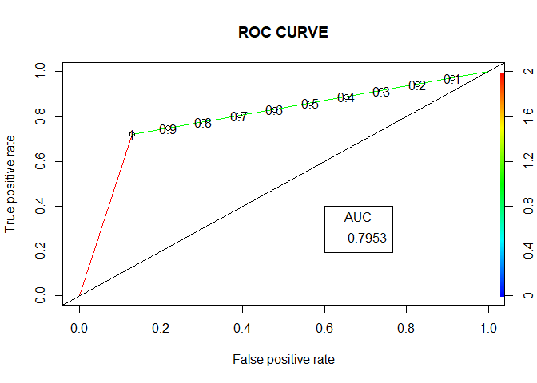<!-- -->

#### Model Building with Feature Engineering on Train data

``` r
#Model 3 with train_Featured
logit_model3 <- glm(Survived ~ .,family=binomial(link='logit'),data = train_Featured[-c(1,4,9)])

#Summary
summary(logit_model3)
```

    ## 
    ## Call:
    ## glm(formula = Survived ~ ., family = binomial(link = "logit"), 
    ##     data = train_Featured[-c(1, 4, 9)])
    ## 
    ## Deviance Residuals: 
    ##     Min       1Q   Median       3Q      Max  
    ## -2.3285  -0.5600  -0.3831   0.5382   2.5481  
    ## 
    ## Coefficients: (1 not defined because of singularities)
    ##               Estimate Std. Error z value Pr(>|z|)    
    ## (Intercept)  3.294e+01  1.954e+03   0.017  0.98655    
    ## Pclass2     -9.732e-01  3.281e-01  -2.966  0.00301 ** 
    ## Pclass3     -2.068e+00  3.203e-01  -6.456 1.07e-10 ***
    ## Sexmale     -3.155e+01  1.954e+03  -0.016  0.98712    
    ## Age         -2.248e-02  1.034e-02  -2.174  0.02971 *  
    ## SibSp       -5.668e-01  1.286e-01  -4.406 1.05e-05 ***
    ## Parch       -3.657e-01  1.370e-01  -2.668  0.00762 ** 
    ## Fare         3.828e-03  2.701e-03   1.417  0.15643    
    ## EmbarkedQ   -1.223e-02  3.994e-01  -0.031  0.97558    
    ## EmbarkedS   -3.915e-01  2.520e-01  -1.553  0.12034    
    ## Child        2.732e-01  4.096e-01   0.667  0.50489    
    ## TitleDr     -5.890e-01  1.716e+00  -0.343  0.73138    
    ## TitleLady   -1.574e+01  1.485e+03  -0.011  0.99154    
    ## TitleMaster  2.621e+00  1.569e+00   1.670  0.09487 .  
    ## TitleMiss   -2.942e+01  1.954e+03  -0.015  0.98799    
    ## TitleMlle   -1.607e+01  2.395e+03  -0.007  0.99465    
    ## TitleMr     -7.910e-01  1.456e+00  -0.543  0.58691    
    ## TitleMrs    -2.862e+01  1.954e+03  -0.015  0.98831    
    ## TitleMs     -1.442e+01  3.095e+03  -0.005  0.99628    
    ## TitleRev    -1.562e+01  9.700e+02  -0.016  0.98715    
    ## TitleSir    -3.101e-01  1.714e+00  -0.181  0.85643    
    ## FamilySize          NA         NA      NA       NA    
    ## ---
    ## Signif. codes:  0 '***' 0.001 '**' 0.01 '*' 0.05 '.' 0.1 ' ' 1
    ## 
    ## (Dispersion parameter for binomial family taken to be 1)
    ## 
    ##     Null deviance: 1186.66  on 890  degrees of freedom
    ## Residual deviance:  721.47  on 870  degrees of freedom
    ## AIC: 763.47
    ## 
    ## Number of Fisher Scoring iterations: 15

``` r
#Predictions on test_Featured
my_prediction <- predict(logit_model3, test_Featured, type = "response")

my_prediction <- ifelse(my_prediction > 0.5,1,0)

my_solution <- data.frame(PassengerId = test_Featured$PassengerId, Survived = my_prediction)

write.csv(my_solution, file = "my_solution_logit2.csv", row.names = FALSE)
```

#### ROC-AUC Curve

``` r
library(ROCR)
ROCRPred <- prediction(my_prediction, test_Featured$Survived)
ROCRPerf <- performance(ROCRPred, measure ="tpr", x.measure ="fpr")

par(mfrow = c(1, 1))
plot(ROCRPerf, colorize = TRUE, print.cutoffs.at = seq(0.1,by=0.1),main = "ROC CURVE")
abline(a=0, b=1)

auc <- performance(ROCRPred, measure = "auc")
auc <- auc@y.values[[1]]
auc <- round(auc, 4)
legend (.6,.4,auc, title = "AUC", cex =1)
```

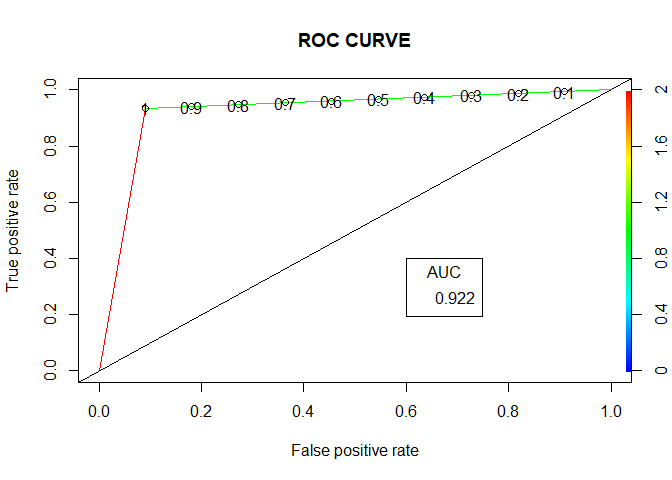<!-- -->

*Overall Logistic Regression Model Accuracy achieved is 0.78947 when
submitted our results on kaggle Competition.*


### Decision Trees

#### Model Building with Gender Variable only on Train data

``` r
library(rattle)
library(rpart.plot)
library(RColorBrewer)
library(rpart)

#Model Building with Gender variable only
dtree1 <- rpart(Survived ~ Sex, data=train_Featured, method="class")
rpart.plot(dtree1)
```

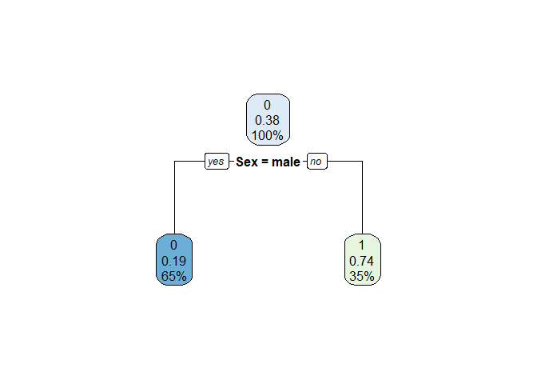<!-- -->

``` r
#Predictions on test_Featured
my_Prediction <- predict(dtree1, test_Featured, type = "class")

#Write to csv File
my_solution <- data.frame(PassengerId = test_Featured$PassengerId, Survived = my_Prediction)
write.csv(my_solution, file = "dtree1.csv", row.names = FALSE)
```

*Overall Decision Tree Model 1 Accuracy achieved is 0.76555 when
submitted our results on kaggle Competition.*


#### Model Building with Deeper Tree without Feature Enginnering

``` r
#Model 2
dtree2 <- rpart(Survived ~ Pclass + Sex + Age + SibSp + Parch + Fare + Embarked,
              data=train_Featured,
              method="class")

#Predictions
my_Prediction <- predict(dtree2, test_Featured, type = "class")

#Write to csv
my_solution <- data.frame(PassengerId = test_Featured$PassengerId, Survived = my_Prediction)
write.csv(my_solution, file = "dtree2.csv", row.names = FALSE)
```

*Overall Decision Tree Model 2 Accuracy achieved is 0.77033 when
submitted our results on kaggle Competition.*


#### Model Building with Deeper Tree with Feature Engineering

``` r
# Build a deeper tree - with feature engineering
dtree3 <- rpart(Survived ~ Pclass + Sex + Age + SibSp + Parch + Fare + Embarked + Child +Title + FamilySize,
             data=train_Featured,
             method="class")

#Predictions
my_Prediction <- predict(dtree3, test_Featured, type = "class")

#Write to csv
my_solution <- data.frame(PassengerId = test_Featured$PassengerId, Survived = my_Prediction)
write.csv(my_solution, file = "dtree3.csv", row.names = FALSE)
```

*Overall Decision Tree Model 3 Accuracy achieved is 0.78947 when
submitted our results on kaggle
Competition.*


#### Model Building with max depth of the tree

``` r
# Go all over and reach max depth of the tree by making cp =0 and minsplit = 2
dtree4 <- rpart(Survived ~ Pclass + Sex + Age + SibSp + Parch + Fare + Embarked + Child +Title + FamilySize,
             data=train_Featured,
             method="class", 
             control=rpart.control(minsplit=2, cp=0))

my_Prediction <- predict(dtree4, test_Featured, type = "class")
my_solution <- data.frame(PassengerId = test_Featured$PassengerId, Survived = my_Prediction)
write.csv(my_solution, file = "dtree4.csv", row.names = FALSE)
```

*Overall Decision Tree Model 4 Accuracy achieved is 0.69377 when
submitted our results on kaggle Competition.*


#### Model Building with Prune Tree

``` r
printcp(dtree4) 
```

    ## 
    ## Classification tree:
    ## rpart(formula = Survived ~ Pclass + Sex + Age + SibSp + Parch + 
    ##     Fare + Embarked + Child + Title + FamilySize, data = train_Featured, 
    ##     method = "class", control = rpart.control(minsplit = 2, cp = 0))
    ## 
    ## Variables actually used in tree construction:
    ## [1] Age        Embarked   FamilySize Fare       Parch      Pclass    
    ## [7] Sex        SibSp      Title     
    ## 
    ## Root node error: 342/891 = 0.38384
    ## 
    ## n= 891 
    ## 
    ##            CP nsplit rel error  xerror     xstd
    ## 1  0.45614035      0  1.000000 1.00000 0.042446
    ## 2  0.05409357      1  0.543860 0.56140 0.035886
    ## 3  0.00877193      3  0.435673 0.47953 0.033824
    ## 4  0.00730994      7  0.400585 0.50292 0.034448
    ## 5  0.00657895      9  0.385965 0.49415 0.034217
    ## 6  0.00584795     13  0.359649 0.46784 0.033501
    ## 7  0.00438596     19  0.324561 0.44737 0.032916
    ## 8  0.00292398     28  0.283626 0.45906 0.033253
    ## 9  0.00194932     50  0.219298 0.42982 0.032395
    ## 10 0.00146199     64  0.190058 0.43860 0.032658
    ## 11 0.00116959    129  0.093567 0.48830 0.034061
    ## 12 0.00097466    146  0.070175 0.52924 0.035116
    ## 13 0.00079745    158  0.058480 0.52924 0.035116
    ## 14 0.00073099    171  0.046784 0.53801 0.035331
    ## 15 0.00000000    179  0.040936 0.53801 0.035331

``` r
#Minimum error occurs when the tree size is = 3

#Find the value of CP for which cross validation error is minimum
min(dtree4$cptable[,"xerror"])
```

    ## [1] 0.4298246

``` r
which.min(dtree4$cptable[,"xerror"])
```

    ## 9 
    ## 9

``` r
cpmin <- dtree4$cptable[9, "CP"]
cpmin
```

    ## [1] 0.001949318

``` r
#Prune the tree by setting the CP parameter as =  cpmin
dtree5 = prune(dtree4, cp = cpmin)

my_Prediction <- predict(dtree5, test_Featured, type = "class")
my_solution <- data.frame(PassengerId = test_Featured$PassengerId, Survived = my_Prediction)
write.csv(my_solution, file = "dtree5.csv", row.names = FALSE)
```

*Overall Decision Tree Model 5 Accuracy achieved is 0.74162 when
submitted our results on kaggle Competition.*


### Random Forest

#### Model Building with Feature Enginnering on Train Data

``` r
set.seed(415)
library("randomForest")
fit <- randomForest(as.factor(Survived) ~ Pclass + Sex + Age + SibSp + Parch + Fare + Embarked + Child + Title + FamilySize,
                    data=train_Featured, importance=TRUE, ntree=2000)
# Look at variable importance
varImpPlot(fit)
```

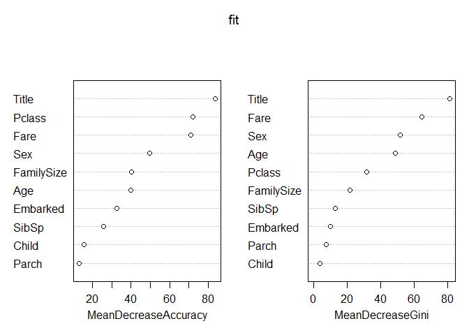<!-- -->

``` r
str(train_Featured)
```

    ## 'data.frame':    891 obs. of  14 variables:
    ##  $ PassengerId: int  1 2 3 4 5 6 7 8 9 10 ...
    ##  $ Survived   : Factor w/ 2 levels "0","1": 1 2 2 2 1 1 1 1 2 2 ...
    ##  $ Pclass     : Factor w/ 3 levels "1","2","3": 3 1 3 1 3 3 1 3 3 2 ...
    ##  $ Name       : chr  "Braund, Mr. Owen Harris" "Cumings, Mrs. John Bradley (Florence Briggs Thayer)" "Heikkinen, Miss. Laina" "Futrelle, Mrs. Jacques Heath (Lily May Peel)" ...
    ##  $ Sex        : Factor w/ 2 levels "female","male": 2 1 1 1 2 2 2 2 1 1 ...
    ##  $ Age        : num  22 38 26 35 35 ...
    ##  $ SibSp      : int  1 1 0 1 0 0 0 3 0 1 ...
    ##  $ Parch      : int  0 0 0 0 0 0 0 1 2 0 ...
    ##  $ Ticket     : chr  "A/5 21171" "PC 17599" "STON/O2. 3101282" "113803" ...
    ##  $ Fare       : num  7.25 71.28 7.92 53.1 8.05 ...
    ##  $ Embarked   : Factor w/ 3 levels "C","Q","S": 3 1 3 3 3 2 3 3 3 1 ...
    ##  $ Child      : num  0 0 0 0 0 0 0 1 0 1 ...
    ##  $ Title      : Factor w/ 11 levels "Col","Dr","Lady",..: 7 8 5 8 7 7 7 4 8 8 ...
    ##  $ FamilySize : num  2 2 1 2 1 1 1 5 3 2 ...

``` r
str(test_Featured)
```

    ## 'data.frame':    418 obs. of  14 variables:
    ##  $ PassengerId: int  892 893 894 895 896 897 898 899 900 901 ...
    ##  $ Survived   : num  0 1 0 0 1 0 1 0 1 0 ...
    ##  $ Pclass     : Factor w/ 3 levels "1","2","3": 3 3 2 3 3 3 3 2 3 3 ...
    ##  $ Name       : chr  "Kelly, Mr. James" "Wilkes, Mrs. James (Ellen Needs)" "Myles, Mr. Thomas Francis" "Wirz, Mr. Albert" ...
    ##  $ Sex        : Factor w/ 2 levels "female","male": 2 1 2 2 1 2 1 2 1 2 ...
    ##  $ Age        : num  34.5 47 62 27 22 14 30 26 18 21 ...
    ##  $ SibSp      : int  0 1 0 0 1 0 0 1 0 2 ...
    ##  $ Parch      : int  0 0 0 0 1 0 0 1 0 0 ...
    ##  $ Ticket     : chr  "330911" "363272" "240276" "315154" ...
    ##  $ Fare       : num  7.83 7 9.69 8.66 12.29 ...
    ##  $ Embarked   : Factor w/ 3 levels "C","Q","S": 2 3 2 3 3 3 2 3 1 3 ...
    ##  $ Child      : num  0 0 0 0 0 1 0 0 0 0 ...
    ##  $ Title      : Factor w/ 11 levels "Col","Dr","Lady",..: 7 8 7 7 8 7 5 7 8 7 ...
    ##  $ FamilySize : num  1 2 1 1 3 1 1 3 1 3 ...

``` r
# Now let's make a prediction and write a submission file
my_Prediction <- predict(fit, test_Featured)
my_solution <- data.frame(PassengerId = test_Featured$PassengerId, Survived = my_Prediction)
write.csv(my_solution, file = "Featuredfirstforest.csv", row.names = FALSE)
```

*Overall Random Forest Model Accuracy achieved is 0.78947 when submitted
our results on kaggle Competition.*


### SVM

#### Model Building with Feature Enginnering on Train Data

``` r
# Fitting SVM to the Training set
# install.packages('e1071')
library(e1071)
svm_model<-svm(Survived ~ Pclass + Sex + Age + SibSp + Parch + Fare + Embarked + Child +Title + FamilySize, data=train_Featured, method = "class")
summary(svm_model)
```

    ## 
    ## Call:
    ## svm(formula = Survived ~ Pclass + Sex + Age + SibSp + Parch + 
    ##     Fare + Embarked + Child + Title + FamilySize, data = train_Featured, 
    ##     method = "class")
    ## 
    ## 
    ## Parameters:
    ##    SVM-Type:  C-classification 
    ##  SVM-Kernel:  radial 
    ##        cost:  1 
    ##       gamma:  0.04545455 
    ## 
    ## Number of Support Vectors:  406
    ## 
    ##  ( 205 201 )
    ## 
    ## 
    ## Number of Classes:  2 
    ## 
    ## Levels: 
    ##  0 1

``` r
my_Prediction <- predict(svm_model, test_Featured, type = "class")

my_solution <- data.frame(PassengerId = test_Featured$PassengerId, Survived = my_Prediction)
write.csv(my_solution, file = "svm.csv", row.names = FALSE)
```

*Overall SVM Model Accuracy achieved is 0.78468 when submitted our
results on kaggle Competition.*


### Model Evaluation

``` r
library(knitr)
library(dplyr)
Score <- c(0.74162,0.78947,0.78947,0.78468)
Model<- c("Decision Tree","Logistic Regression","Random Forest","SVM")
Model_Evaluation <- data.frame(Score,Model)
Model_Evaluation <- arrange(Model_Evaluation,desc(Score))
kable(Model_Evaluation,caption = "A Model Accuracy Evaluation")
```

|   Score | Model               |
| ------: | :------------------ |
| 0.78947 | Logistic Regression |
| 0.78947 | Random Forest       |
| 0.78468 | SVM                 |
| 0.74162 | Decision Tree       |

A Model Accuracy Evaluation
