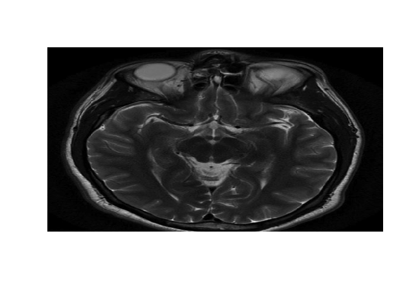
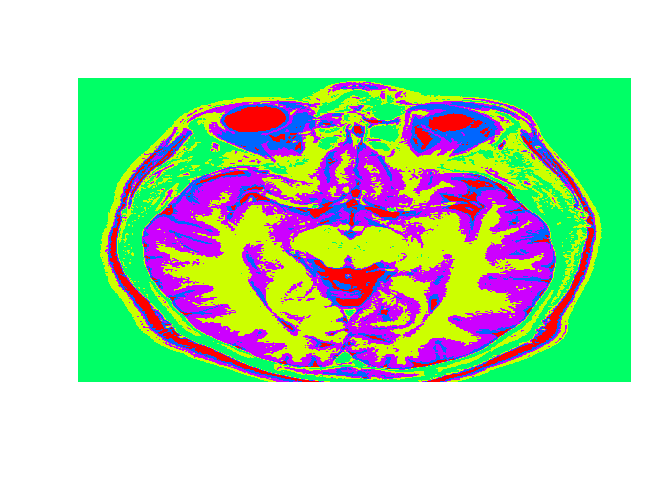
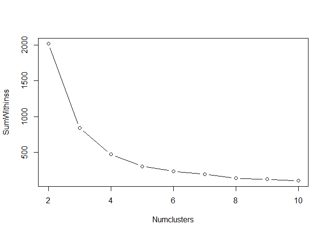
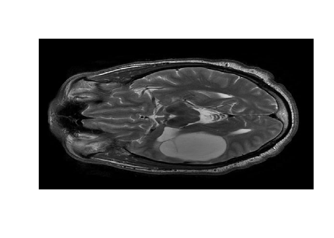
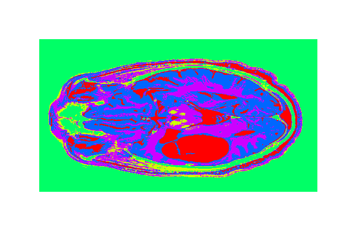

Tumor Detection using MRI Brain Image Segmentation
================
Akash Lamba

-   [Objective](#objective)
-   [Healthy Patient Dataset](#healthy-patient-dataset)
-   [Structure](#structure)
-   [MRI Brain Image](#mri-brain-image)
-   [K-means Clustering](#k-means-clustering)
-   [Segmented Image](#segmented-image)
-   [ScreePlot](#screeplot)
-   [Sick Patient Dataset](#sick-patient-dataset)
-   [Data Splitting](#data-splitting)
-   [Making Predictions](#making-predictions)
-   [Conclusion](#conclusion)

### Objective

-   We will try to Segment the MRI Brain Image of a healthy patient using k-means Clustering Algorithm. Then, we will use this clusters to automatically detect tumors in MRI Brain Images of sick Patients.

### Healthy Patient Dataset

-   We will call the dataset `healthy`.

``` r
healthy <- read.csv("healthy.csv",header = FALSE)
```

### Structure

-   We will first convert our dataset into a matrix.

``` r
healthyMatrix = as.matrix(healthy)
str(healthyMatrix)
```

    ##  num [1:566, 1:646] 0.00427 0.00855 0.01282 0.01282 0.01282 ...
    ##  - attr(*, "dimnames")=List of 2
    ##   ..$ : NULL
    ##   ..$ : chr [1:646] "V1" "V2" "V3" "V4" ...

*We have 566 by 646 pixel resolution for our image.*

### MRI Brain Image

-   We are given a T2-Weighted MRI Brain Image that shows the top section of the brain.
-   It shows different substances, such as the gray matter, the white matter, and the cerebrospinal fluid.
-   We will see the image using the gray color scheme.

``` r
image(healthyMatrix,col=grey(seq(0,1,length=256)),axes=F)
```



### K-means Clustering

-   We will first convert the `healthyMatrix` to a vector, and let's call it `healthyVector`.

``` r
healthyVector = as.vector(healthyMatrix)
```

-   For Now, We will start with k=5 clusters and apply the `kmeans` algorithm on our `healthyVector`.

``` r
k = 5
set.seed(1)
KMC= kmeans(healthyVector,centers = k,iter.max = 100)
str(KMC)
```

    ## List of 9
    ##  $ cluster     : int [1:365636] 3 3 3 3 3 3 3 3 3 3 ...
    ##  $ centers     : num [1:5, 1] 0.4818 0.1062 0.0196 0.3094 0.1842
    ##   ..- attr(*, "dimnames")=List of 2
    ##   .. ..$ : chr [1:5] "1" "2" "3" "4" ...
    ##   .. ..$ : NULL
    ##  $ totss       : num 5775
    ##  $ withinss    : num [1:5] 96.6 47.2 39.2 57.5 62.3
    ##  $ tot.withinss: num 303
    ##  $ betweenss   : num 5472
    ##  $ size        : int [1:5] 20556 101085 133162 31555 79278
    ##  $ iter        : int 2
    ##  $ ifault      : int 0
    ##  - attr(*, "class")= chr "kmeans"

*The `clusterVector` assigns each intensity value to a cluster.*

-   To output the segmented image, we need to extract the `clusterVector`.

``` r
healthyClusters <- KMC$cluster
```

### Segmented Image

-   We will convert the `healthyClusters` vector into a matrix and then plot the MRI Brain Image.

``` r
dim(healthyClusters) = c(nrow(healthyMatrix), ncol(healthyMatrix))
image(healthyClusters,axes=FALSE,col = rainbow(k))
```



### ScreePlot

-   One common way to select the number of clusters is by using scree plot.
-   A standard scree plot has the number of clusters on x-axis, and the sum of within-clusters sum of squares on the y-axis.
-   We create a plot using `sapply()` function.

``` r
SumWithinss = sapply(2:10, function(x) {sum(kmeans(healthyVector, centers=x, iter.max=1000)$withinss)})
Numclusters = seq(2,10,1)
plot(Numclusters,SumWithinss,type = "b")
```



*For our dataset, it looks like 4 or 5 clusters is a good choice.*

### Sick Patient Dataset

-   The `tumor.csv` file corresponds to an MRI brain image of a patient with oligodendroglioma, a tumor that commonly occurs in front lobe in the brain.
-   We will convert `tumor` dataframe into a matrix `tumorMatrix` and then convert the matrix into a vector `tumorVector`.
-   We will plot the `tumorVector` image.

``` r
#import dataset
tumor <- read.csv("tumor.csv") 
#convert into matrix
tumorMatrix<-as.matrix(tumor)
#convert into vector
tumorVector<-as.vector(tumorMatrix)
#plot image
image(tumorMatrix,axes=FALSE,col=grey(seq(0,1,length=256)))
```



### Data Splitting

-   We will treat the `healthyVector` as training set and `tumorVector` as testing set.
-   We need to install the package `flexclust` that contains the object class KCCA, which stands for K-Centroids Cluster analysis.
-   We need to convert the information clustering algorithm to an object of the class KCCA. This conversion is needed before we can use the `predict()` function to the test set `tumorVector`.

``` r
library(flexclust)
KMC.kcca = as.kcca(KMC, healthyVector)
```

### Making Predictions

-   Let us call the cluster vector `tumorClusters`.
-   The `tumorClusters`vector will assign a value 1 to 5 to each of the intensity values in the `tumerVector`, as predicted by the k-means algorithm.

``` r
tumorClusters <-predict(KMC.kcca, newdata=tumorVector)
```

-   We will convert `tumorClusters` vector to a matrix for visualizing the segmented image.
-   We will plot the `tumorClusters` using the `image()` function.

``` r
dim(tumorClusters)<-c(nrow(tumorMatrix),ncol(tumorMatrix))
image(tumorClusters,axes=FALSE,col=rainbow(k))
```



*We can see the abnormal substance highlighted in red that was not present in the healthy MRI image.*

### Conclusion

-   For the sick patient, the substance highlighted in blue is the oligodendroglioma tumor.
-   We do not see substantial blue regions in the healthy brain image, apart from the region around the eyes.
-   Looking at the eye regions, we notice that the two images were not taken precisely at the same section of the brain.
-   This might explain some differences in shapes between the two images.

#### Segmented MRI Image(R Implemented Images)


#### T2 Weighted MRI Images(Original Brain Image)


