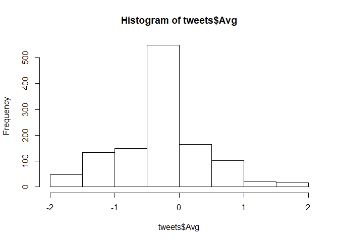
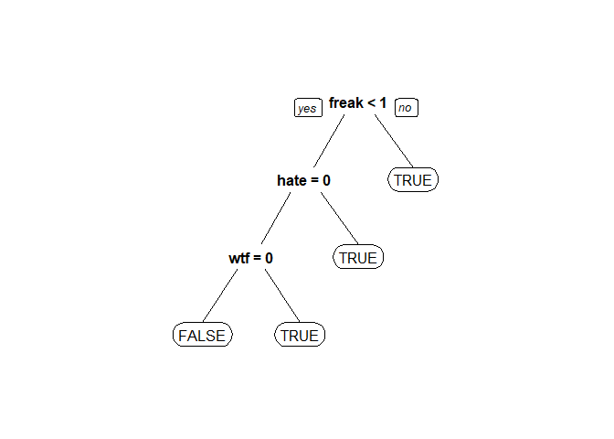

Sentiment Mining - Apple
================
Akash Lamba

### Challenge

  - **Apple** is a computer company known for it’s
    laptop,phones,tablets, and personal media players.
  - Large number of fans, large number of “haters”.
  - Apple wants to monitor how people feel about them over time, and how
    people recieve new announcements.
  - Can we correctly classify tweets being **negative,positive or
    neither** about apple.


### Loading Packages

``` r
library(tm)#Text Mining
library(SnowballC)#Helps us to use Tm package
library(caTools)# Splitting
library(caret)# Machine Learning
library(rpart)# Machine learning
library(rpart.plot)# Tree plot
library(randomForest)#Machine Learning
```

### Importing the data

``` r
tweets = read.csv("tweets.csv", stringsAsFactors=FALSE)
```

### Structure

  - We can see that we have 1181 observations of 2 variables
  - The text of the tweet called “**Tweet**” and the average sentiment
    score called “**Avg**” average.

<!-- end list -->

``` r
str(tweets)
```

    ## 'data.frame':    1181 obs. of  2 variables:
    ##  $ Tweet: chr  "I have to say, Apple has by far the best customer care service I have ever received! @Apple @AppStore" "iOS 7 is so fricking smooth & beautiful!! #ThanxApple @Apple" "LOVE U @APPLE" "Thank you @apple, loving my new iPhone 5S!!!!!  #apple #iphone5S pic.twitter.com/XmHJCU4pcb" ...
    ##  $ Avg  : num  2 2 1.8 1.8 1.8 1.8 1.8 1.6 1.6 1.6 ...

### Feature Engineering

  - We are more interested in finding out the tweets with clear negative
    sentiments.
  - Lets define a new variable in our dataset tweets called “Negative”.

<!-- end list -->

``` r
tweets$Negative = as.factor(tweets$Avg <= -1)
table(tweets$Negative)
```

    ## 
    ## FALSE  TRUE 
    ##   999   182

*We can see that 182 tweets out of 1181 are Negative.*

### Our Human Intelligence Task

  - Judge the sentiment expressed by the following item toward the
    software company “Apple”.
  - Workers could pick from + Strongly Negative(-2) + Negative(-1) +
    Neutral(0) + Positive(+1) + Strongly Positive(+2)
  - Five workers labelled each tweet.
  - Distribution of the number of tweets classified into each categories

<!-- end list -->

``` r
hist(tweets$Avg)
```

<!-- -->

*Majority of the tweets classified as neutral with a small number as
strongly negative and strongly positive.*

  - For each tweet we take the average of five scores.
      - “LOVE YOU @APPLE”(1.8)
      - “@apple @twitter Happy Programmers Day Folks”(0.4)
      - “So dissapointed in @apple Sold me a Macbook Air that wont run
        my apps”(-1.4)

### Pre-Processing

#### Corpus

  - We will need to convert our tweets into corpus for pre-processing.
  - Corpus is a collection of documents.

<!-- end list -->

``` r
corpus= Corpus(VectorSource(tweets$Tweet))
corpus
```

    ## <<SimpleCorpus>>
    ## Metadata:  corpus specific: 1, document level (indexed): 0
    ## Content:  documents: 1181

#### ToLower

  - We will convert the complete corpus to a lowe case using `Tm_map()`
    function.

<!-- end list -->

``` r
corpus = tm_map(corpus,tolower)
#First tweet
corpus[[1]][1]
```

    ## $content
    ## [1] "i have to say, apple has by far the best customer care service i have ever received! @apple @appstore"

#### RemovePunctuation

  - We will remove the punctuations from our corpus.

<!-- end list -->

``` r
corpus = tm_map(corpus,removePunctuation)
#First tweet
corpus[[1]][1]
```

    ## $content
    ## [1] "i have to say apple has by far the best customer care service i have ever received apple appstore"

#### Remove the stopwords

  - We will remove all the stopwords as well as apple since this will
    help in improving prediction accuracy.

<!-- end list -->

``` r
corpus=tm_map(corpus,removeWords,c("apple",stopwords("english")))
#First tweet
corpus[[1]][1]
```

    ## $content
    ## [1] "   say    far  best customer care service   ever received  appstore"

#### Stemming

  - We will use stemming to further remove the unhelpful letters from
    the words.

<!-- end list -->

``` r
corpus = tm_map(corpus,stemDocument)
#First tweet
corpus[[1]][1]
```

    ## $content
    ## [1] "say far best custom care servic ever receiv appstor"

### Bag of Words

  - The `tm()` package provides a function called `DocumentTermMatrix()`
    that generates a matrix : + Rows corresponds to documents in our
    case the tweets. + Columns corresponds to the words in those tweets.
    + Values are the number of times that words had appear in each
    document.
  - Let’s call this matrix as **Frequencies** and We will call
    `DocumentTermMatrix()` on the corpus created.

<!-- end list -->

``` r
frequencies = DocumentTermMatrix(corpus)
frequencies
```

    ## <<DocumentTermMatrix (documents: 1181, terms: 3289)>>
    ## Non-/sparse entries: 8980/3875329
    ## Sparsity           : 100%
    ## Maximal term length: 115
    ## Weighting          : term frequency (tf)

*We can see that there are 3289 terms or words in our matrix and 1181
documents or tweets after pre-processing.*

  - Lets’ inspect this matrix that we just created.

<!-- end list -->

``` r
inspect(frequencies[1000:1005,505:515])
```

    ## <<DocumentTermMatrix (documents: 6, terms: 11)>>
    ## Non-/sparse entries: 1/65
    ## Sparsity           : 98%
    ## Maximal term length: 23
    ## Weighting          : term frequency (tf)
    ## Sample             :
    ##       Terms
    ## Docs   asap courtsideassistappforio current follow idea kickbutt preinstal
    ##   1000    0                       0       0      0    1        0         0
    ##   1001    0                       0       0      0    0        0         0
    ##   1002    0                       0       0      0    0        0         0
    ##   1003    0                       0       0      0    0        0         0
    ##   1004    0                       0       0      0    0        0         0
    ##   1005    0                       0       0      0    0        0         0
    ##       Terms
    ## Docs   save ssd support
    ##   1000    0   0       0
    ##   1001    0   0       0
    ##   1002    0   0       0
    ##   1003    0   0       0
    ##   1004    0   0       0
    ##   1005    0   0       0

*We can see that our data is very sparse which means we have many zeroes
in our data.*

  - Let’s see the most popular terms in our
    matrix.

<!-- end list -->

``` r
findFreqTerms(frequencies,lowfreq = 20)
```

    ##  [1] "say"                  "love"                 "iphon"               
    ##  [4] "iphone5"              "new"                  "thank"               
    ##  [7] "phone"                "can"                  "make"                
    ## [10] "market"               "one"                  "will"                
    ## [13] "cant"                 "get"                  "just"                
    ## [16] "updat"                "fingerprint"          "iphone5c"            
    ## [19] "store"                "time"                 "come"                
    ## [22] "now"                  "use"                  "back"                
    ## [25] "anyon"                "work"                 "app"                 
    ## [28] "android"              "think"                "ipad"                
    ## [31] "well"                 "freak"                "dont"                
    ## [34] "via"                  "better"               "like"                
    ## [37] "pleas"                "samsung"              "want"                
    ## [40] "batteri"              "ios7"                 "microsoft"           
    ## [43] "itun"                 "buy"                  "releas"              
    ## [46] "look"                 "appl"                 "need"                
    ## [49] "googl"                "twitter"              "ipod"                
    ## [52] "ipodplayerpromo"      "promoipodplayerpromo" "lol"                 
    ## [55] "realli"               "promo"

*We can see that out of 3289 words only 56 words appears atleast 20
times in our tweets.This means we have lot of terms which will be
useless in our prediction.*

  - Let’s remove some terms that don’t appear very often by using the
    `removeSparseTerms()` function.

<!-- end list -->

``` r
sparse = removeSparseTerms(frequencies,0.995)
sparse
```

    ## <<DocumentTermMatrix (documents: 1181, terms: 309)>>
    ## Non-/sparse entries: 4669/360260
    ## Sparsity           : 99%
    ## Maximal term length: 20
    ## Weighting          : term frequency (tf)

*We can see that out of 3289 terms in our sparse matrix only 309 words
appears in 0.5% of tweets.*

  - Let’s convert this sparse matrix into a dataframe that will be able
    to use in our predictive models.

<!-- end list -->

``` r
tweetsSparse = as.data.frame(as.matrix(sparse))
```

  - Let’s run the make.names() function to make use of all our words as
    appropriate variable name.Since R struggles with the variable name
    that starts with a number, and we probably have some words that
    start with a number.

<!-- end list -->

``` r
#with sparse is tweetsSparse Dataframe
colnames(tweetsSparse) = make.names(colnames(tweetsSparse))
```

  - Let’s add the dependent variable to our dataframe.

<!-- end list -->

``` r
tweetsSparse$Negative = tweets$Negative
```

### Data partitioning

``` r
set.seed(123)
#Split with Sparse tweetsSparse  and without Sparse tweetsdf
split=sample.split(tweetsSparse$Negative,SplitRatio = 0.7)
#trainSparse
trainSparse = subset(tweetsSparse,split==TRUE)
#testSparse
testSparse = subset(tweetsSparse,split==FALSE)
```

### Model Building

  - Decision Tree
  - Random Forest

### 1\. Decision Tree

#### Create Model

``` r
tweetCart <- rpart(Negative~.,data=trainSparse,method="class")
prp(tweetCart)
```

<!-- -->

#### Prediction on Test data

``` r
predictCart <- predict(tweetCart,newdata=testSparse,type="class")
#accuracy
table(testSparse$Negative,predictCart)
```

    ##        predictCart
    ##         FALSE TRUE
    ##   FALSE   294    6
    ##   TRUE     37   18

*The accuracy of our decision tree model is `0.87`.*

#### Comparing with the baseline model

``` r
table(testSparse$Negative)
```

    ## 
    ## FALSE  TRUE 
    ##   300    55

*We have 300 observation with non-negative sentiment and 55 observation
with negative sentiment. The accuracy of our baseline model that would
predict non-negative sentiment is `0.84`. So, our CART model performs
better than simple baseline model.*

### 2\. Random Forest

#### Create Model

``` r
tweetRF <- randomForest(Negative~.,data=trainSparse)
```

#### Prediction on Test data

``` r
predictRF <- predict(tweetRF,newdata=testSparse)
table(testSparse$Negative,predictRF)
```

    ##        predictRF
    ##         FALSE TRUE
    ##   FALSE   293    7
    ##   TRUE     32   23

*The accuracy of random forest model is `0.89`.*

### Result Comparision

We can rightly say that **Random Forest** model performed slightly
performed better than the **decision Tree** model with a better
accuracy.
